**[Vocabulary]{.underline}**

**1. Look and write the words. There is one example.    (one point
each)**

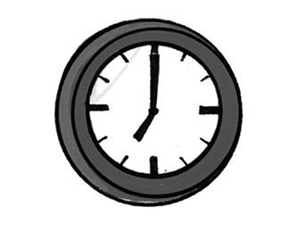

1\. klcco        *[clock]{.underline}*

2\. enohp        \_\_\_\_\_\_\_\_\_\_\_\_

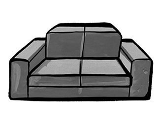

3\. faso        \_\_\_\_\_\_\_\_\_\_\_\_

4\. rrromi        \_\_\_\_\_\_\_\_\_\_\_\_

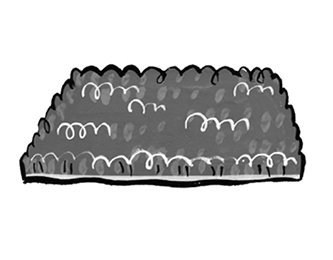

5\. tam        \_\_\_\_\_\_\_\_\_\_\_\_

6\. malp        \_\_\_\_\_\_\_\_\_\_\_\_

**2. Look and draw lines. There is one example.   (one point each)**

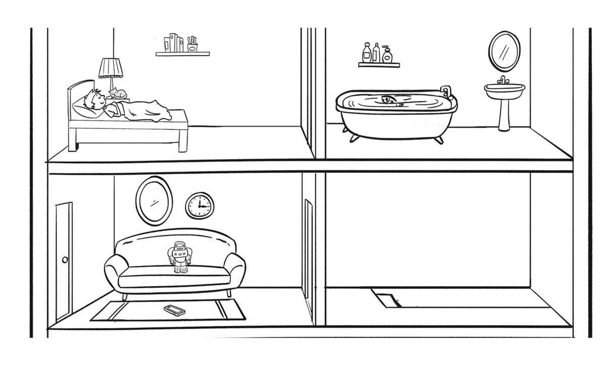

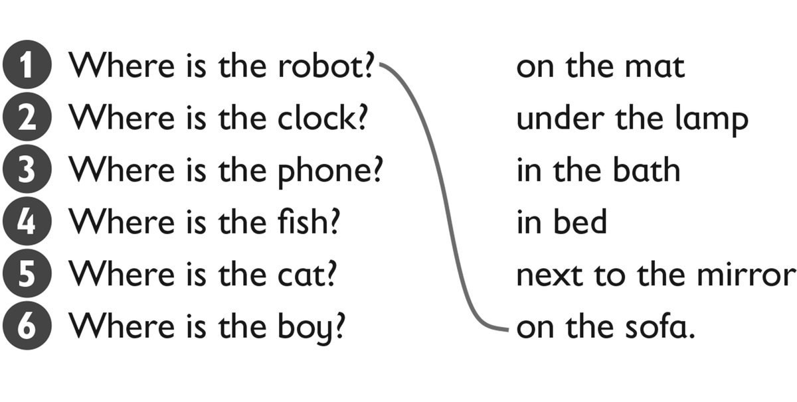

**3. Write this, these, that, those. There is one example.   (one point
each)**

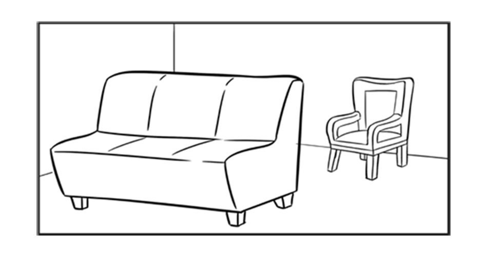

1\. **A**  *[that armchair]{.underline}*

    **B**  \_\_\_\_\_\_\_\_\_\_\_\_ sofa

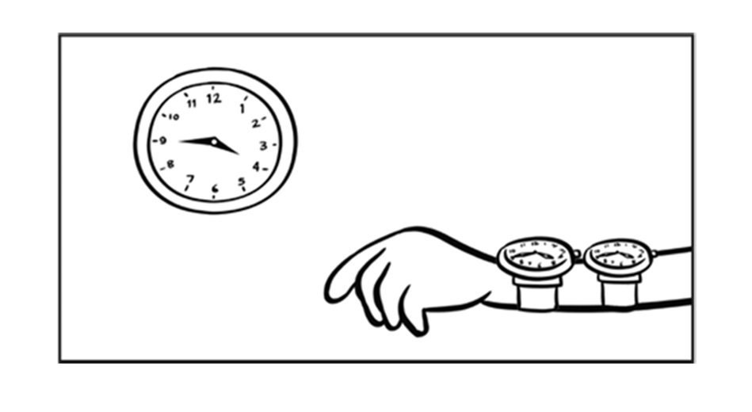

2\. **A**  \_\_\_\_\_\_\_\_\_\_\_\_ clock

    **B**  \_\_\_\_\_\_\_\_\_\_\_\_ watches

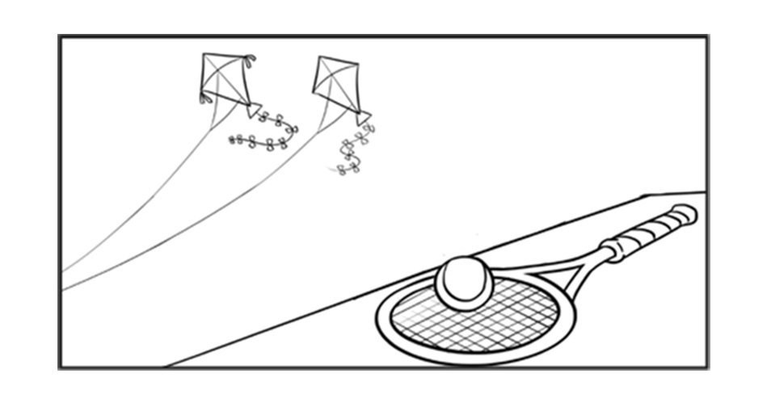

3\. **A**  \_\_\_\_\_\_\_\_\_\_\_\_ kites

    **B**  \_\_\_\_\_\_\_\_\_\_\_\_ ball

**[Grammar]{.underline}**

**4. Look and write *Yes, it is* / *No, it isn't* / *Yes, they are* /
*No, they aren't.* There is one example.   (one point each)**

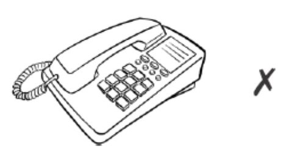

1\. Is that phone yours? *[No, it isn't.]{.underline}*

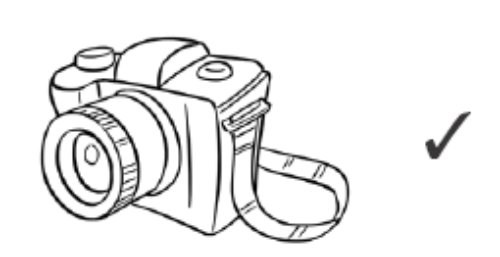

2\. Is that camera yours? \_\_\_\_\_\_\_\_\_\_\_\_

3\. Are those socks yours? \_\_\_\_\_\_\_\_\_\_\_\_

4\. Are those books yours? \_\_\_\_\_\_\_\_\_\_\_\_

5\. Is that dog yours? \_\_\_\_\_\_\_\_\_\_\_\_

6\. Is that kite yours? \_\_\_\_\_\_\_\_\_\_\_\_

**5. Look and circle. There is one example.    (one point each)**

1\. Which bag is yours? -- The orange *[one]{.underline}* / ones.

2\. Which socks are Jane's? - The red one / ones.

3\. Is this phone yours? -- Yes, it's yours / mine.

4\. Are those shoes yours, Fred? -- No, they are / aren't mine.

5\. Is this watch Grandpa's? -- Yes, it's his / hers.

6\. Whose trousers are these? -- It's / They're Peter's.

**[Listening]{.underline}**

**6. Listen and write the letter. There is one example.   (one point
each)**

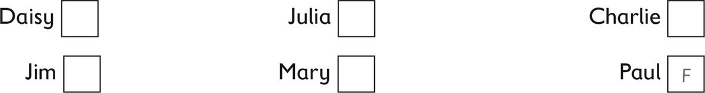

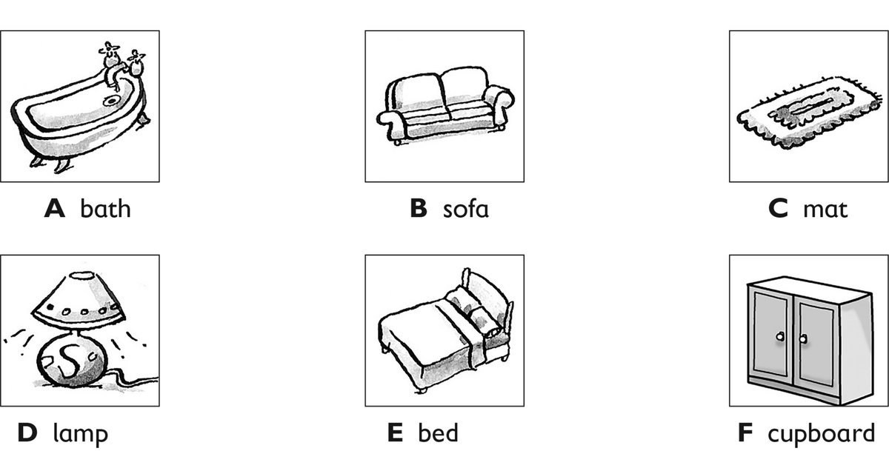

**7. Listen and draw lines. Then colour. There is one example.   (one
point each)**

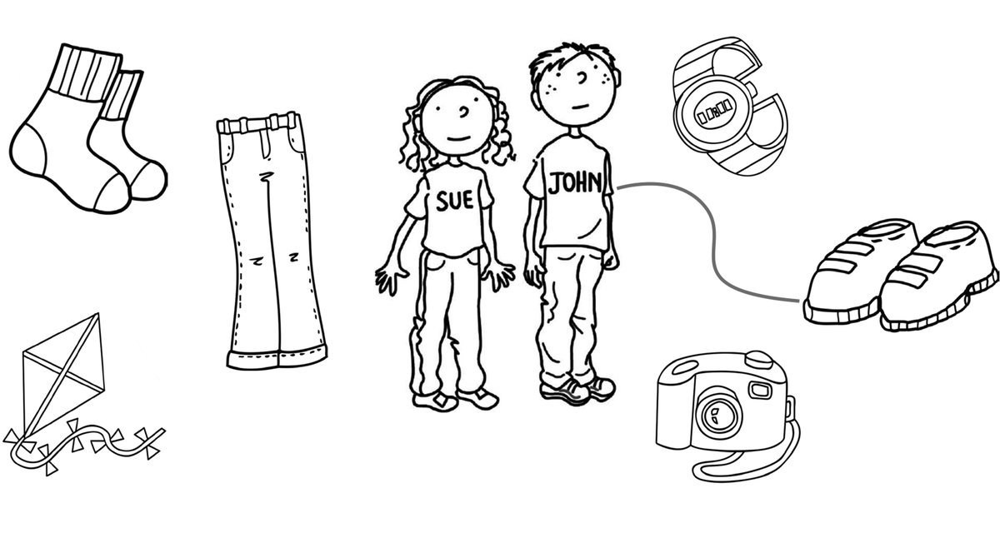

**[Reading]{.underline}**

**8. Read and write. There are two extra words. There is one
example.   (one point each)**

bed \| chair \| cupboard \| ~~lamp~~ \| mat \| mirror \| robot \| watch

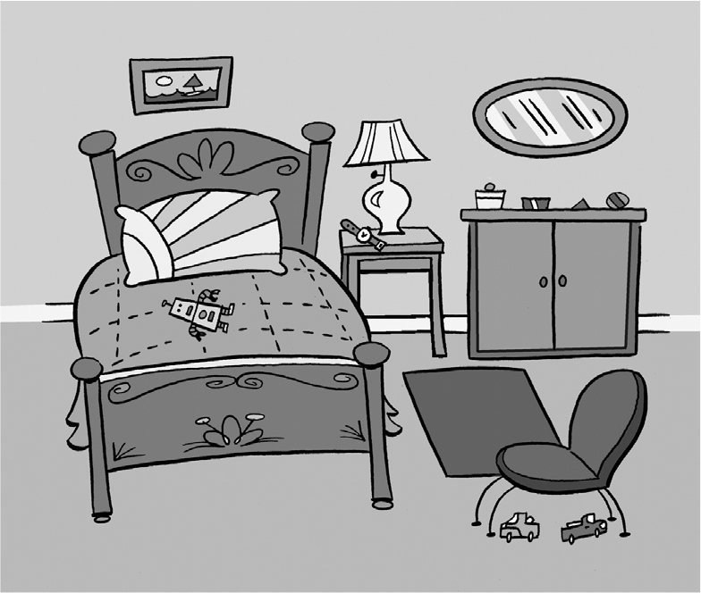

1\. This helps you see at night. *[lamp]{.underline}*

2\. You sleep in this. \_\_\_\_\_\_\_\_\_\_\_\_

3\. You stand on this. It's on the floor. \_\_\_\_\_\_\_\_\_\_\_\_

4\. You look at your face in this. \_\_\_\_\_\_\_\_\_\_\_\_

5\. This tells you the time. \_\_\_\_\_\_\_\_\_\_\_\_

6\. You can put your toys in this. \_\_\_\_\_\_\_\_\_\_\_\_

