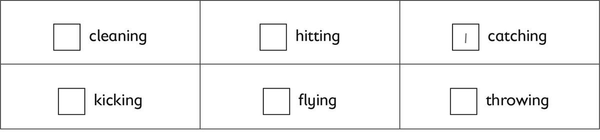
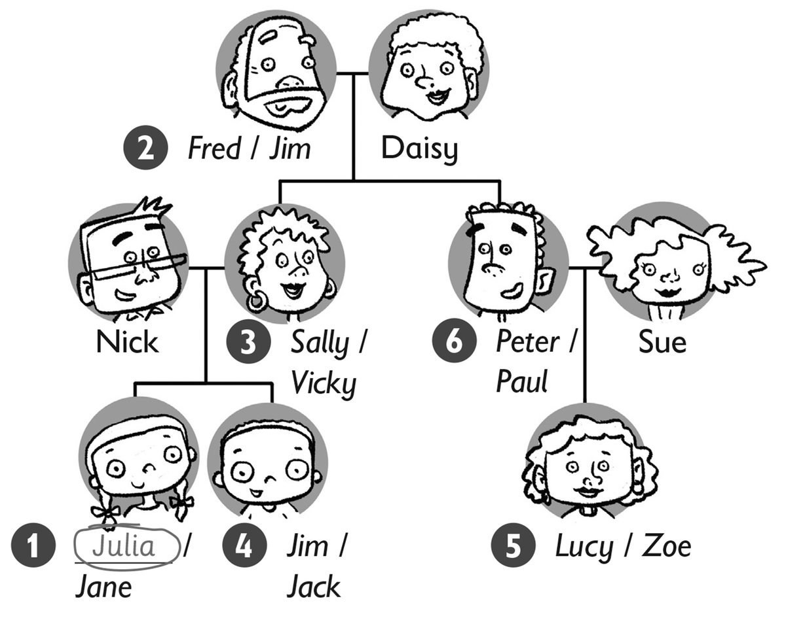
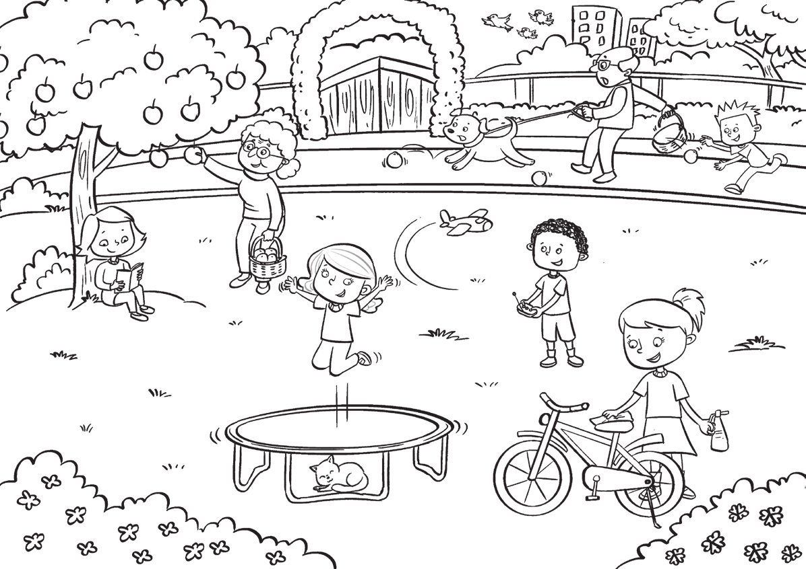

**[Vocabulary]{.underline}**

**1. Look and circle. There is one example.   (one point each)**

1\. Hugo is Frank's *[dad]{.underline}* / *brother*.

2\. Tony is Sam's *grandpa* / *cousin*.

*grandpa*

3\. Lenny is *May's* / *Frank's* cousin.

*Frank's*

4\. Kim is May's *grandma* / *mum*.

*mum*

5\. May is *Lenny's* / *Hugo's* sister.

*Lenny's*

6\. Lucy is *Sam's* / *Frank's* mum.

*Frank's*

**2. Look and write the number. There is one example.   (one point
each)**

*2. kick*

*3. jump*

*4. throw*

*5. hit*

*6. fly*

**3. Look and draw lines. There is one example.   (one point each)**

*2. my shoes*

*3. 5 km*

*4. on the sofa*

*5. in my bed*

*6. a ball*

**[Grammar]{.underline}**

**4. Look and write. There is one example.   (one point each)**

cleaning \| ~~flying~~ \| kicking \| reading \| sleeping \| throwing

1\. What's Grandpa doing?

    He's *[flying]{.underline}* a kite.

2\. What's Grandma doing?

    She's \_\_\_\_\_\_\_\_\_\_\_\_\_\_\_ the table.

*cleaning*

3\. What's the baby doing?

    She's \_\_\_\_\_\_\_\_\_\_\_\_\_\_\_ sleeping.

*sleeping*

4\. What's Mum doing?

    She's \_\_\_\_\_\_\_\_\_\_\_\_\_\_\_ a book.

*reading*

5\. What's Jack doing?

    He's \_\_\_\_\_\_\_\_\_\_\_\_\_\_\_ a ball.

*throwing*

6\. What's Paul doing?

    He's \_\_\_\_\_\_\_\_\_\_\_\_\_\_\_ a ball.

*kicking*

**5. Look and circle. There is one example.   (one point each)**

1\. He *['s]{.underline}* / *isn't* cleaning the car.    ✓

2\. I *'m* / *'m not* sitting in the park.     ✓

*'m*

3\. She *'s* / *isn't* reading her book.    ✗

*isn't*

4\. I *'m* / *'m not* sleeping!    ✗

*'m not*

5\. She *'s* / *isn't* playing football.    ✓

*'s*

6\. He *'s* / *isn't* flying a kite.    ✗

*isn't*

**[Listening]{.underline}**

**6. Listen and circle. There is one example.   (one point each)**

*2. Jim*

*3. Sally*

*4. Jack*

*5. Lucy*

*6. Paul*

**Audio script**

Hello. My name's Julia and this is my beautiful family!

Jim and Daisy are my grandparents. Jim is my grandpa and Daisy is my
grandma.

They're both seventy-five years old!

\[pause\]

My dad's name is Nick and my mum's name is Sally.

\[pause\]

I've got a baby brother. He's one year old! His name's Jack.

\[pause\]

I've got one cousin. Her name's Lucy. She hasn't got brothers or
sisters.

\[pause\]

Lucy's mum's name is Sue and her dad's name is Paul. Paul is my mum's
brother!

**7. Listen and write *yes* or *no*. There is one example.**

*2. no*

*3. yes*

*4. no*

*5. no*

*6. yes*

**Audio script**

1\. He's hitting a ball.

2\. He's reading a book.

3\. She's jumping.

4\. She's kicking a ball.

5\. He's throwing a ball.

6\. She's running.

**[Reading]{.underline}**

**8. Look. Put the letters in order. Write. There is one example.   (one
point each)**

1\. The dog is getting an        ronega *[orange]{.underline}*.

2\. One girl is cleaning her        kebi
\_\_\_\_\_\_\_\_\_\_\_\_\_\_\_\_.

*bike*

3\. One boy is flying a        enalp \_\_\_\_\_\_\_\_\_\_\_\_\_\_\_\_.

*plane*

4\. What's the girl doing under the tree?        edaring
\_\_\_\_\_\_\_\_\_\_\_\_\_\_\_\_

*reading*

5\. What's Grandma doing?        tegting
\_\_\_\_\_\_\_\_\_\_\_\_\_\_\_\_ an apple

*getting*

6\. Who is catching oranges?        a small oby
\_\_\_\_\_\_\_\_\_\_\_\_\_\_\_\_

*boy*

