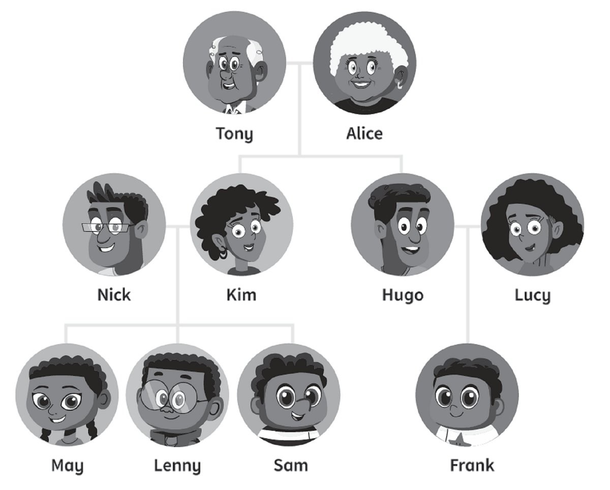
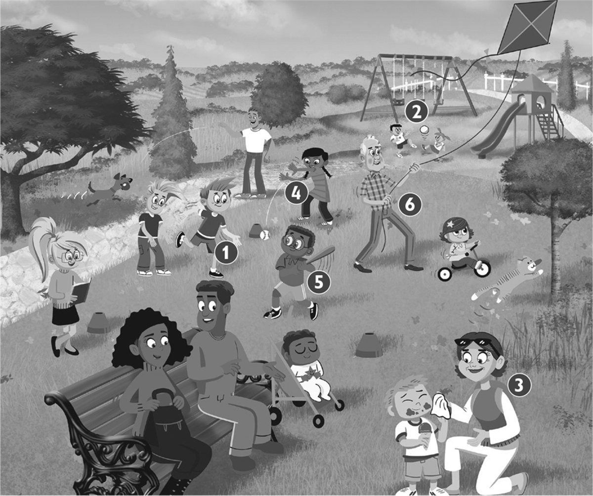
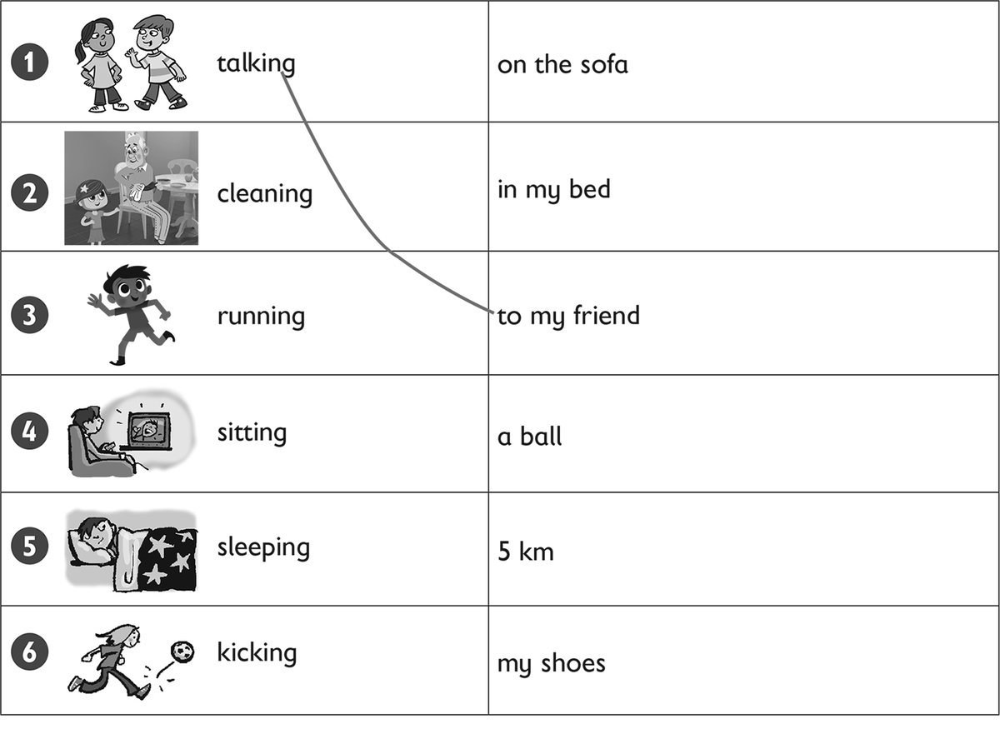
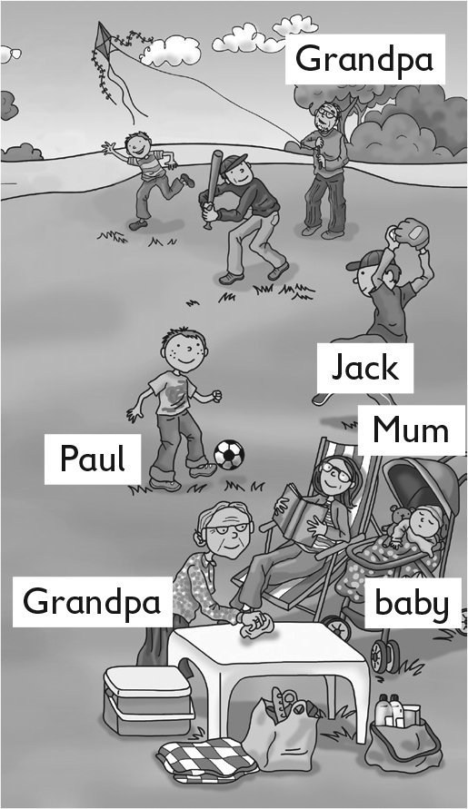
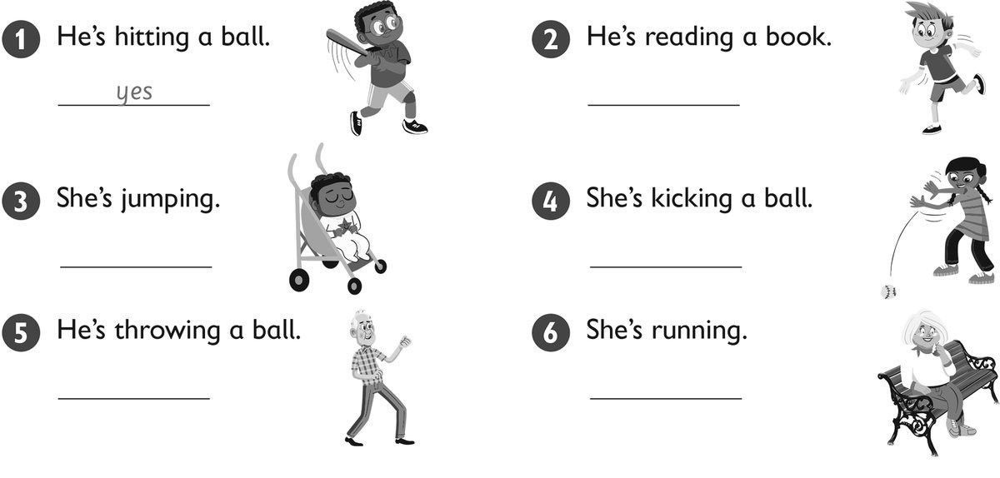

**[Vocabulary]{.underline}**

**1. Look and circle. There is one example.   (one point each)**

1\. Hugo is Frank's *[dad]{.underline}* / *brother*.

2\. Tony is Sam's *grandpa* / *cousin*.

3\. Lenny is *May's* / *Frank's* cousin.

4\. Kim is May's *grandma* / *mum*.

5\. May is *Lenny's* / *Hugo's* sister.

6\. Lucy is *Sam's* / *Frank's* mum.

**2. Look and write the number. There is one example.   (one point
each)**

**3. Look and draw lines. There is one example.   (one point each)**

**[Grammar]{.underline}**

**4. Look and write. There is one example.   (one point each)**

cleaning \| ~~flying~~ \| kicking \| reading \| sleeping \| throwing

1\. What's Grandpa doing?

    He's *[flying]{.underline}* a kite.

2\. What's Grandma doing?

    She's \_\_\_\_\_\_\_\_\_\_\_\_\_\_\_ the table.

3\. What's the baby doing?

    She's \_\_\_\_\_\_\_\_\_\_\_\_\_\_\_ sleeping.

4\. What's Mum doing?

    She's \_\_\_\_\_\_\_\_\_\_\_\_\_\_\_ a book.

5\. What's Jack doing?

    He's \_\_\_\_\_\_\_\_\_\_\_\_\_\_\_ a ball.

6\. What's Paul doing?

    He's \_\_\_\_\_\_\_\_\_\_\_\_\_\_\_ a ball.

**5. Look and circle. There is one example.   (one point each)**

1\. He *['s]{.underline}* / *isn't* cleaning the car.    ✓

2\. I *'m* / *'m not* sitting in the park.     ✓

3\. She *'s* / *isn't* reading her book.    ✗

4\. I *'m* / *'m not* sleeping!    ✗

5\. She *'s* / *isn't* playing football.    ✓

6\. He *'s* / *isn't* flying a kite.    ✗

**[Listening]{.underline}**

**6. Listen and circle. There is one example.   (one point each)**

**7. Listen and write *yes* or *no*. There is one example.**

**[Reading]{.underline}**

**8. Look. Put the letters in order. Write. There is one example.   (one
point each)**

1\. The dog is getting an        ronega *[orange]{.underline}*.

2\. One girl is cleaning her        kebi
\_\_\_\_\_\_\_\_\_\_\_\_\_\_\_\_.

3\. One boy is flying a        enalp \_\_\_\_\_\_\_\_\_\_\_\_\_\_\_\_.

4\. What's the girl doing under the tree?        edaring
\_\_\_\_\_\_\_\_\_\_\_\_\_\_\_\_

5\. What's Grandma doing?        tegting
\_\_\_\_\_\_\_\_\_\_\_\_\_\_\_\_ an apple

6\. Who is catching oranges?        a small oby
\_\_\_\_\_\_\_\_\_\_\_\_\_\_\_\_

