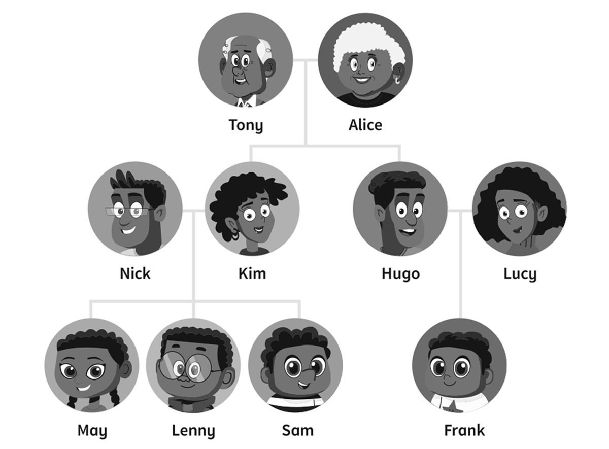
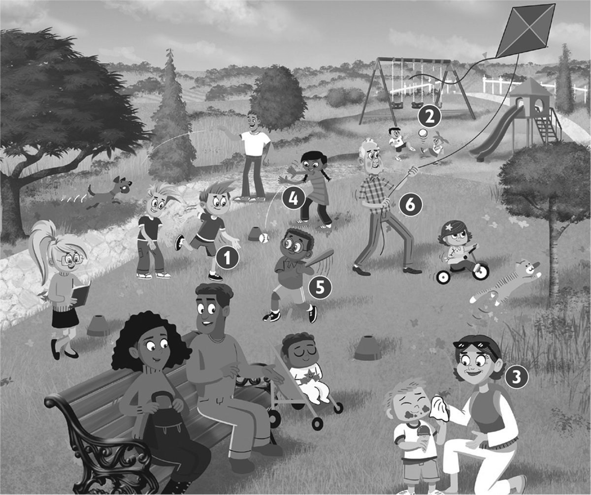
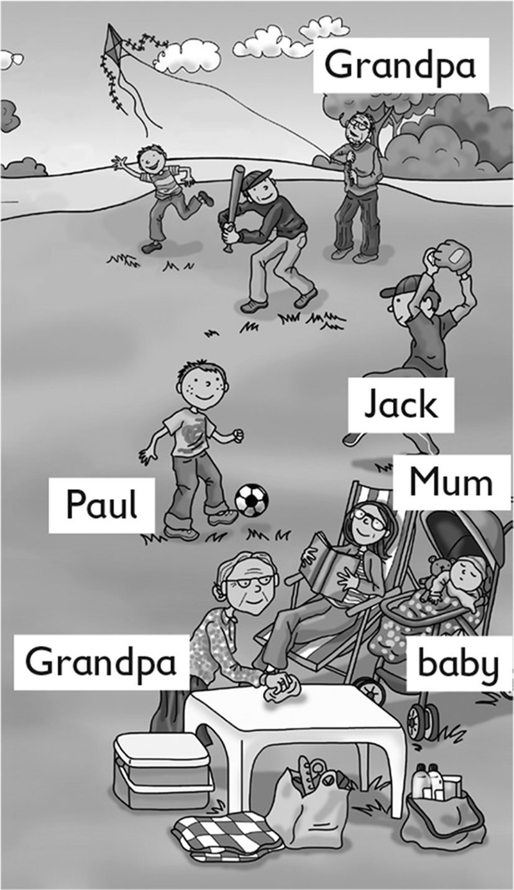

**[Vocabulary]{.underline}**

**1. Look and write. There is one example.   (one point each)**

1\. Hugo / Frank *[Hugo is Frank's dad.]{.underline}*

2\. Lenny / Frank \_\_\_\_\_\_\_\_\_\_\_\_\_\_\_.

*Tony is Sam's grandpa*

3\. May / Lenny \_\_\_\_\_\_\_\_\_\_\_\_\_\_\_.

*Lenny is Frank's cousin*

4\. Tony / Sam's \_\_\_\_\_\_\_\_\_\_\_\_\_\_\_.

*Kim is May's mum/mother*

5\. Kim / May \_\_\_\_\_\_\_\_\_\_\_\_\_\_\_.

*May is Lenny's sister*

6\. Lucy / Frank \_\_\_\_\_\_\_\_\_\_\_\_\_\_\_.

*Lucy is Frank's mum/mother*

**2. Look. Put the letters in order. Write the number. There is one
example.   (one point each)**

*2. kick*

*3. jump*

*4. throw*

*5. hit*

*6. fly*

**3. Look and match. Number the pictures. There is one example.   (one
point each)**

*2. clean my shoes*

*3. read a book*

*4. sit on the sofa*

*5. sleep in my bed*

*6. play football*

**[Grammar]{.underline}**

**4. Look and write. There are two extra words. There is one
example.   (one point each)**

clean \| ~~fly~~ \| hit \| jump \| kick \| read \| sleep \| throw

1\. What's Grandpa doing? He's *[flying]{.underline}* a kite.

2\. What's Grandma doing? She's*cleaning* the table.

3\. What's the baby doing? She's *sleeping* sleeping.

4\. What's Mum doing? She's *reading* a book.

5\. What's Jack doing? He's *throwing (kicking)* a ball.

6\. What's Paul doing? He's *kicking (throwing)* a ball.

**5. Look and write. There is one example.   (one point each)**

1\. ✓  He *['s cleaning]{.underline}* (clean) the car.

2\. ✓  I *'m sitting* (sit) in the park.

3\. ✗  She *isn't reading* (read) her book.

4\. ✗  I *'m not sleeping* (sleep)!

5\. ✓  She *'s playing* (play) football.

6\. ✗  He *isn't flying* (fly) a kite.

**[Listening]{.underline}**

**6. Listen and look. Then write. There is one example.   (one point
each)**

*2. Jim*

*3. Sally*

*4. Jack*

*5. Lucy*

*6. Paul*

**Audio script**

Hello. My name's Julia and this is my beautiful family!

Jim and Daisy are my grandparents. Jim is my grandpa and Daisy is my
grandma. They're both seventy-five years old!

My dad's name is Nick and my mum's name is Sally.

I've got a baby brother. He's one year old! His name's Jack.

I've got one cousin. Her name's Lucy. She hasn't got brothers or
sisters.

Lucy's mum's name is Sue and her dad's name is Paul. Paul is my mum's
brother!

**7. Listen and write *yes* or *no*. There is one example.   (one point
each)**

*2. no*

*3. yes*

*4. no*

*5. no*

*6. yes*

**Audio script**

He's hitting a ball.

He's reading a book.

She's jumping.

She's kicking a ball.

He's throwing a ball.

She's running.

**[Reading]{.underline}**

**8. Look. Then read and write. There is one example.   (one point
each)**

1\. The dog is getting an *[orange]{.underline}*.

2\. One girl is cleaning her \_\_\_\_\_\_\_\_\_\_\_\_\_\_\_.

*bike*

3\. One boy is flying a \_\_\_\_\_\_\_\_\_\_\_\_\_\_\_.

*plane*

4\. What's the girl doing under the tree? \_\_\_\_\_\_\_\_\_\_\_\_\_\_\_

*reading*

5\. What's grandma doing? \_\_\_\_\_\_\_\_\_\_\_\_\_\_\_ an apple

*getting*

6\. Who is catching oranges? a small \_\_\_\_\_\_\_\_\_\_\_\_\_\_\_

*boy*

