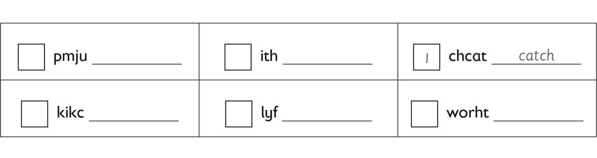
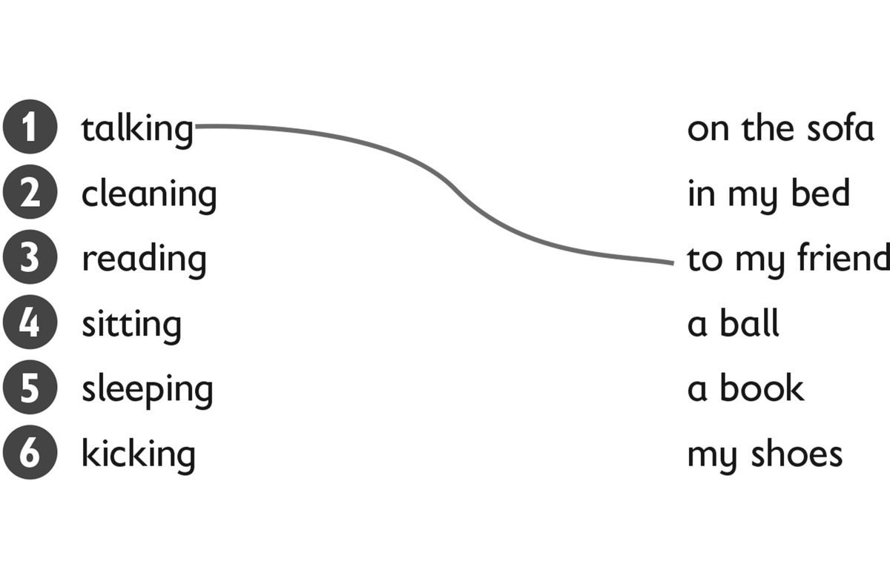
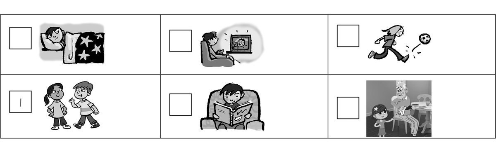
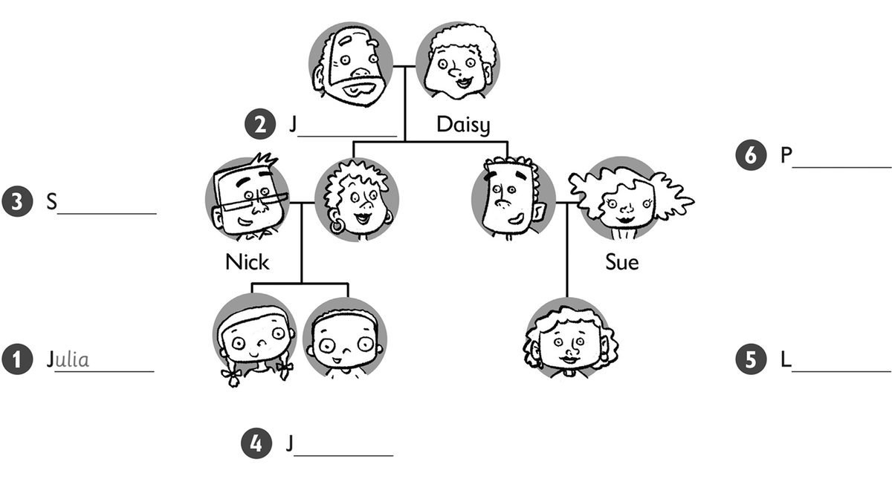
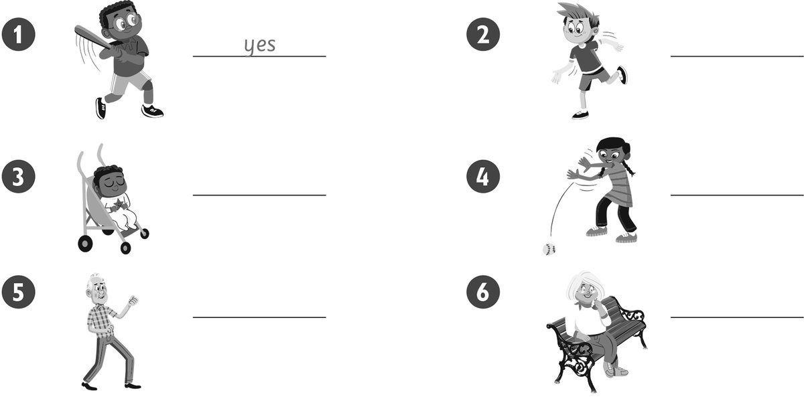

**[Vocabulary]{.underline}**

**1. Look and write. There is one example.   (one point each)**

1\. Hugo / Frank *[Hugo is Frank's dad.]{.underline}*

2\. Lenny / Frank \_\_\_\_\_\_\_\_\_\_\_\_\_\_\_.

3\. May / Lenny \_\_\_\_\_\_\_\_\_\_\_\_\_\_\_.

4\. Tony / Sam's \_\_\_\_\_\_\_\_\_\_\_\_\_\_\_.

5\. Kim / May \_\_\_\_\_\_\_\_\_\_\_\_\_\_\_.

6\. Lucy / Frank \_\_\_\_\_\_\_\_\_\_\_\_\_\_\_.

**2. Look. Put the letters in order. Write the number. There is one
example.   (one point each)**

**3. Look and match. Number the pictures. There is one example.   (one
point each)**

**[Grammar]{.underline}**

**4. Look and write. There are two extra words. There is one
example.   (one point each)**

clean \| ~~fly~~ \| hit \| jump \| kick \| read \| sleep \| throw

1\. What's Grandpa doing? He's *[flying]{.underline}* a kite.

2\. What's Grandma doing?
She's\_\_\_\_\_\_\_\_\_\_\_\_\_\_\_\_\_\_\_\_\_\_\_\_\_ the table.

3\. What's the baby doing? She's
\_\_\_\_\_\_\_\_\_\_\_\_\_\_\_\_\_\_\_\_\_\_\_\_\_ sleeping.

4\. What's Mum doing? She's
\_\_\_\_\_\_\_\_\_\_\_\_\_\_\_\_\_\_\_\_\_\_\_\_\_ a book.

5\. What's Jack doing? He's
\_\_\_\_\_\_\_\_\_\_\_\_\_\_\_\_\_\_\_\_\_\_\_\_\_ a ball.

6\. What's Paul doing? He's
\_\_\_\_\_\_\_\_\_\_\_\_\_\_\_\_\_\_\_\_\_\_\_\_\_ a ball.

**5. Look and write. There is one example.   (one point each)**

1\. ✓  He *['s cleaning]{.underline}* (clean) the car.

2\. ✓  I \_\_\_\_\_\_\_\_\_\_\_\_\_\_\_\_\_\_\_\_\_\_ (sit) in the park.

3\. ✗  She \_\_\_\_\_\_\_\_\_\_\_\_\_\_\_\_\_\_\_\_\_\_ (read) her book.

4\. ✗  I \_\_\_\_\_\_\_\_\_\_\_\_\_\_\_\_\_\_\_\_\_\_ (sleep)!

5\. ✓  She \_\_\_\_\_\_\_\_\_\_\_\_\_\_\_\_\_\_\_\_\_\_ (play) football.

6\. ✗  He \_\_\_\_\_\_\_\_\_\_\_\_\_\_\_\_\_\_\_\_\_\_ (fly) a kite.

**[Listening]{.underline}**

**6. Listen and look. Then write. There is one example.   (one point
each)**

**7. Listen and write *yes* or *no*. There is one example.   (one point
each)**

**[Reading]{.underline}**

**8. Look. Then read and write. There is one example.   (one point
each)**

1\. The dog is getting an *[orange]{.underline}*.

2\. One girl is cleaning her \_\_\_\_\_\_\_\_\_\_\_\_\_\_\_.

3\. One boy is flying a \_\_\_\_\_\_\_\_\_\_\_\_\_\_\_.

4\. What's the girl doing under the tree? \_\_\_\_\_\_\_\_\_\_\_\_\_\_\_

5\. What's grandma doing? \_\_\_\_\_\_\_\_\_\_\_\_\_\_\_ an apple

6\. Who is catching oranges? a small \_\_\_\_\_\_\_\_\_\_\_\_\_\_\_

