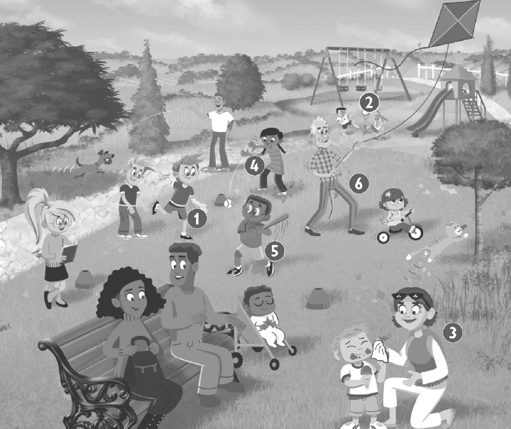
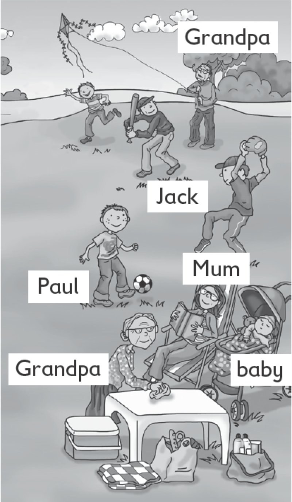
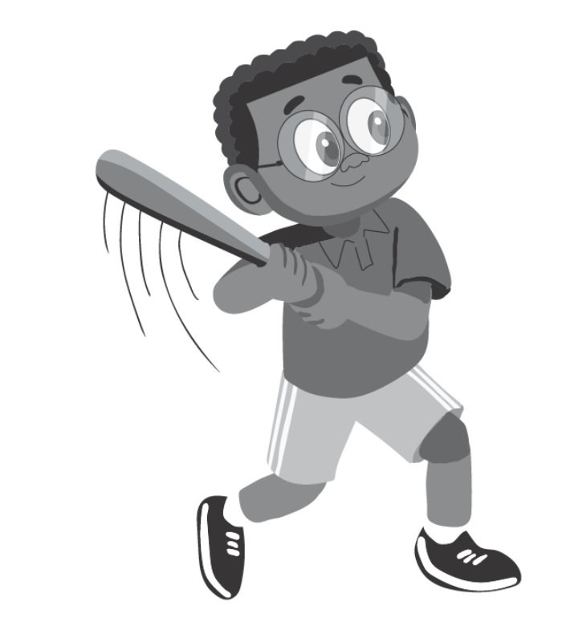
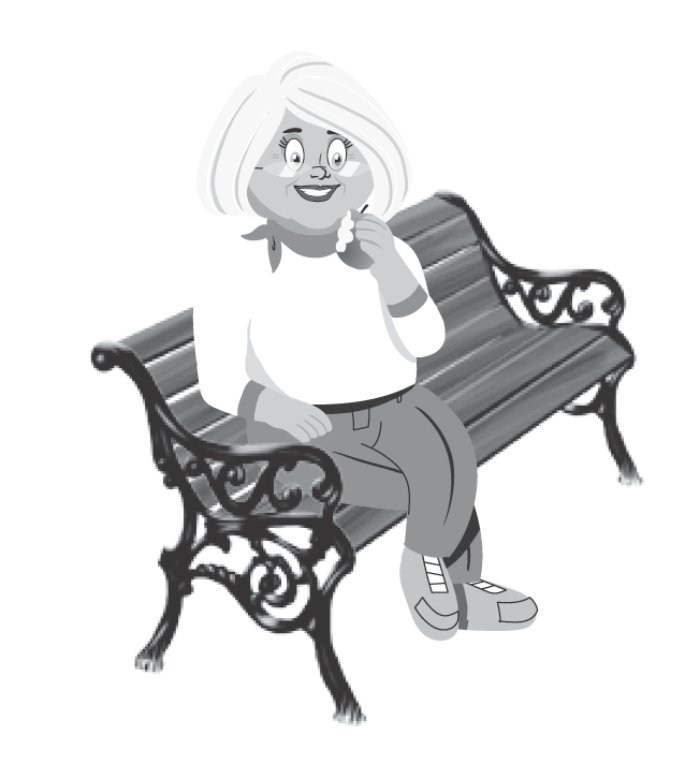

**[Vocabulary]{.underline}**

**1. Look and write. There is one example.   (one point each)**

1\. 1. Hugo is Frank's *[dad]{.underline}*.

2\. 2. Tony is Sam's *grandpa*.

3\. 3. Lenny is *Frank's* cousin.

4\. 4. Kim is May's *mum*.

5\. 5. May is *Lenny's / Sam's* sister.

6\. 6. Lucy is *Frank's* mum.

**2. Look. Put the letters in order. Write. There is one example.   (one
point each)**

1\. 1. chcat *[catching]{.underline}*

2\. 2. ckik \_\_\_\_\_\_\_\_\_\_\_\_\_\_\_ ing

*kicking*

3\. 3. nleca \_\_\_\_\_\_\_\_\_\_\_\_\_\_\_ ing

*cleaning*

4\. 4. worht \_\_\_\_\_\_\_\_\_\_\_\_\_\_\_ ing

*throwing*

5\. 5. itht \_\_\_\_\_\_\_\_\_\_\_\_\_\_\_ ing

*hitting*

6\. 6. lyf \_\_\_\_\_\_\_\_\_\_\_\_\_\_\_ ing

*flying*

**3. Look, circle and number the pictures. There is one example.   (one
point each)**

1\. *cleaning* / *[talking]{.underline}* to my friend

2\. *cleaning* / *reading* my shoes

*cleaning my shoes*

3\. *running* / *kicking* a ball

*getting a ball*

4\. *sitting* / *flying* on the sofa

*sitting on the sofa*

5\. *sleeping* / *swimming* in my bed

*sleeping in my bed*

6\. *running* / *jumping* 5 km

*running 5 km*

**[Grammar]{.underline}**

**4. Look and write. There are two extra words. There is one
example.   (one point each)**

cleaning \| ~~flying~~ \| hitting \| jumping \| kicking \| reading \|
sleeping \| throwing

1\. What's Grandpa doing?

    He's *[flying]{.underline}* a kite.

2\. What's Grandma doing?

    She's \_\_\_\_\_\_\_\_\_\_\_\_ the table.

*cleaning*

3\. What's the baby doing?

    She's \_\_\_\_\_\_\_\_\_\_\_\_ sleeping.

*sleeping*

4\. What's Mum doing?

    She's \_\_\_\_\_\_\_\_\_\_\_\_ a book.

*reading*

5\. What's Jack doing?

    He's \_\_\_\_\_\_\_\_\_\_\_\_ a ball.

*throwing*

6\. What's Paul doing?

    He's \_\_\_\_\_\_\_\_\_\_\_\_ a ball.

*kicking*

**5. Look. Write '*m*, '*m not*, '*s*, *isn't*. There is one
example.   (one point each)**

1\. ✓  He *['s]{.underline}* cleaning the car.

2\. ✓  I' *'m* sitting in the park.

3\. ✗  She *isn't* reading her book.

4\. ✗  I *'m not* sleeping!

5\. ✓  She *'s* playing football.

6\. ✗  He *isn't* flying a kite.

**[Listening]{.underline}**

**6. Listen and look. Then write. There is one example.   (one point
each)**

Jack \| Jim \| ~~Julia~~ \| Lucy \| Paul \| Sally

*2. Jim*

*3. Sally*

*4. Jack*

*5. Lucy*

*6. Paul*

**Audio script**

Hello. My name's Julia and this is my beautiful family!

Jim and Daisy are my grandparents. Jim is my grandpa and Daisy is my
grandma. They're both seventy-five years old!

\[pause\]

My dad's name is Nick and my mum's name is Sally.

\[pause\]

I've got a baby brother. He's one year old! His name's Jack.

\[pause\]

I've got one cousin. Her name's Lucy. She hasn't got brothers or
sisters.

\[pause\]

Lucy's mum's name is Sue and her dad's name is Paul. Paul is my mum's
brother!

**7. Listen and write *yes* or *no*. There is one example.   (one point
each)**

1\. He's hitting a ball.

    *[yes]{.underline}*

2\. He's reading a book.

    \_\_\_\_\_\_\_\_\_\_\_\_

*no*

3\. She's jumping.

\_\_\_\_\_\_\_\_\_\_\_\_

*yes*

4\. She's kicking a ball.

    \_\_\_\_\_\_\_\_\_\_\_\_

*no*

5\. He's throwing a ball.

    \_\_\_\_\_\_\_\_\_\_\_\_

*no*

6\. She's running.

    \_\_\_\_\_\_\_\_\_\_\_\_

*yes*

**Audio script**

1\. He's hitting a ball.

2\. He's reading a book.

3\. She's jumping.

4\. She's kicking a ball.

5\. He's throwing a ball.

6\. She's running.

**[Reading]{.underline}**

**8. Look. Then read and write. There is one example    (one point
each)**

1\. The dog is getting an       **o***[range]{.underline}*.

2\. One girl is cleaning her      **b**\_\_\_\_\_\_\_\_\_\_\_\_.

*bike*

3\. One boy is flying a      **p**\_\_\_\_\_\_\_\_\_\_\_\_.

*plane*

4\. What's the girl doing under the
tree?      **r**\_\_\_\_\_\_\_\_\_\_\_\_.

*reading*

5\. What's grandma doing?      **g**\_\_\_\_\_\_\_\_\_\_\_\_ an apple

*getting*

6\. Who is catching oranges?      a small **b**\_\_\_\_\_\_\_\_\_\_\_\_

*boy*

