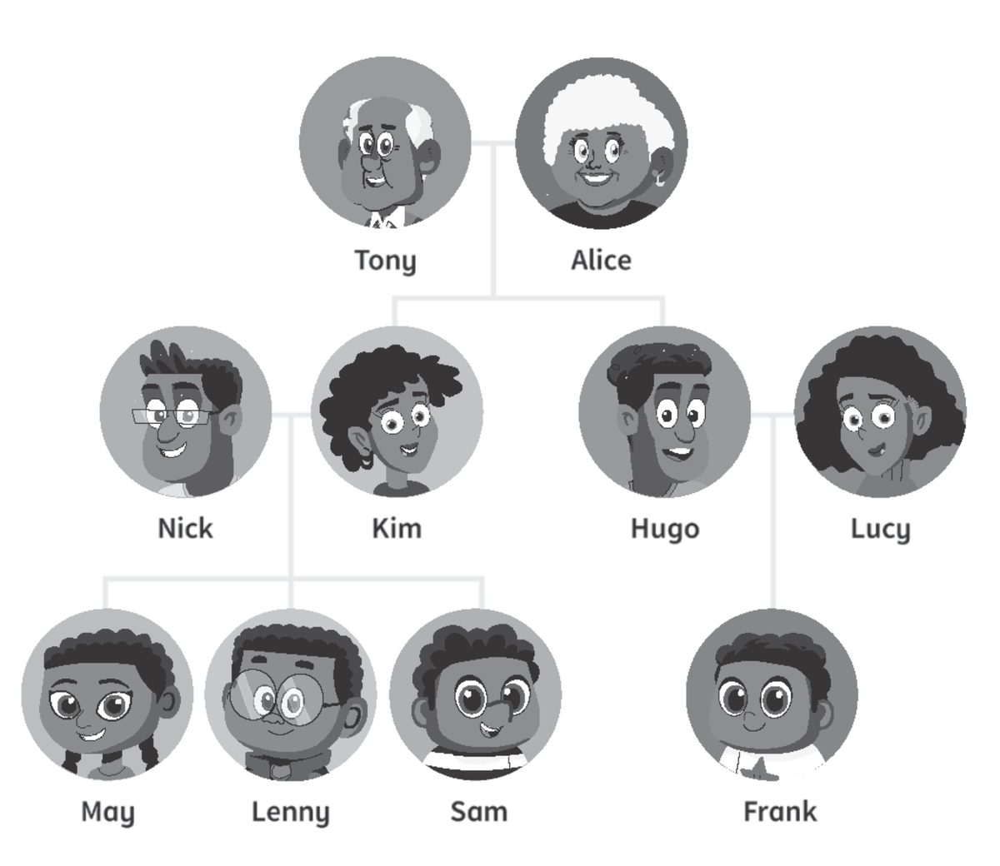
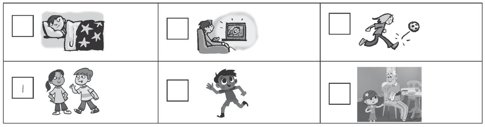
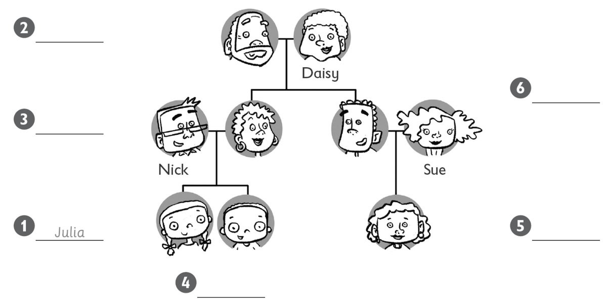
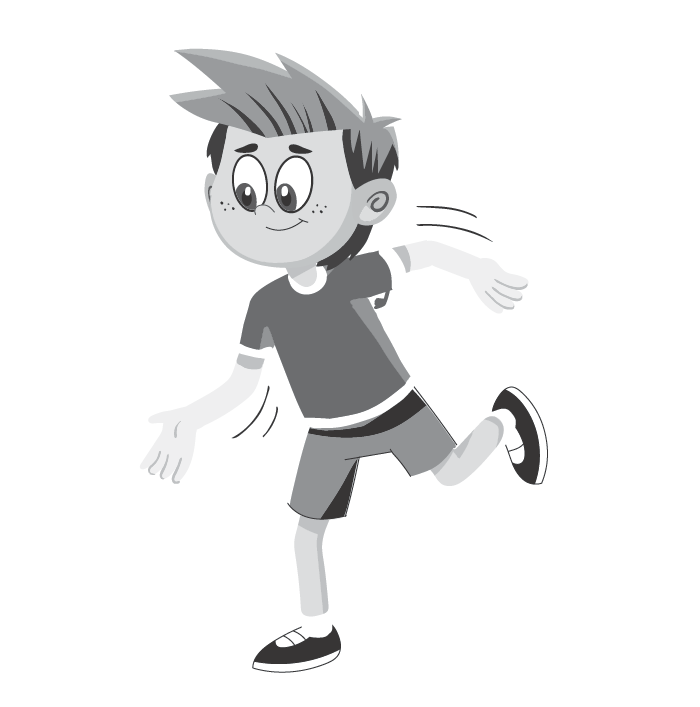
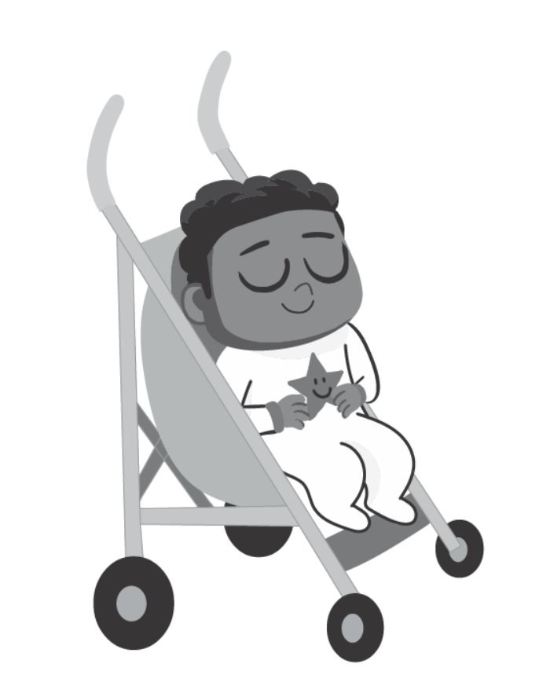
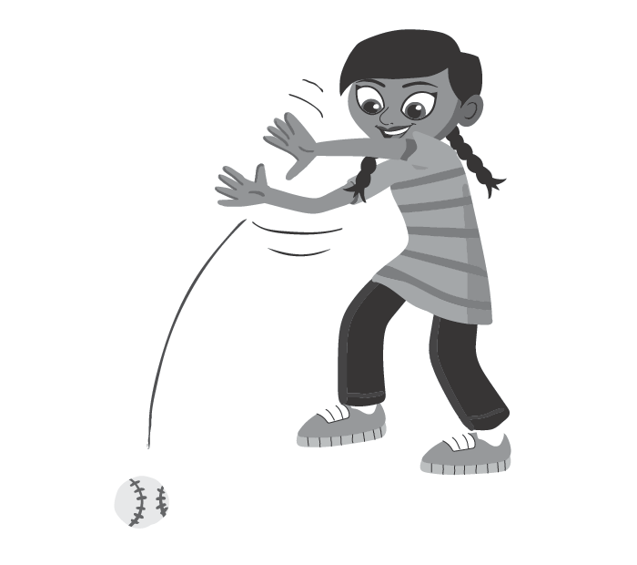
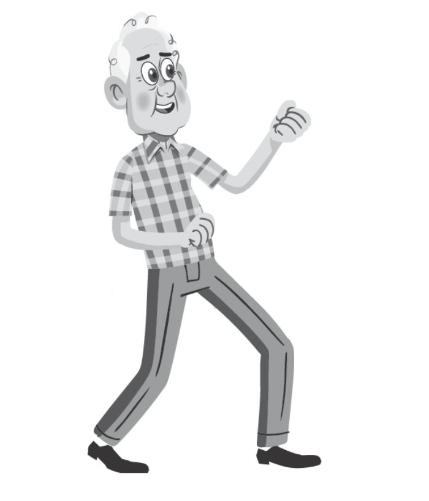
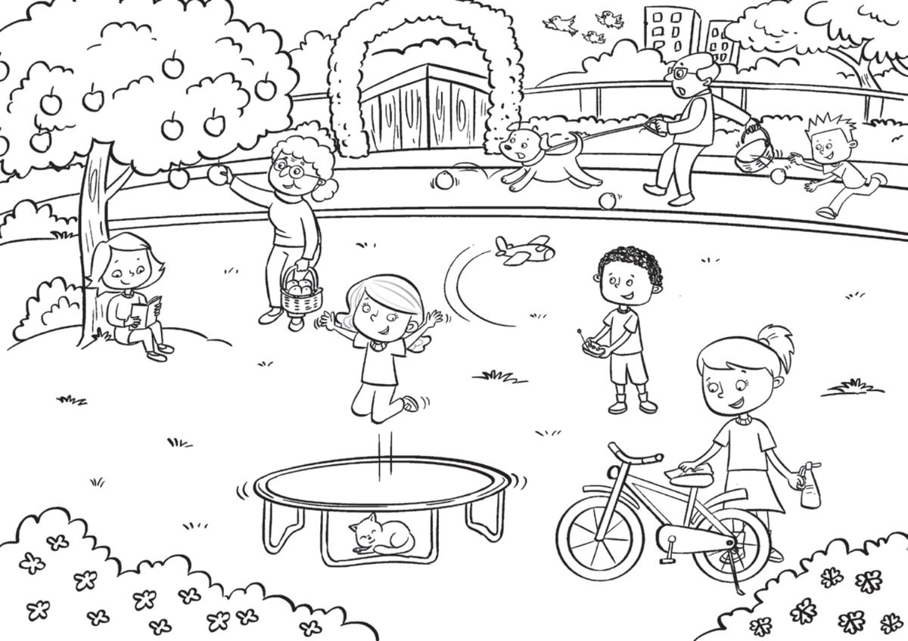

**[Vocabulary]{.underline}**

**1. Look and write. There is one example.   (one point each)**

1\. 1. Hugo is Frank's *[dad]{.underline}*.

2\. 2. Tony is Sam's \_\_\_\_\_\_\_\_\_\_\_\_\_\_\_\_\_\_\_\_\_\_.

3\. 3. Lenny is \_\_\_\_\_\_\_\_\_\_\_\_\_\_\_\_\_\_\_\_\_\_ cousin.

4\. 4. Kim is May's \_\_\_\_\_\_\_\_\_\_\_\_\_\_\_\_\_\_\_\_\_\_.

5\. 5. May is \_\_\_\_\_\_\_\_\_\_\_\_\_\_\_\_\_\_\_\_\_\_ sister.

6\. 6. Lucy is \_\_\_\_\_\_\_\_\_\_\_\_\_\_\_\_\_\_\_\_\_\_ mum.

**2. Look. Put the letters in order. Write. There is one example.   (one
point each)**

1\. 1. chcat *[catching]{.underline}*

2\. 2. ckik \_\_\_\_\_\_\_\_\_\_\_\_\_\_\_ ing

3\. 3. nleca \_\_\_\_\_\_\_\_\_\_\_\_\_\_\_ ing

4\. 4. worht \_\_\_\_\_\_\_\_\_\_\_\_\_\_\_ ing

5\. 5. itht \_\_\_\_\_\_\_\_\_\_\_\_\_\_\_ ing

6\. 6. lyf \_\_\_\_\_\_\_\_\_\_\_\_\_\_\_ ing

**3. Look, circle and number the pictures. There is one example.   (one
point each)**

1\. *cleaning* / *[talking]{.underline}* to my friend

2\. *cleaning* / *reading* my shoes

3\. *running* / *kicking* a ball

4\. *sitting* / *flying* on the sofa

5\. *sleeping* / *swimming* in my bed

6\. *running* / *jumping* 5 km

**[Grammar]{.underline}**

**4. Look and write. There are two extra words. There is one
example.   (one point each)**

cleaning \| ~~flying~~ \| hitting \| jumping \| kicking \| reading \|
sleeping \| throwing

1\. What's Grandpa doing?

    He's *[flying]{.underline}* a kite.

2\. What's Grandma doing?

    She's \_\_\_\_\_\_\_\_\_\_\_\_ the table.

3\. What's the baby doing?

    She's \_\_\_\_\_\_\_\_\_\_\_\_ sleeping.

4\. What's Mum doing?

    She's \_\_\_\_\_\_\_\_\_\_\_\_ a book.

5\. What's Jack doing?

    He's \_\_\_\_\_\_\_\_\_\_\_\_ a ball.

6\. What's Paul doing?

    He's \_\_\_\_\_\_\_\_\_\_\_\_ a ball.

**5. Look. Write '*m*, '*m not*, '*s*, *isn't*. There is one
example.   (one point each)**

1\. ✓  He *['s]{.underline}* cleaning the car.

2\. ✓  I' \_\_\_\_\_\_\_\_\_\_\_\_\_ sitting in the park.

3\. ✗  She \_\_\_\_\_\_\_\_\_\_\_\_\_ reading her book.

4\. ✗  I \_\_\_\_\_\_\_\_\_\_\_\_\_ sleeping!

5\. ✓  She \_\_\_\_\_\_\_\_\_\_\_\_\_ playing football.

6\. ✗  He \_\_\_\_\_\_\_\_\_\_\_\_\_ flying a kite.

**[Listening]{.underline}**

**6. Listen and look. Then write. There is one example.   (one point
each)**

Jack \| Jim \| ~~Julia~~ \| Lucy \| Paul \| Sally

**7. Listen and write *yes* or *no*. There is one example.   (one point
each)**

1\. He's hitting a ball.

    *[yes]{.underline}*

2\. He's reading a book.

    \_\_\_\_\_\_\_\_\_\_\_\_

3\. She's jumping.

\_\_\_\_\_\_\_\_\_\_\_\_

4\. She's kicking a ball.

    \_\_\_\_\_\_\_\_\_\_\_\_

5\. He's throwing a ball.

    \_\_\_\_\_\_\_\_\_\_\_\_

6\. She's running.

    \_\_\_\_\_\_\_\_\_\_\_\_

**[Reading]{.underline}**

**8. Look. Then read and write. There is one example    (one point
each)**

1\. The dog is getting an       **o***[range]{.underline}*.

2\. One girl is cleaning her      **b**\_\_\_\_\_\_\_\_\_\_\_\_.

3\. One boy is flying a      **p**\_\_\_\_\_\_\_\_\_\_\_\_.

4\. What's the girl doing under the
tree?      **r**\_\_\_\_\_\_\_\_\_\_\_\_.

5\. What's grandma doing?      **g**\_\_\_\_\_\_\_\_\_\_\_\_ an apple

6\. Who is catching oranges?      a small **b**\_\_\_\_\_\_\_\_\_\_\_\_

