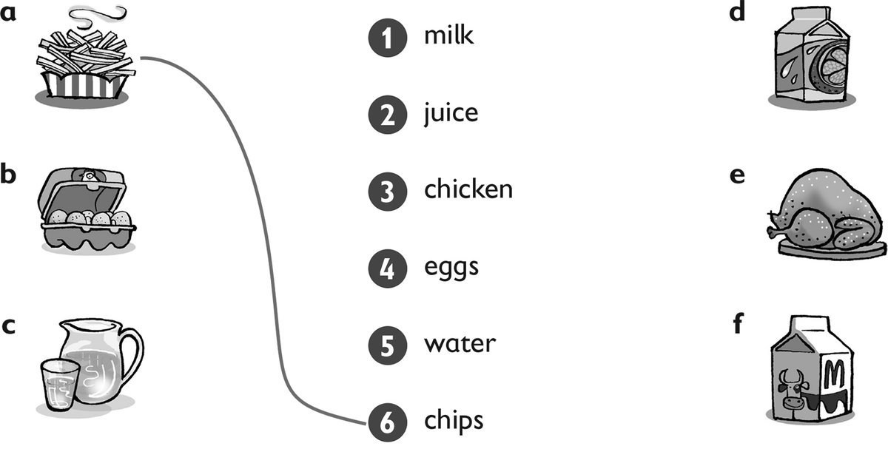
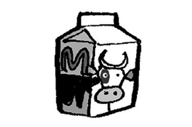
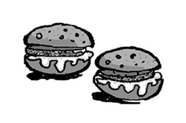
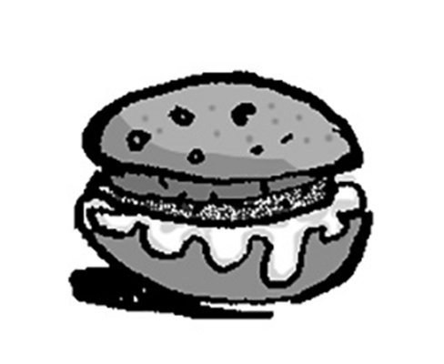
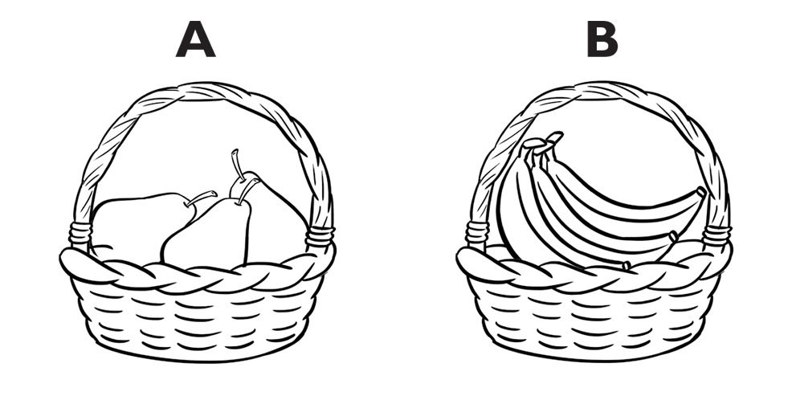
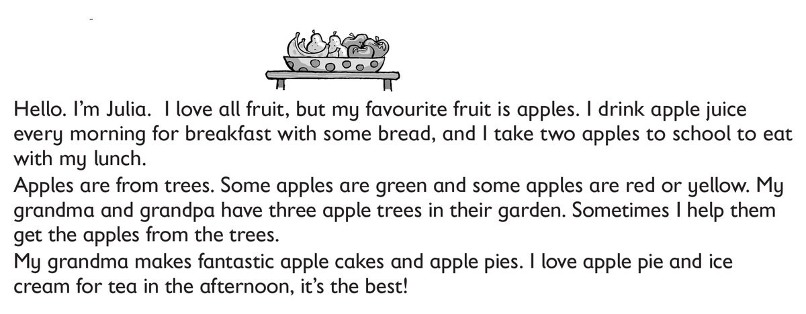

**[Vocabulary]{.underline}**

**1. Read and draw lines. There is one example.    (one point each)**

*b -- 4, c -- 5, d -- 2, e -- 3, f -- 1*

**2. Look and read. Circle. There is one example.    (one point each)**

1\. This is *juice* / *[milk]{.underline}*.

2\. This is *a fish* / *a chicken*.

*a fish*

3\. These are *tomatoes* / *lemons*.

*lemons*

4\. These are *carrots* / *oranges*.

*carrots*

5\. This is *bread* / *rice*.

*bread*

6\. These are *burgers* / *meatballs*.

*burgers*

**3. Read, draw and write. There is one example.    (one point each)**

lunch \| dinner \| ~~breakfast~~

1\. I eat an egg and bread for *[breakfast]{.underline}*.

2\. I eat a burger and an apple for \_\_\_\_\_\_\_\_\_\_\_\_.

*lunch*

3\. I eat fish and carrots for \_\_\_\_\_\_\_\_\_\_\_\_.

*dinner*

**[Grammar]{.underline}**

**4. Complete the sentences. There is one example.   (one point each)**

1\. *[Can]{.underline}* I have some chips, please?

2\. *Can* *I* have some meatballs, please?

3\. *Can* *I* *have* some rice, please?

4\. *Can* *I* *have* *some* millk, please?

5\. *Can* *I* *have* *some* bread, *please*?

6\. *Can* *I* *have* *some* water and *some* eggs, *please*?

**5. Read and write the numbers. Tick the bag. There is one
example.   (one point each)**

[    *1*   ]{.underline} Can I have some fruit, please?

\_\_\_\_\_ Thank you.

\_\_\_\_\_ Which fruit? Pears or bananas?

\_\_\_\_\_ Yes, here you are.

\_\_\_\_\_ Bananas, please.

*5*

*2*

*4*

*3*

**[Listening]{.underline}**

**6. Listen and number. There is one example.   (one point each)**

*bananas*

*carrots*

*eggs*

*water*

*pears*

**Audio script**

1\. These come from potatoes. You can eat them with meat or fish.

2\. These are a fruit. They're long and yellow.

3\. These are a vegetable. They're long and orange.

4\. These are from a chicken. People eat them for breakfast.

5\. You drink this. It's good for you.

6\. These are from trees. They're a green fruit.

**7. Listen and circle. There is one example.    (one point each)**

*juice*

*bread*

*ice cream*

*chips*

*apples*

**Audio script**

**1**

**Woman:** Hello. Can I have an *orange*, please?

**Man:** Yes. Here you are.

**Woman:** Thank you.

\[pause\]

**2**

**Boy:** Dad, can I have some *juice*, please?

**Dad:** Yes. Here you are.

**Boy:** Thanks.

**3**

**Boy:** Mum, can I have some *bread*, please?

**Mum:** Yes. Here you are.

**Boy:** Thank you!

**4**

**Girl:** Can I have some *ice cream*, please?

**Man:** Yes. Here you are.

**Girl:** Great!

**5**

**Boy:** Excuse me. Can I have some *chips* with my fish, please?

**Woman:** Yes. Here you are.

**Boy:** Thanks.

**6**

**Man:** Can I have some fruit, please?

**Woman:** Yes. Bananas, apples or pears?

**Man:** Two *apples*, please.

**Woman:** Here you are.

**Man:** Thank you.

**[Reading]{.underline}**

**8. Read and complete the words. There is one example.   (one point
each)**

1\. What is Julia's favourite fruit? a*[pples]{.underline}*

2\. What does she drink for breakfast? apple j\_\_\_\_\_\_\_\_\_\_

*juice*

3\. How many apples does she take to school? t\_\_\_\_\_\_\_\_\_\_

*two*

4\. Where are apples from? tr\_\_\_\_\_\_\_\_\_\_

*trees*

5\. Who has three apple trees? Grandma and Gr\_\_\_\_\_\_\_\_\_\_

*Grandpa*

6\. What does Julia love to eat for tea? apple pie and ice
\_\_\_\_\_\_\_\_\_\_

*cream*

