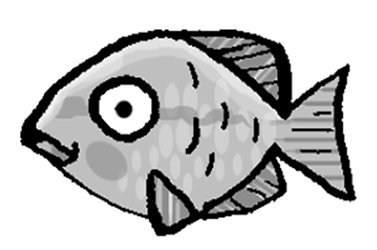
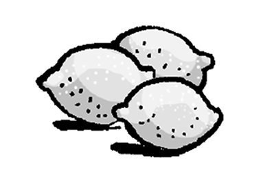
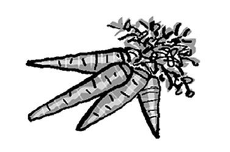
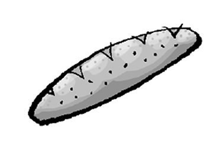
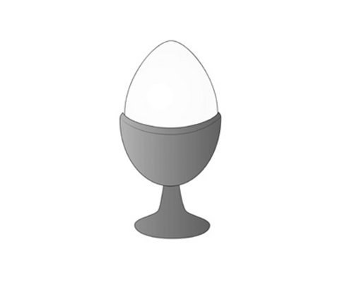
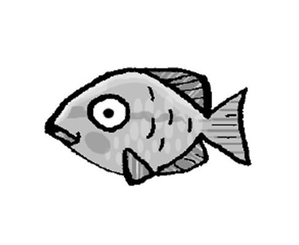
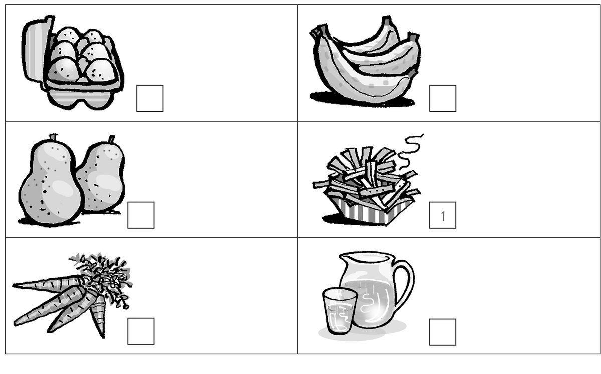
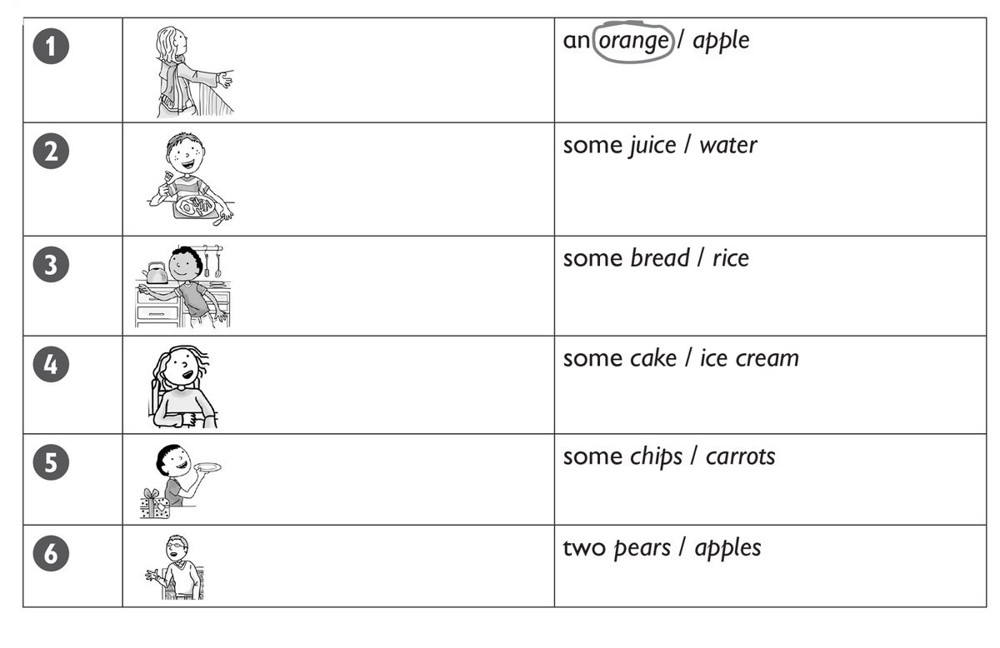

**[Vocabulary]{.underline}**

**1. Read and draw lines. There is one example.    (one point each)**

**2. Look and read. Circle. There is one example.    (one point each)**

1\. This is *juice* / *[milk]{.underline}*.

2\. This is *a fish* / *a chicken*.

3\. These are *tomatoes* / *lemons*.

4\. These are *carrots* / *oranges*.

5\. This is *bread* / *rice*.

6\. These are *burgers* / *meatballs*.

**3. Read, draw and write. There is one example.    (one point each)**

lunch \| dinner \| ~~breakfast~~

1\. I eat an egg and bread for *[breakfast]{.underline}*.

2\. I eat a burger and an apple for \_\_\_\_\_\_\_\_\_\_\_\_.

3\. I eat fish and carrots for \_\_\_\_\_\_\_\_\_\_\_\_.

**[Grammar]{.underline}**

**4. Complete the sentences. There is one example.   (one point each)**

1\. *[Can]{.underline}* I have some chips, please?

2\. \_\_\_\_\_\_\_\_\_\_\_\_\_\_ \_\_\_\_\_\_\_\_\_\_\_\_\_\_ have some
meatballs, please?

3\. \_\_\_\_\_\_\_\_\_\_\_\_\_\_ \_\_\_\_\_\_\_\_\_\_\_\_\_\_
\_\_\_\_\_\_\_\_\_\_\_\_\_\_ some rice, please?

4\. \_\_\_\_\_\_\_\_\_\_\_\_\_\_ \_\_\_\_\_\_\_\_\_\_\_\_\_\_
\_\_\_\_\_\_\_\_\_\_\_\_\_\_ \_\_\_\_\_\_\_\_\_\_\_\_\_\_ millk, please?

5\. \_\_\_\_\_\_\_\_\_\_\_\_\_\_ \_\_\_\_\_\_\_\_\_\_\_\_\_\_
\_\_\_\_\_\_\_\_\_\_\_\_\_\_ \_\_\_\_\_\_\_\_\_\_\_\_\_\_ bread,
\_\_\_\_\_\_\_\_\_\_\_\_\_\_?

6\. \_\_\_\_\_\_\_\_\_\_\_\_\_\_ \_\_\_\_\_\_\_\_\_\_\_\_\_\_
\_\_\_\_\_\_\_\_\_\_\_\_\_\_ \_\_\_\_\_\_\_\_\_\_\_\_\_\_ water and
\_\_\_\_\_\_\_\_\_\_\_\_\_\_ eggs, \_\_\_\_\_\_\_\_\_\_\_\_\_\_?

**5. Read and write the numbers. Tick the bag. There is one
example.   (one point each)**

[    *1*   ]{.underline} Can I have some fruit, please?

\_\_\_\_\_ Thank you.

\_\_\_\_\_ Which fruit? Pears or bananas?

\_\_\_\_\_ Yes, here you are.

\_\_\_\_\_ Bananas, please.

**[Listening]{.underline}**

**6. Listen and number. There is one example.   (one point each)**

**7. Listen and circle. There is one example.    (one point each)**

**[Reading]{.underline}**

**8. Read and complete the words. There is one example.   (one point
each)**

1\. What is Julia's favourite fruit? a*[pples]{.underline}*

2\. What does she drink for breakfast? apple j\_\_\_\_\_\_\_\_\_\_

3\. How many apples does she take to school? t\_\_\_\_\_\_\_\_\_\_

4\. Where are apples from? tr\_\_\_\_\_\_\_\_\_\_

5\. Who has three apple trees? Grandma and Gr\_\_\_\_\_\_\_\_\_\_

6\. What does Julia love to eat for tea? apple pie and ice
\_\_\_\_\_\_\_\_\_\_

