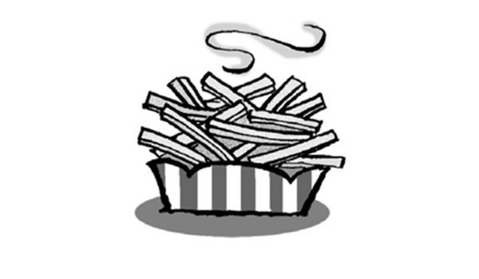
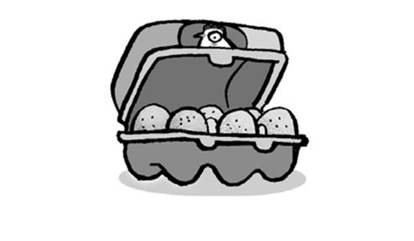
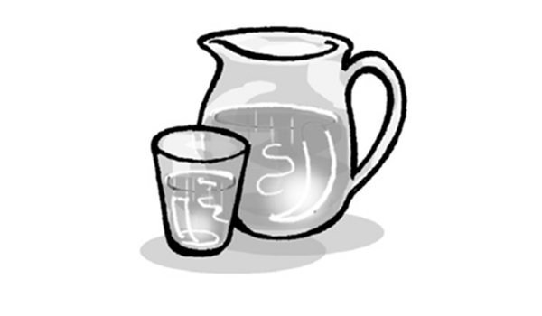
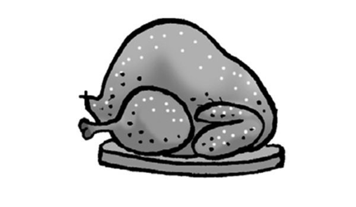
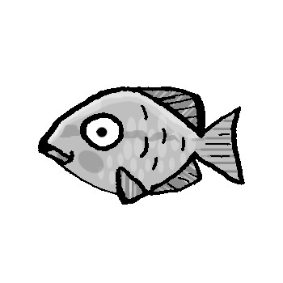
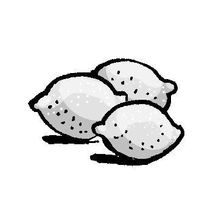
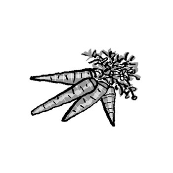
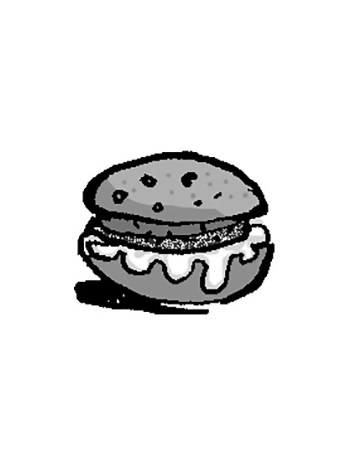
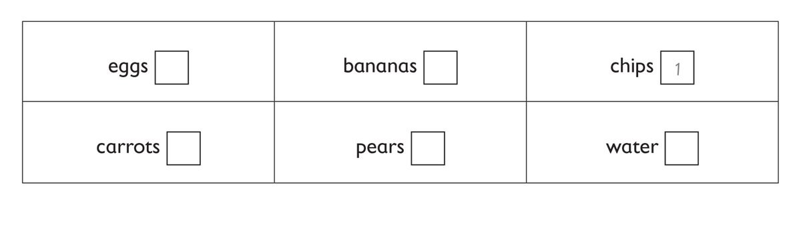

**[Vocabulary]{.underline}**

**1. Write the words. There is one example.   (one point each)**

  -------------------------------------------------------------------------------------------------------------------------------------------------------------------------------------------------------------------- -- ----------------------------------------------------------------------------------------------------------------------------------------------------------------------------------------------------------------- -- -----------------------------------------------------------------------------------------------------------------------------------------------------------------------------------------------------------------
   1.            
  *[chips]{.underline}*                                                                                                                                                                                                   2. *eggs*                                                                                                                                                                                                            3. *water*

  -------------------------------------------------------------------------------------------------------------------------------------------------------------------------------------------------------------------- -- ----------------------------------------------------------------------------------------------------------------------------------------------------------------------------------------------------------------- -- -----------------------------------------------------------------------------------------------------------------------------------------------------------------------------------------------------------------

  ----------------------------------------------------------------------------------------------------------------------------------------------------------------------------------------------------------------- -- ----------------------------------------------------------------------------------------------------------------------------------------------------------------------------------------------------------------- -- -----------------------------------------------------------------------------------------------------------------------------------------------------------------------------------------------------------------
              
  4. *juice*                                                                                                                                                                                                           5. *chicken*                                                                                                                                                                                                         6. *milk*

  ----------------------------------------------------------------------------------------------------------------------------------------------------------------------------------------------------------------- -- ----------------------------------------------------------------------------------------------------------------------------------------------------------------------------------------------------------------- -- -----------------------------------------------------------------------------------------------------------------------------------------------------------------------------------------------------------------

**2. Look and read. Write *This* / *These*. Tick or cross. There is one
example.   (one point each)**

1\. *[This]{.underline}* is milk. *[✓]{.underline}*

2\. \_\_\_\_\_ is a fish. \_\_\_\_\_\_

*This ✓*

3\. \_\_\_\_\_ are potatoes. \_\_\_\_\_\_

*These ✗*

4\. \_\_\_\_\_ are carrots. \_\_\_\_\_\_

*These ✓*

5\. \_\_\_\_\_ is bread. \_\_\_\_\_\_

*This ✓*

6\. \_\_\_\_\_ are meatballs. \_\_\_\_\_\_

*These ✗*

**3. Put the letters in order. Then read, write and draw. There is one
example.   (one point each)**

uchln \| nerdin \| ~~rabefskat~~

1\. I eat an egg and bread for *[breakfast]{.underline}*.

2\. I eat a burger and an apple for \_\_\_\_\_\_\_\_\_\_\_\_.

*lunch*

3\. I eat fish and carrots for \_\_\_\_\_\_\_\_\_\_\_\_.

*dinner*

**[Grammar]{.underline}**

**4. Look and write sentences. There is one example.   (one point
each)**

1\. have / chips / lunch *[Can I have some chips for lunch,
please?]{.underline}*

2\. have / milk / breakfast \_\_\_\_\_\_\_\_\_\_\_\_\_\_\_\_\_\_\_\_

*Can I have some milk for breakfast, please?*

3\. have / chicken / dinner \_\_\_\_\_\_\_\_\_\_\_\_\_\_\_\_\_\_\_\_

*Can I have some chicken for dinner, please?*

4\. have / an egg / breakfast \_\_\_\_\_\_\_\_\_\_\_\_\_\_\_\_\_\_\_\_

*Can I have an egg for breakfast, please?*

5\. have / rice / lunch \_\_\_\_\_\_\_\_\_\_\_\_\_\_\_\_\_\_\_\_

*Can I have some rice for lunch, please?*

6\. have / meatballs / dinner \_\_\_\_\_\_\_\_\_\_\_\_\_\_\_\_\_\_\_\_

*Can I have some meatballs for dinner, please?*

**5. Read and write. There is one example.   (one point each)**

Bananas \| Three bananas \| Thank you \| Here you are \| ~~Can I have~~
\| Which fruit

1\. *[Can I have]{.underline}* some fruit, please?

2\. \_\_\_\_\_\_\_\_\_\_\_\_? Oranges? Pears? \_\_\_\_\_\_\_\_\_\_\_\_?

*Which fruit Bananas*

3\. \_\_\_\_\_\_\_\_\_\_\_\_, please.

*Three bananas*

4\. Yes, \_\_\_\_\_\_\_\_\_\_\_\_.

*Here you are*

5\. \_\_\_\_\_\_\_\_\_\_\_\_.

*Thank you*

**[Listening]{.underline}**

**6. Listen and write the number. There is one example.   (one point
each)**

*bananas*

*carrots*

*eggs*

*water*

*pears*

**Audio script**

1\. These come from potatoes. You can eat them with meat or fish.

2\. These are a fruit. They're long and yellow.

3\. These are a vegetable. They're long and orange.

4\. These are from a chicken. People eat them for breakfast.

5\. You drink this. It's good for you.

6\. These are from trees. They're a green fruit.

**7. Listen and write. There is one example.   (one point each)**

*juice*

*bread*

*ice cream*

*chips*

*apples*

**Audio script**

**1**

**Woman:** Hello. Can I have an *orange*, please?

**Man:** Yes. Here you are.

**Woman:** Thank you.

**2**

**Boy:** Dad, can I have some *juice*, please?

**Dad:** Yes. Here you are.

**Boy:** Thanks.

**3**

**Boy:** Mum, can I have some *bread*, please?

**Mum:** Yes. Here you are.

**Boy:** Thank you!

**4**

**Girl:** Can I have some ice *cream*, please?

**Man:** Yes. Here you are.

**Girl:** Great!

**5**

**Boy:** Excuse me. Can I have some *chips* with my fish, please?

**Woman:** Yes. Here you are.

**Boy:** Thanks.

**6**

**Man:** Can I have some fruit, please?

**Woman:** Yes. Bananas, apples or pears?

**Man:** Two *apples*, please.

**Woman:** Here you are.

**Man:** Thank you.

**[Reading]{.underline}**

**8. Read and answer. Write the words. There is one example.   (one
point each)**

1\. What is Julia's favourite fruit? *[apples]{.underline}*

2\. What does she drink for breakfast? \_\_\_\_\_\_\_\_\_\_\_\_
\_\_\_\_\_\_\_\_\_\_\_\_

*apple juice*

3\. How many apples does she take to school? \_\_\_\_\_\_\_\_\_\_\_\_

*two*

4\. Where are apples from? \_\_\_\_\_\_\_\_\_\_\_\_

*trees*

5\. Who has three apple trees? \_\_\_\_\_\_\_\_\_\_\_\_ and
\_\_\_\_\_\_\_\_\_\_\_\_

*Grandma Grandpa*

6\. What does Julia love to eat for tea with apple pie?
\_\_\_\_\_\_\_\_\_\_\_\_ \_\_\_\_\_\_\_\_\_\_\_\_

*ice cream*

