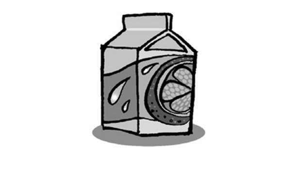
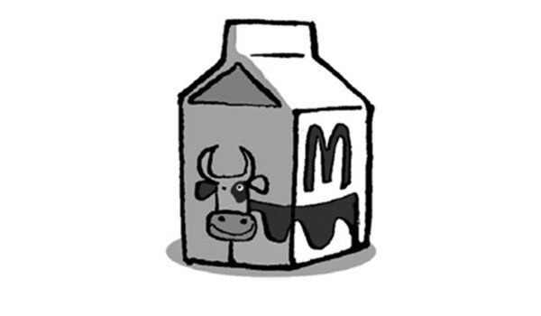
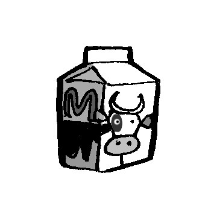
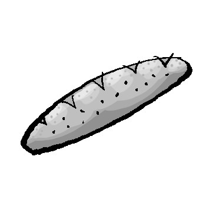
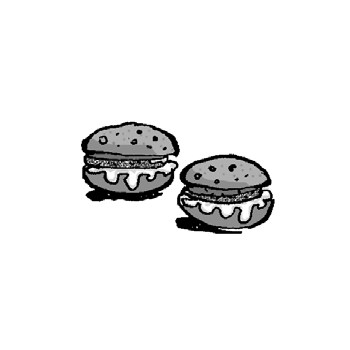
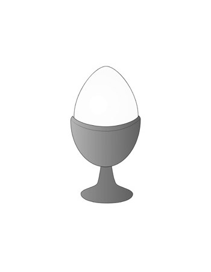
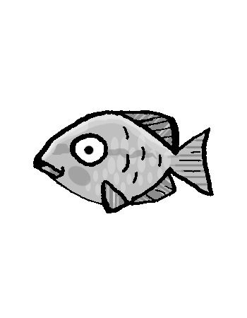
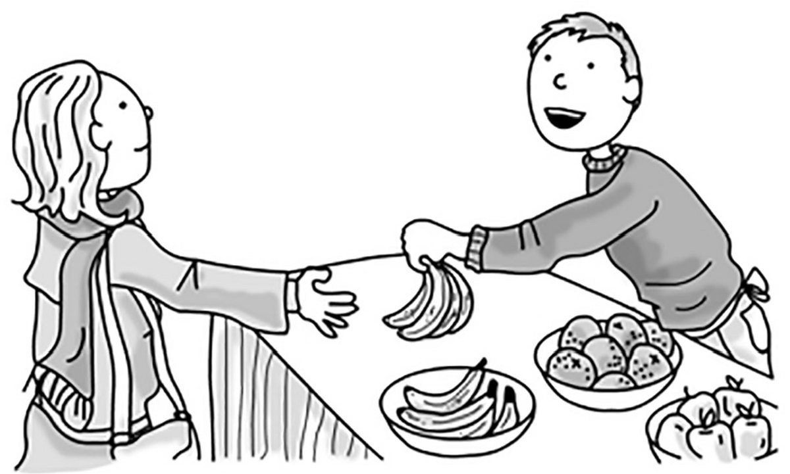
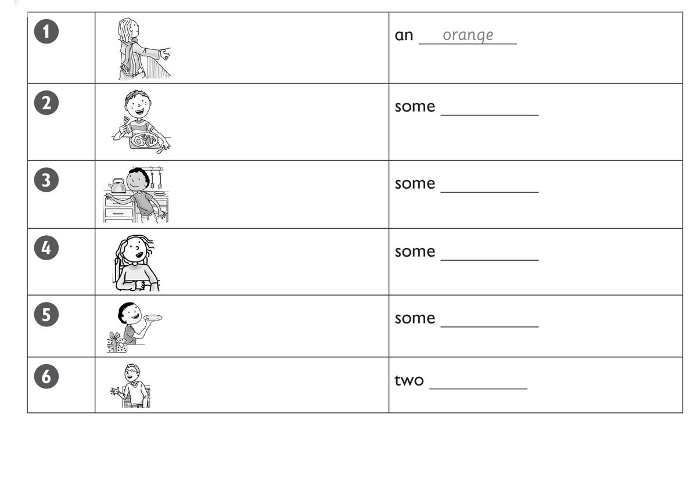
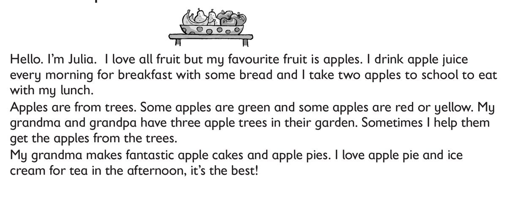

**[Vocabulary]{.underline}**

**1. Write the words. There is one example.   (one point each)**

  ----------------------------------------------------------------------------------------------------------------------------------------------------------------------------------------------------------------------- -- -------------------------------------------------------------------------------------------------------------------------------------------------------------------------------------------------------------------- -- --------------------------------------------------------------------------------------------------------------------------------------------------------------------------------------------------------------------
   1.            
  *[chips]{.underline}*                                                                                                                                                                                                      2. \_\_\_\_\_\_\_                                                                                                                                                                                                       3. \_\_\_\_\_\_\_

  ----------------------------------------------------------------------------------------------------------------------------------------------------------------------------------------------------------------------- -- -------------------------------------------------------------------------------------------------------------------------------------------------------------------------------------------------------------------- -- --------------------------------------------------------------------------------------------------------------------------------------------------------------------------------------------------------------------

  -------------------------------------------------------------------------------------------------------------------------------------------------------------------------------------------------------------------- -- -------------------------------------------------------------------------------------------------------------------------------------------------------------------------------------------------------------------- -- --------------------------------------------------------------------------------------------------------------------------------------------------------------------------------------------------------------------
              
  4. \_\_\_\_\_\_\_                                                                                                                                                                                                       5. \_\_\_\_\_\_\_                                                                                                                                                                                                       6. \_\_\_\_\_\_\_

  -------------------------------------------------------------------------------------------------------------------------------------------------------------------------------------------------------------------- -- -------------------------------------------------------------------------------------------------------------------------------------------------------------------------------------------------------------------- -- --------------------------------------------------------------------------------------------------------------------------------------------------------------------------------------------------------------------

**2. Look and read. Write *This* / *These*. Tick or cross. There is one
example.   (one point each)**

1\. *[This]{.underline}* is milk. *[✓]{.underline}*

2\. \_\_\_\_\_ is a fish. \_\_\_\_\_\_

3\. \_\_\_\_\_ are potatoes. \_\_\_\_\_\_

4\. \_\_\_\_\_ are carrots. \_\_\_\_\_\_

5\. \_\_\_\_\_ is bread. \_\_\_\_\_\_

6\. \_\_\_\_\_ are meatballs. \_\_\_\_\_\_

**3. Put the letters in order. Then read, write and draw. There is one
example.   (one point each)**

uchln \| nerdin \| ~~rabefskat~~

1\. I eat an egg and bread for *[breakfast]{.underline}*.

2\. I eat a burger and an apple for \_\_\_\_\_\_\_\_\_\_\_\_.

3\. I eat fish and carrots for \_\_\_\_\_\_\_\_\_\_\_\_.

**[Grammar]{.underline}**

**4. Look and write sentences. There is one example.   (one point
each)**

1\. have / chips / lunch *[Can I have some chips for lunch,
please?]{.underline}*

2\. have / milk / breakfast \_\_\_\_\_\_\_\_\_\_\_\_\_\_\_\_\_\_\_\_

3\. have / chicken / dinner \_\_\_\_\_\_\_\_\_\_\_\_\_\_\_\_\_\_\_\_

4\. have / an egg / breakfast \_\_\_\_\_\_\_\_\_\_\_\_\_\_\_\_\_\_\_\_

5\. have / rice / lunch \_\_\_\_\_\_\_\_\_\_\_\_\_\_\_\_\_\_\_\_

6\. have / meatballs / dinner \_\_\_\_\_\_\_\_\_\_\_\_\_\_\_\_\_\_\_\_

**5. Read and write. There is one example.   (one point each)**

Bananas \| Three bananas \| Thank you \| Here you are \| ~~Can I have~~
\| Which fruit

1\. *[Can I have]{.underline}* some fruit, please?

2\. \_\_\_\_\_\_\_\_\_\_\_\_? Oranges? Pears? \_\_\_\_\_\_\_\_\_\_\_\_?

3\. \_\_\_\_\_\_\_\_\_\_\_\_, please.

4\. Yes, \_\_\_\_\_\_\_\_\_\_\_\_.

5\. \_\_\_\_\_\_\_\_\_\_\_\_.

**[Listening]{.underline}**

**6. Listen and write the number. There is one example.   (one point
each)**

**7. Listen and write. There is one example.   (one point each)**

**[Reading]{.underline}**

**8. Read and answer. Write the words. There is one example.   (one
point each)**

1\. What is Julia's favourite fruit? *[apples]{.underline}*

2\. What does she drink for breakfast? \_\_\_\_\_\_\_\_\_\_\_\_
\_\_\_\_\_\_\_\_\_\_\_\_

3\. How many apples does she take to school? \_\_\_\_\_\_\_\_\_\_\_\_

4\. Where are apples from? \_\_\_\_\_\_\_\_\_\_\_\_

5\. Who has three apple trees? \_\_\_\_\_\_\_\_\_\_\_\_ and
\_\_\_\_\_\_\_\_\_\_\_\_

6\. What does Julia love to eat for tea with apple pie?
\_\_\_\_\_\_\_\_\_\_\_\_ \_\_\_\_\_\_\_\_\_\_\_\_

