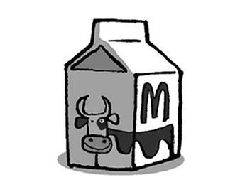
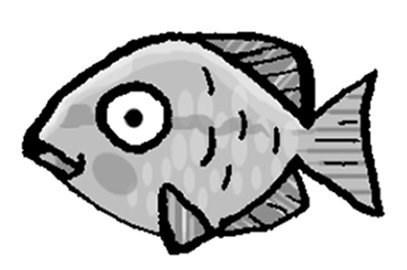
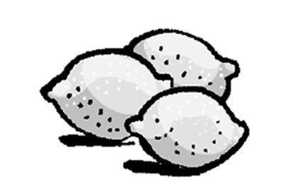
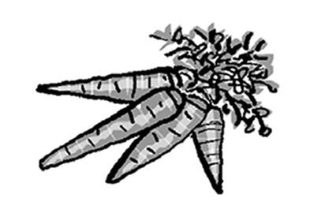
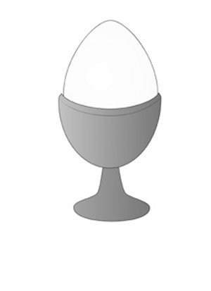
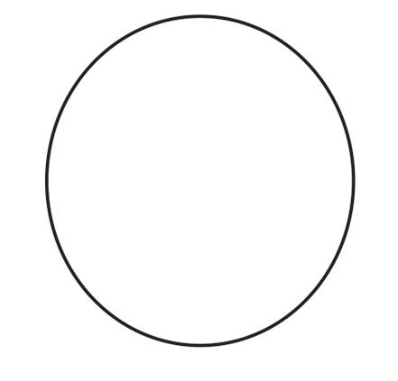
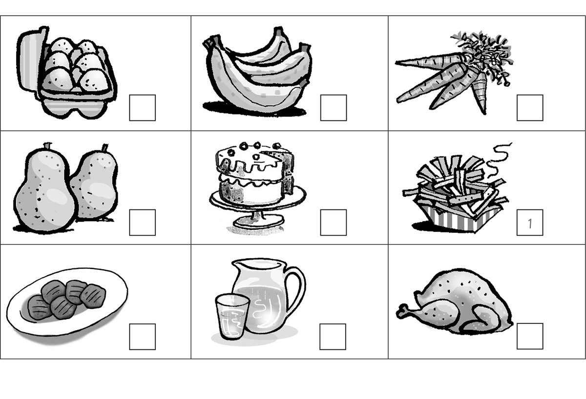
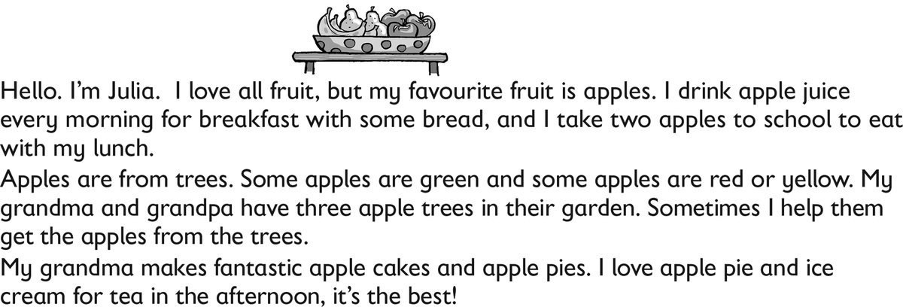

**[Vocabulary]{.underline}**

**1. Complete the words. There is one example.   (one point each)**

1\. *[c]{.underline}* *[h]{.underline}* *[i]{.underline}*
*[p]{.underline}* *[s]{.underline}*

2\. \_\_\_ g \_\_\_ \_\_\_

*eggs*

3\. w \_\_\_ \_\_\_ \_\_\_ \_\_\_

*water*

4\. \_\_\_ u \_\_\_ \_\_\_ \_\_\_

*juice*

5\. \_\_\_ h \_\_\_ \_\_\_ \_\_\_ en

*chicken*

6\. m \_\_\_ \_\_\_ \_\_\_

*milk*

**2. Look and read. Tick or cross. There is one example.   (one point
each)**

1\. This is juice. *[✗]{.underline}*

2\. This is a fish. \_\_\_\_\_

*✓*

3\. These are potatoes. \_\_\_\_\_

*✗*

4\. These are carrots. \_\_\_\_\_

*✓*

5\. This is bread. \_\_\_\_\_

*✓*

6\. These are meatballs. \_\_\_\_\_

*✗*

**3. Put the letters in order. Then read, write and draw. There is one
example.   (one point each)**

uchln \| nerdin \| ~~rabefskat~~

1\. I eat an egg and bread for *[breakfast]{.underline}*.

2\. I eat a burger and an apple for \_\_\_\_\_\_\_\_\_\_\_\_.

*lunch*

3\. I eat fish and carrots for \_\_\_\_\_\_\_\_\_\_\_\_.

*dinner*

**[Grammar]{.underline}**

**4. Order and write. There is one example.   (one point each)**

1\. chips, / please? / some / have / I / Can

    *[Can I have some chips, please?]{.underline}*

2\. Can / have / some / I / meatballs, / please?

    \_\_\_\_\_\_\_\_\_\_\_\_\_\_\_\_\_\_\_\_\_\_\_\_\_\_\_\_\_\_\_\_\_\_\_\_\_\_\_\_\_\_\_\_\_\_\_\_\_\_\_\_\_\_\_\_\_\_\_\_

*Can I have some meatballs, please?*

3\. his / What's / breakfast? / favourite

    \_\_\_\_\_\_\_\_\_\_\_\_\_\_\_\_\_\_\_\_\_\_\_\_\_\_\_\_\_\_\_\_\_\_\_\_\_\_\_\_\_\_\_\_\_\_\_\_\_\_\_\_\_\_\_\_\_\_\_\_

*What's his favourite breakfast?*

4\. an / please? / egg, / have / I / Can

    \_\_\_\_\_\_\_\_\_\_\_\_\_\_\_\_\_\_\_\_\_\_\_\_\_\_\_\_\_\_\_\_\_\_\_\_\_\_\_\_\_\_\_\_\_\_\_\_\_\_\_\_\_\_\_\_\_\_\_\_

*Can I have an egg please?*

5\. please? / have / I / rice, / Can / some

    \_\_\_\_\_\_\_\_\_\_\_\_\_\_\_\_\_\_\_\_\_\_\_\_\_\_\_\_\_\_\_\_\_\_\_\_\_\_\_\_\_\_\_\_\_\_\_\_\_\_\_\_\_\_\_\_\_\_\_\_

*Can I have some rice, please?*

6\. favourite / bananas. / breakfast / His / is

    \_\_\_\_\_\_\_\_\_\_\_\_\_\_\_\_\_\_\_\_\_\_\_\_\_\_\_\_\_\_\_\_\_\_\_\_\_\_\_\_\_\_\_\_\_\_\_\_\_\_\_\_\_\_\_\_\_\_\_\_

*His favourite breakfast is bananas.*

**5. Read and write the numbers and the fruits. Tick the bag. There is
one example.   (one point each)**

[    *1*   ]{.underline} Can I have some fruit, please?

\_\_\_\_\_ Thank you.

\_\_\_\_\_ Which fruit? P \_\_\_\_\_\_\_\_\_\_ / b \_\_\_\_\_\_\_\_\_\_?

\_\_\_\_\_ Yes, here you are.

\_\_\_\_\_ B \_\_\_\_\_\_\_\_\_\_, please.

*5*

*2*

*4*

*3*

**[Listening]{.underline}**

**6. Listen and number. There are three extra pictures. There is one
example.   (one point each)**

*bananas*

*carrots*

*eggs*

*water*

*pears*

**Audio script**

1\. These come from potatoes. You can eat them with meat or fish.

2\. These are a fruit. They're long and yellow.

3\. These are a vegetable. They're long and orange.

4\. These are from a chicken. People eat them for breakfast.

5\. You drink this. It's good for you.

6\. These are from trees. They're a green fruit.

**7. Listen and draw lines. There is one example.**

*some juice*

*some bread*

*some ice cream*

*some chips*

*two apples*

**Audio script**

**1**

**Woman:** Hello. Can I have an *orange*, please?

**Man:** Yes. Here you are.

**Woman:** Thank you.

**2**

**Boy:** Dad, can I have some *juice*, please?

**Dad:** Yes. Here you are.

**Boy:** Thanks.

**3**

**Boy:** Mum, can I have some *bread*, please?

**Mum:** Yes. Here you are.

**Boy:** Thank you!

**4**

**Girl:** Can I have some *ice cream*, please?

**Man:** Yes. Here you are.

**Girl:** Great!

**5**

**Boy:** Excuse me. Can I have some *chips* with my fish, please?

**Woman:** Yes. Here you are.

**Boy:** Thanks.

**6**

**Man:** Can I have some fruit, please?

**Woman:** Yes. Bananas, apples or pears?

**Man:** Two *apples*, please.

**Woman:** Here you are.

**Man:** Thank you.

**[Reading]{.underline}**

**8. Read and answer. Write the words. There is one example.   (one
point each)**

1\. What is Julia's favourite fruit? *[apples]{.underline}*

2\. What does she drink for breakfast? apple \_\_\_\_\_\_\_\_\_\_\_\_

*juice*

3\. How many apples does she take to school? \_\_\_\_\_\_\_\_\_\_\_\_

*two*

4\. Where are apples from? \_\_\_\_\_\_\_\_\_\_\_\_

*trees*

5\. Who has three apple trees? Grandma and \_\_\_\_\_\_\_\_\_\_\_\_

*Grandpa*

6\. What does Julia love to eat for tea? ice \_\_\_\_\_\_\_\_\_\_\_\_

*cream*

