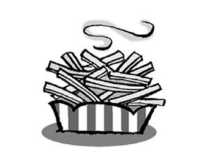
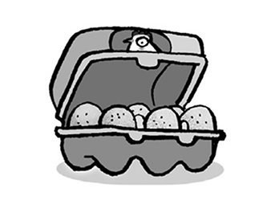
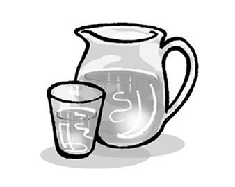
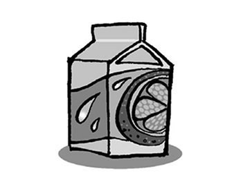
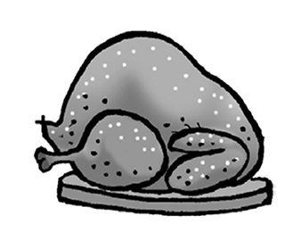
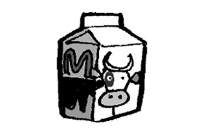
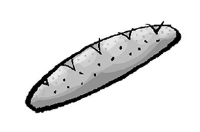
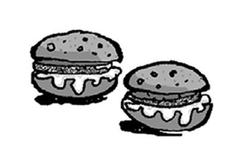
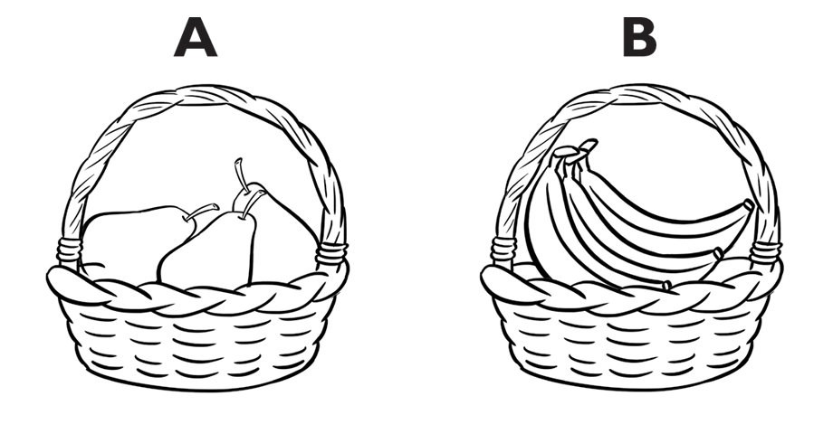
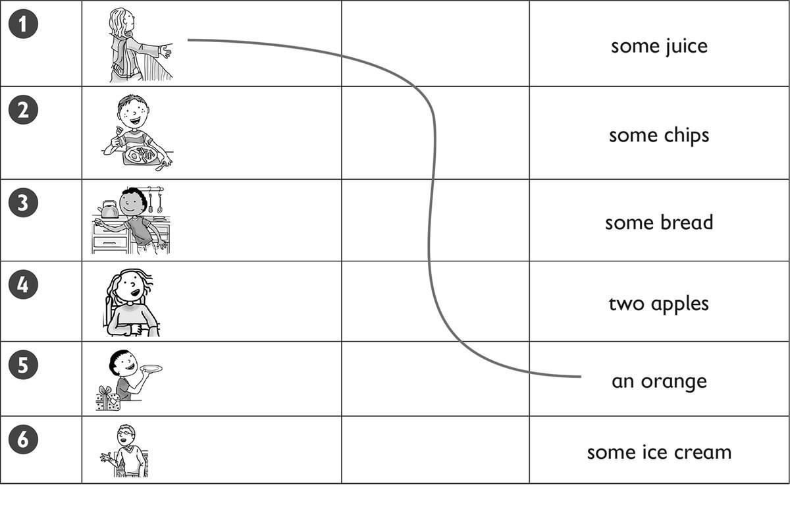

**[Vocabulary]{.underline}**

**1. Complete the words. There is one example.   (one point each)**

1\. *[c]{.underline}* *[h]{.underline}* *[i]{.underline}*
*[p]{.underline}* *[s]{.underline}*

2\. \_\_\_ g \_\_\_ \_\_\_

3\. w \_\_\_ \_\_\_ \_\_\_ \_\_\_

4\. \_\_\_ u \_\_\_ \_\_\_ \_\_\_

5\. \_\_\_ h \_\_\_ \_\_\_ \_\_\_ en

6\. m \_\_\_ \_\_\_ \_\_\_

**2. Look and read. Tick or cross. There is one example.   (one point
each)**

1\. This is juice. *[✗]{.underline}*

2\. This is a fish. \_\_\_\_\_

3\. These are potatoes. \_\_\_\_\_

4\. These are carrots. \_\_\_\_\_

5\. This is bread. \_\_\_\_\_

6\. These are meatballs. \_\_\_\_\_

**3. Put the letters in order. Then read, write and draw. There is one
example.   (one point each)**

uchln \| nerdin \| ~~rabefskat~~

1\. I eat an egg and bread for *[breakfast]{.underline}*.

2\. I eat a burger and an apple for \_\_\_\_\_\_\_\_\_\_\_\_.

3\. I eat fish and carrots for \_\_\_\_\_\_\_\_\_\_\_\_.

**[Grammar]{.underline}**

**4. Order and write. There is one example.   (one point each)**

1\. chips, / please? / some / have / I / Can

    *[Can I have some chips, please?]{.underline}*

2\. Can / have / some / I / meatballs, / please?

    \_\_\_\_\_\_\_\_\_\_\_\_\_\_\_\_\_\_\_\_\_\_\_\_\_\_\_\_\_\_\_\_\_\_\_\_\_\_\_\_\_\_\_\_\_\_\_\_\_\_\_\_\_\_\_\_\_\_\_\_

3\. his / What's / breakfast? / favourite

    \_\_\_\_\_\_\_\_\_\_\_\_\_\_\_\_\_\_\_\_\_\_\_\_\_\_\_\_\_\_\_\_\_\_\_\_\_\_\_\_\_\_\_\_\_\_\_\_\_\_\_\_\_\_\_\_\_\_\_\_

4\. an / please? / egg, / have / I / Can

    \_\_\_\_\_\_\_\_\_\_\_\_\_\_\_\_\_\_\_\_\_\_\_\_\_\_\_\_\_\_\_\_\_\_\_\_\_\_\_\_\_\_\_\_\_\_\_\_\_\_\_\_\_\_\_\_\_\_\_\_

5\. please? / have / I / rice, / Can / some

    \_\_\_\_\_\_\_\_\_\_\_\_\_\_\_\_\_\_\_\_\_\_\_\_\_\_\_\_\_\_\_\_\_\_\_\_\_\_\_\_\_\_\_\_\_\_\_\_\_\_\_\_\_\_\_\_\_\_\_\_

6\. favourite / bananas. / breakfast / His / is

    \_\_\_\_\_\_\_\_\_\_\_\_\_\_\_\_\_\_\_\_\_\_\_\_\_\_\_\_\_\_\_\_\_\_\_\_\_\_\_\_\_\_\_\_\_\_\_\_\_\_\_\_\_\_\_\_\_\_\_\_

**5. Read and write the numbers and the fruits. Tick the bag. There is
one example.   (one point each)**

[    *1*   ]{.underline} Can I have some fruit, please?

\_\_\_\_\_ Thank you.

\_\_\_\_\_ Which fruit? P \_\_\_\_\_\_\_\_\_\_ / b \_\_\_\_\_\_\_\_\_\_?

\_\_\_\_\_ Yes, here you are.

\_\_\_\_\_ B \_\_\_\_\_\_\_\_\_\_, please.

**[Listening]{.underline}**

**6. Listen and number. There are three extra pictures. There is one
example.   (one point each)**

**7. Listen and draw lines. There is one example.**

**[Reading]{.underline}**

**8. Read and answer. Write the words. There is one example.   (one
point each)**

1\. What is Julia's favourite fruit? *[apples]{.underline}*

2\. What does she drink for breakfast? apple \_\_\_\_\_\_\_\_\_\_\_\_

3\. How many apples does she take to school? \_\_\_\_\_\_\_\_\_\_\_\_

4\. Where are apples from? \_\_\_\_\_\_\_\_\_\_\_\_

5\. Who has three apple trees? Grandma and \_\_\_\_\_\_\_\_\_\_\_\_

6\. What does Julia love to eat for tea? ice \_\_\_\_\_\_\_\_\_\_\_\_

