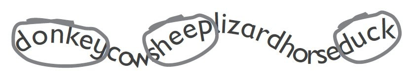
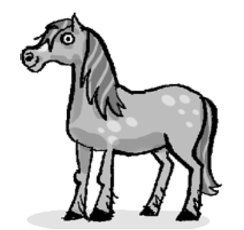
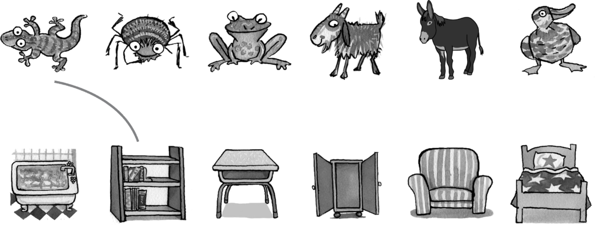
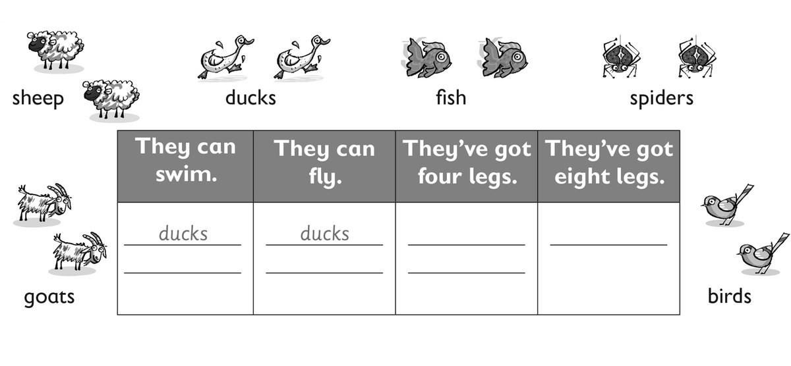
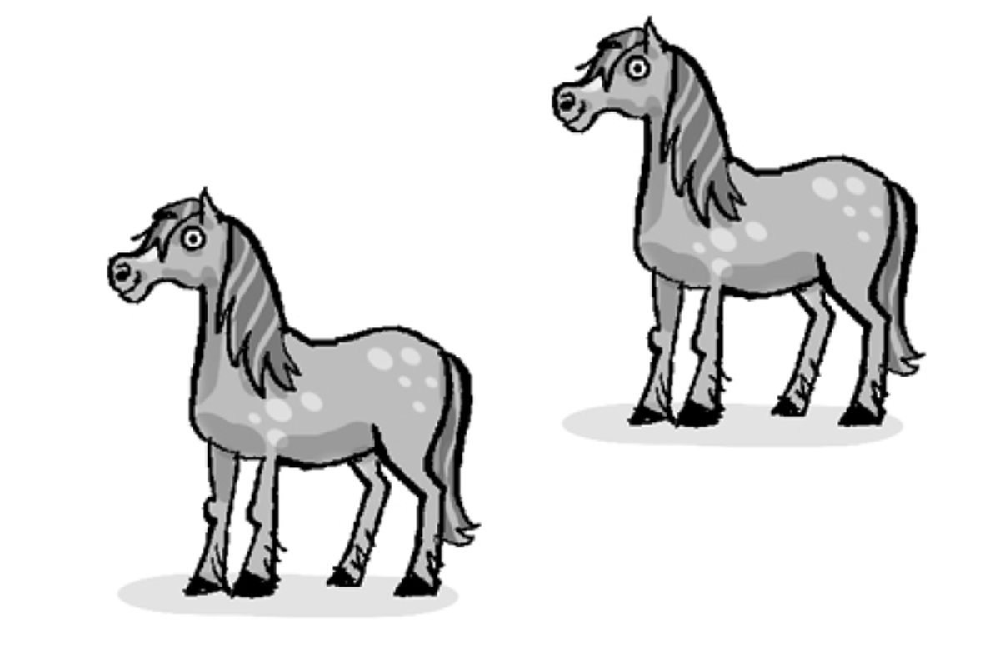
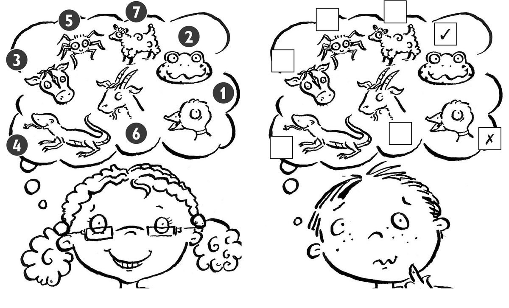
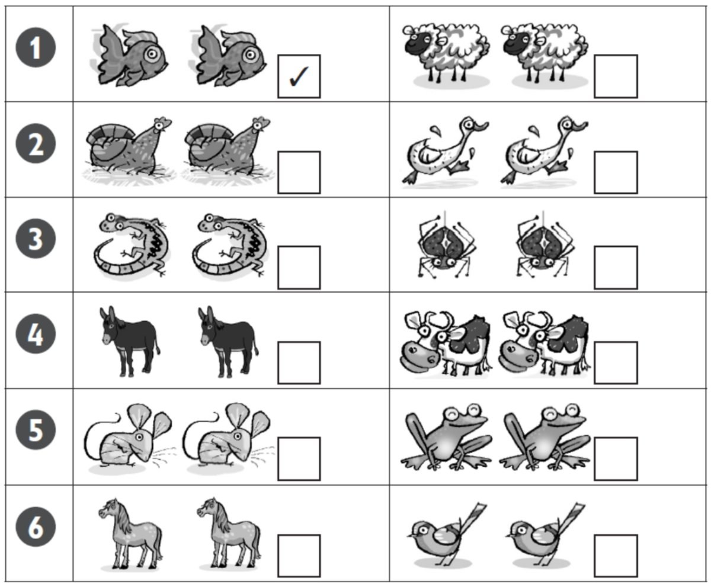
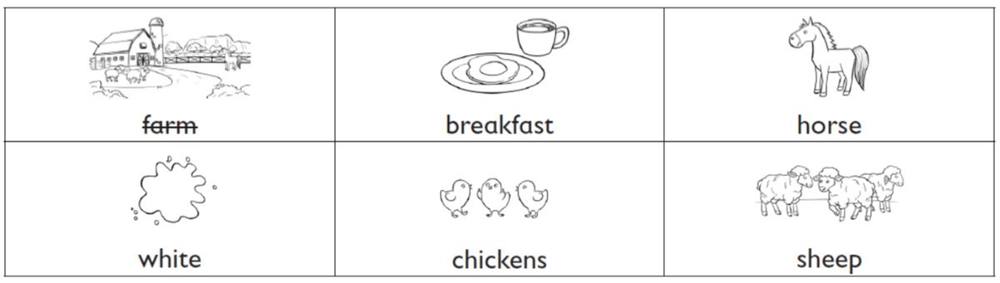

**[Vocabulary]{.underline}**

**1. Look and circle. Write. There is one example.   (one point each)**

  ---------------------------------------------------------------------------------------------------------------------------------------------------------------------------------------------------------------- -- ---------------------------------------------------------------------------------------------------------------------------------------------------------------------------------------------------------------- -- ---------------------------------------------------------------------------------------------------------------------------------------------------------------------------------------------------------------- -- ---------------------------------------------------------------------------------------------------------------------------------------------------------------------------------------------------------------- -- ----------------------------------------------------------------------------------------------------------------------------------------------------------------------------------------------------------------
                          
  1.                                                                                                                                                                                                                  2.                                                                                                                                                                                                                  3.                                                                                                                                                                                                                  4.                                                                                                                                                                                                                  5.

  ---------------------------------------------------------------------------------------------------------------------------------------------------------------------------------------------------------------- -- ---------------------------------------------------------------------------------------------------------------------------------------------------------------------------------------------------------------- -- ---------------------------------------------------------------------------------------------------------------------------------------------------------------------------------------------------------------- -- ---------------------------------------------------------------------------------------------------------------------------------------------------------------------------------------------------------------- -- ----------------------------------------------------------------------------------------------------------------------------------------------------------------------------------------------------------------

  ----------------------------------------------------------------------------------------------------------------------------------------------------------------------------------------------------------------
  
  6.

  ----------------------------------------------------------------------------------------------------------------------------------------------------------------------------------------------------------------

**2. Look, read and draw lines. There is one example.   (one point
each)**

1\. The lizard is on the bookcase.

2\. The goat is in the cupboard.

*goat -- cupboard*

3\. The donkey is in the bed.

*donkey -- bed*

4\. The frog is in the bath.

*frog -- bath*

5\. The spider under the desk.

*spider -- desk*

6\. The duck is on the chair.

*duck -- chair*

**3. Look, read and write. There are two examples.   (one point each)**

*They can swim: fish*

*they can fly: birds*

*They've got four legs: sheep, goats*

*they've got eight legs: spiders*

**[Grammar]{.underline}**

**4. Read and circle. There is one example.   (one point each)**

1\. Horses *are* / *[have got]{.underline}* four legs.

2\. Sheep *are* / *can* white.

*are*

3\. Frogs *can* / *have got* swim.

*can*

4\. Donkeys *are* / *have got* long ears.

*have got*

5\. Mice *are* / *can* small.

*are*

6\. Chickens *can't* / *haven't got* fly.

*can't*

**5. Read and write ☺ *do* or ☻ *don't*. There is one example.   (one
point each)**

1\. I like sheep. ☺ So *[do]{.underline}* I.

2\. I like birds. ☺ So *do* I.

3\. I like mice. ☻ I *don't*.

4\. I like lizards. ☻ I *don't*.

5\. I love birds. ☺ So *do* I.

6\. I love spiders. ☻ I *don't*.

**[Listening]{.underline}**

**6. Listen and tick or cross. There are two examples.   (one point
each)**

*3. cow -- ✗*

*4. lizards -- ✓*

*5. spiders -- ✗*

*6. goats -- ✓*

*7. sheep -- ✗*

**Audio script**

**Girl:** I like ducks.     **Boy:** I don't.

**Girl:** I like frogs.     **Boy:** So do I.

**Girl:** I like cows.     **Boy:** I don't.

**Girl:** I like lizards.     **Boy:** So do I.

**Girl:** I like spiders.     **Boy:** I don't.

**Girl:** I like goats.     **Boy:** So do I.

**Girl:** I like sheep.     **Boy:** I don't.

**7. Listen and tick. There is one example.   (one point each)**

*2. chickens*

*3. spiders*

*4. cows*

*5. mice*

*6. horses*

**Audio script**

1\. They're small. They can swim.

2\. They're birds, but they can't fly.

3\. They're small. They've got eight legs.

4\. They're big. They're black and white.

5\. They're small. They've got big ears and long tails.

6\. They're big. They've got short ears. They've got four legs. They can
run fast.

**[Reading]{.underline}**

**8. Read and write the word. There is one example.   (one point each)**

My cousin's mum and dad are farmers, and they live on a big **(1)**
*[farm]{.underline}*. I love visiting them at the weekend. They've got
lots of animals. They've got cows, chickens, **(2)**
\_\_\_\_\_\_\_\_\_\_\_\_\_\_\_\_\_\_\_\_\_ and horses.

The horses are my favourite animals. I sometimes ride my cousin's
**(3)** \_\_\_\_\_\_\_\_\_\_\_\_\_\_\_\_\_\_\_\_\_. Her name is
Chocolate Biscuit. She's brown and **(4)**
\_\_\_\_\_\_\_\_\_\_\_\_\_\_\_\_\_\_\_\_\_. She's very beautiful.

I always get eggs from the **(5)**
\_\_\_\_\_\_\_\_\_\_\_\_\_\_\_\_\_\_\_\_\_ to take home. My mum loves
eggs for **(6)** \_\_\_\_\_\_\_\_\_\_\_\_\_\_\_\_\_\_\_\_\_, but I
don't!

*2. sheep*

*3. horse*

*4. white*

*5. chickens*

*6. breakfast*

