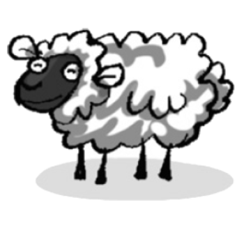
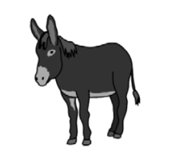
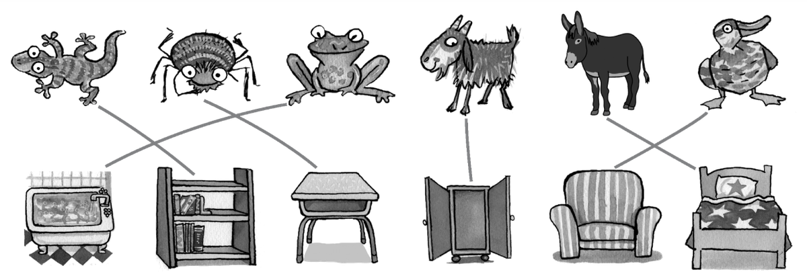
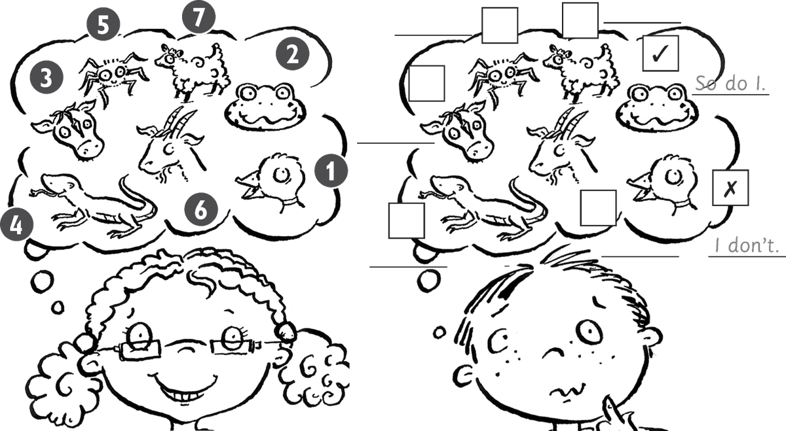
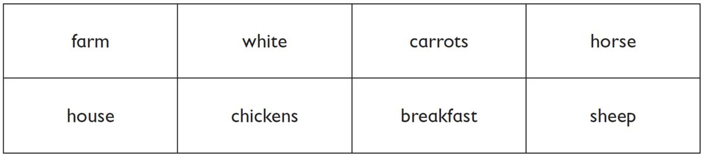

**[Vocabulary]{.underline}**

**1. Look. Complete the words. There is one example.   (one point
each)**

1\. \_\_ o \_\_

*cow*

2\. \_\_ o \_\_ \_\_ e

*horse*

3\. \_\_ he \_\_ p

*sheep*

4\. d \_\_ \_\_ k

*duck*

5\. *[d o n k e y]{.underline}*

6\. \_\_ i \_\_ a \_\_ \_\_

*lizard*

**2. Look, read and put the words in order. Then write. There are two
examples.   (one point each)**

chair \| bath \| bed \| ~~bookcase~~ \| cupboard \| desk

1\. Where's the (zradil) *[lizard]{.underline}*?

    It's on the *[bookcase]{.underline}*.

2\. Where's the (ucdk) *duck*?

    It's on the *armchair*.

3\. Where's the (gofr) *frog*?

    It's in the *bath*.

4\. Where's the (toag) *goat*?

    It's in the *cupboard*.

5\. Where's the (dreips) *spider*?

    It's under the *desk*.

6\. Where's the (kynode) *donkey*?

    It's in the *bed*.

**3. Read and write. There are two examples.   (one point each)**

*They can swim: fish*

*They can fly: birds*

*They've got four legs: sheep, goats*

*They've got eight legs: spiders*

**[Grammar]{.underline}**

**4. Read and write. There is one example.   (one point each)**

are \| can \| can't \| have got

1\. Horses *[have got]{.underline}* four legs.

2\. Sheep *are* white.

3\. Frogs *can* swim.

4\. Donkeys *have got* long ears.

5\. Mice *are* small.

6\. Chickens *can't* fly.

**5. Read and choose the words. Write. There is one example.   (one
point each)**

1\. I like sheep. ✓    *[So do I]{.underline}*.

2\. I like donkeys. ✓     *So do I*

3\. I like mice. ✗     *I don't*

4\. I like lizards. ✗     *I don't*

5\. I love birds. ✓     *So do I*

6\. I love spiders. ✗     *I don't*

**[Listening]{.underline}**

**6. Listen and tick or cross. Then write *I don't* or *So do I*. There
are two examples.   (one point each)**

*cow -- ✗, I don't*

*lizards -- ✓, So do I*

*spiders -- ✗, I don't*

*goats -- ✓, So do I*

*sheep -- ✗, I don't*

**Audio script**

**Girl:** I like ducks.    **Boy:** I don't.

**Girl:** I like frogs.    **Boy:** So do I.

**Girl:** I like cows.    **Boy:** I don't.

**Girl:** I like lizards.    **Boy:** So do I.

**Girl:** I like spiders.    **Boy:** I don't.

**Girl:** I like goats.    **Boy:** So do I.

**Girl:** I like sheep.    **Boy:** I don't.

**7. Listen and number. There are two extra pictures. There is one
example.   (one point each)**

*2. chickens*

*3. spiders*

*4. cows*

*5. mices*

*6. horses*

**Audio script**

1\. They're small. They can swim.

2\. They're birds but they can't fly.

3\. They're small. They've got eight legs.

4\. They're big. They're black and white.

5\. They're small. They've got big ears and long tails.

6\. They're big. They've got short ears. They've got four legs. They can
run fast.

**8. Read and write the words. There are two extra words. There is one
example.   (one point each)**

My cousin's mum and dad are farmers, and they live on a big **(1)**
*[farm]{.underline}*. I love visiting them at the weekend because
they've got lots of animals. They've got cows, chickens, **(2)**
\_\_\_\_\_\_\_\_\_\_\_\_\_\_\_\_\_\_\_\_\_ and horses.

The horses are my favourite animals. I sometimes ride my cousin's
**(3)** \_\_\_\_\_\_\_\_\_\_\_\_\_\_\_\_\_\_\_\_\_. Her name is
Chocolate Biscuit because she's brown and **(4)**
\_\_\_\_\_\_\_\_\_\_\_\_\_\_\_\_\_\_\_\_\_. She's very beautiful.

I always get eggs from the **(5)**
\_\_\_\_\_\_\_\_\_\_\_\_\_\_\_\_\_\_\_\_\_ to take home. My mum loves
eggs for **(6)** \_\_\_\_\_\_\_\_\_\_\_\_\_\_\_\_\_\_\_\_\_, but I
don't!

*2. sheep*

*3. horse*

*4. white*

*5. chickens*

*6. breakfast*

