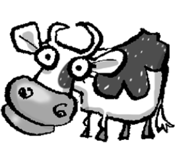
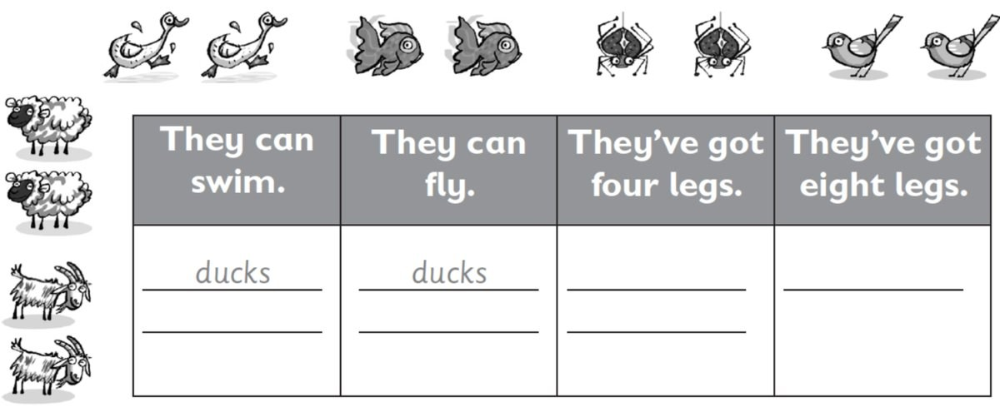
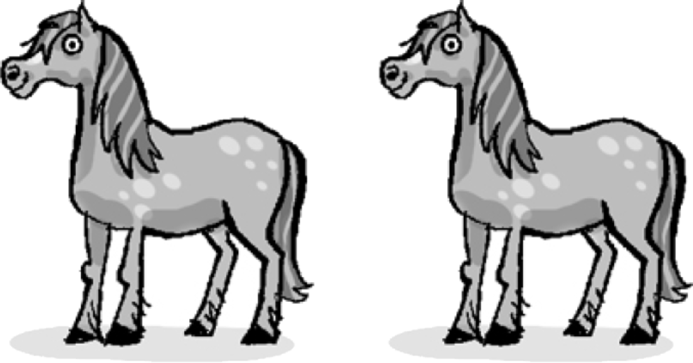
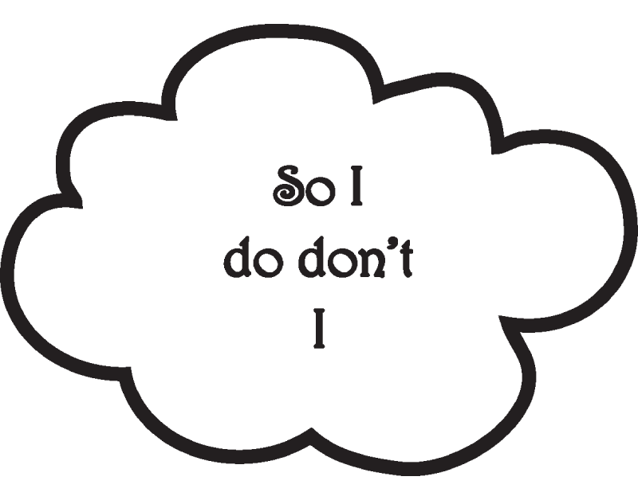
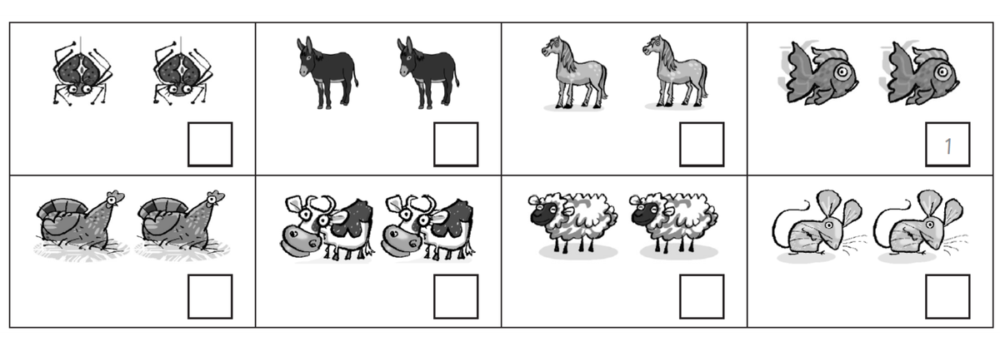

**[Vocabulary]{.underline}**

**1. Look. Complete the words. There is one example.   (one point
each)**

1\. \_\_ o \_\_

2\. \_\_ o \_\_ \_\_ e

3\. \_\_ he \_\_ p

4\. d \_\_ \_\_ k

5\. *[d o n k e y]{.underline}*

6\. \_\_ i \_\_ a \_\_ \_\_

**2. Look, read and put the words in order. Then write. There are two
examples.   (one point each)**

chair \| bath \| bed \| ~~bookcase~~ \| cupboard \| desk

1\. Where's the (zradil) *[lizard]{.underline}*?

    It's on the *[bookcase]{.underline}*.

2\. Where's the (ucdk) \_\_\_\_\_\_\_\_\_\_\_\_\_\_\_?

    It's on the \_\_\_\_\_\_\_\_\_\_\_\_\_\_\_.

3\. Where's the (gofr) \_\_\_\_\_\_\_\_\_\_\_\_\_\_\_?

    It's in the \_\_\_\_\_\_\_\_\_\_\_\_\_\_\_.

4\. Where's the (toag) \_\_\_\_\_\_\_\_\_\_\_\_\_\_\_?

    It's in the \_\_\_\_\_\_\_\_\_\_\_\_\_\_\_.

5\. Where's the (dreips) \_\_\_\_\_\_\_\_\_\_\_\_\_\_\_?

    It's under the \_\_\_\_\_\_\_\_\_\_\_\_\_\_\_.

6\. Where's the (kynode) \_\_\_\_\_\_\_\_\_\_\_\_\_\_\_?

    It's in the \_\_\_\_\_\_\_\_\_\_\_\_\_\_\_.

**3. Read and write. There are two examples.   (one point each)**

**[Grammar]{.underline}**

**4. Read and write. There is one example.   (one point each)**

are \| can \| can't \| have got

1\. Horses *[have got]{.underline}* four legs.

2\. Sheep \_\_\_\_\_\_\_\_\_\_\_\_\_\_\_ white.

3\. Frogs \_\_\_\_\_\_\_\_\_\_\_\_\_\_\_ swim.

4\. Donkeys \_\_\_\_\_\_\_\_\_\_\_\_\_\_\_ long ears.

5\. Mice \_\_\_\_\_\_\_\_\_\_\_\_\_\_\_ small.

6\. Chickens \_\_\_\_\_\_\_\_\_\_\_\_\_\_\_ fly.

**5. Read and choose the words. Write. There is one example.   (one
point each)**

1\. I like sheep. ✓    *[So do I]{.underline}*.

2\. I like donkeys. ✓     \_\_\_\_\_\_\_\_\_\_\_\_\_\_

3\. I like mice. ✗     \_\_\_\_\_\_\_\_\_\_\_\_\_\_

4\. I like lizards. ✗     \_\_\_\_\_\_\_\_\_\_\_\_\_\_

5\. I love birds. ✓     \_\_\_\_\_\_\_\_\_\_\_\_\_\_

6\. I love spiders. ✗     \_\_\_\_\_\_\_\_\_\_\_\_\_\_

**[Listening]{.underline}**

**6. Listen and tick or cross. Then write *I don't* or *So do I*. There
are two examples.   (one point each)**

**7. Listen and number. There are two extra pictures. There is one
example.   (one point each)**

**8. Read and write the words. There are two extra words. There is one
example.   (one point each)**

My cousin's mum and dad are farmers, and they live on a big **(1)**
*[farm]{.underline}*. I love visiting them at the weekend because
they've got lots of animals. They've got cows, chickens, **(2)**
\_\_\_\_\_\_\_\_\_\_\_\_\_\_\_\_\_\_\_\_\_ and horses.

The horses are my favourite animals. I sometimes ride my cousin's
**(3)** \_\_\_\_\_\_\_\_\_\_\_\_\_\_\_\_\_\_\_\_\_. Her name is
Chocolate Biscuit because she's brown and **(4)**
\_\_\_\_\_\_\_\_\_\_\_\_\_\_\_\_\_\_\_\_\_. She's very beautiful.

I always get eggs from the **(5)**
\_\_\_\_\_\_\_\_\_\_\_\_\_\_\_\_\_\_\_\_\_ to take home. My mum loves
eggs for **(6)** \_\_\_\_\_\_\_\_\_\_\_\_\_\_\_\_\_\_\_\_\_, but I
don't!

