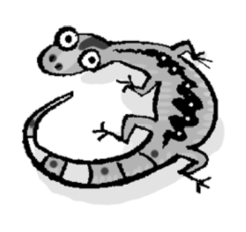
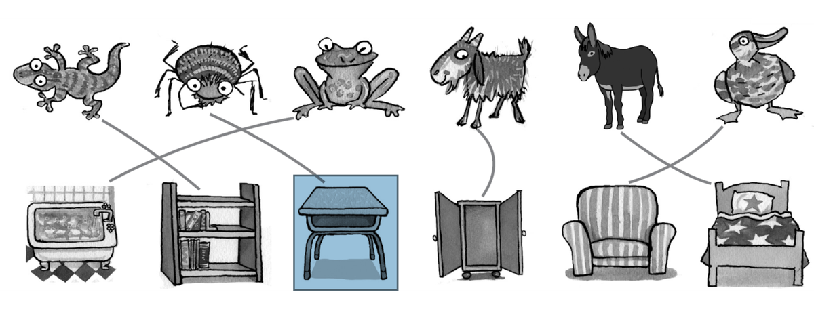
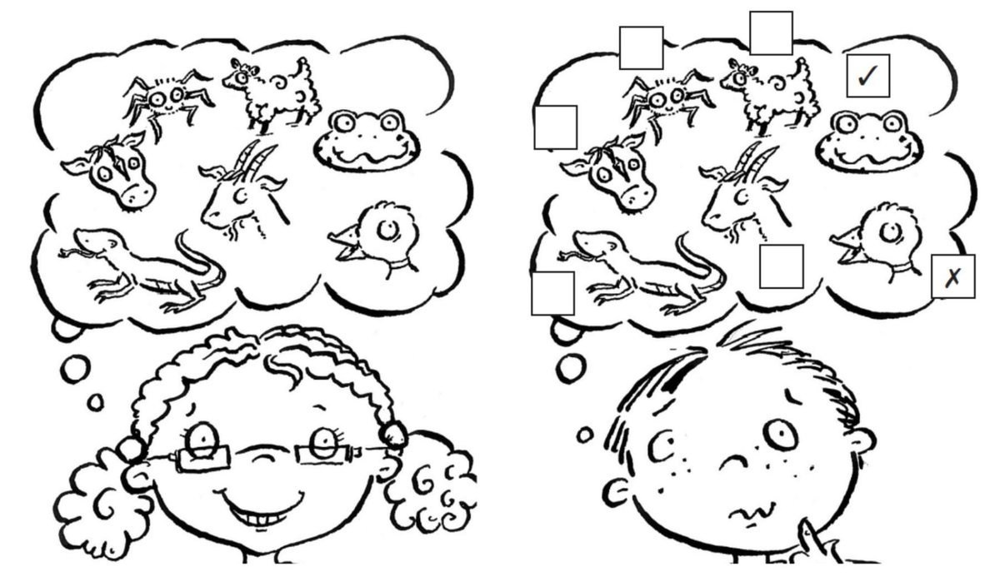
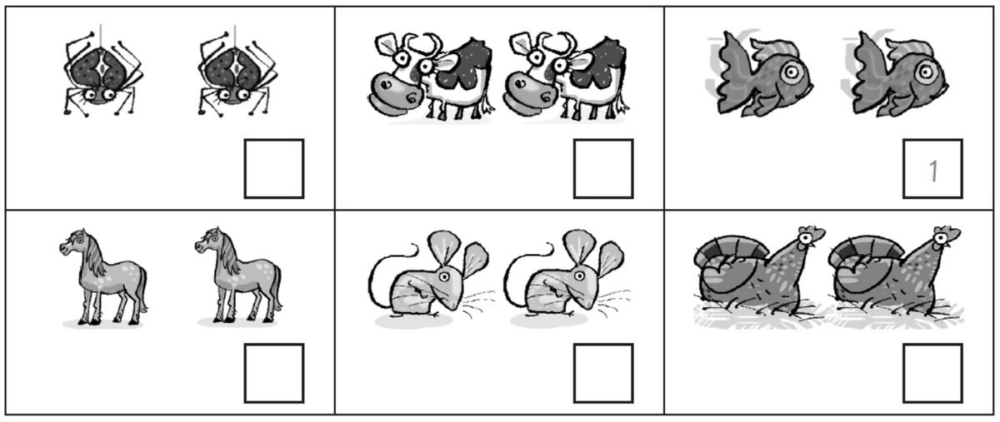
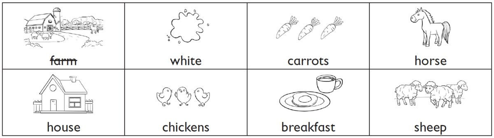

**[Vocabulary]{.underline}**

**1. Look and write. There is one example.   (one point each)**

1\. c \_\_\_\_\_\_\_\_\_\_\_\_

*cow*

2\. h \_\_\_\_\_\_\_\_\_\_\_\_

*horse*

3\. s \_\_\_\_\_\_\_\_\_\_\_\_

*sheep*

4\. d \_\_\_\_\_\_\_\_\_\_\_\_

*duck*

5\. *[donkey]{.underline}*

6\. l \_\_\_\_\_\_\_\_\_\_\_\_

*lizard*

**2. Look, read and draw lines. There is one example.   (one point
each)**

*2. in the cupboard*

*3. in the bed*

*4. in the bath*

*5. under the desk*

*6. on the armchair*

**3. Read and write. There are two examples.   (one point each)**

~~ducks~~ \| sheep \| birds \| fish \| spiders \| goats

They can swim. *[ducks]{.underline}*, \_\_\_\_\_\_\_\_\_\_\_\_\_\_\_\_\_

They can fly. *[ducks]{.underline}*, \_\_\_\_\_\_\_\_\_\_\_\_\_\_\_\_\_

They've got four legs. \_\_\_\_\_\_\_\_\_\_\_\_\_\_\_\_\_,
\_\_\_\_\_\_\_\_\_\_\_\_\_\_\_\_\_

They've got eight legs. \_\_\_\_\_\_\_\_\_\_\_\_\_\_\_\_\_

*They can swim: fish*

*They can fly: birds*

*They've got four legs: sheep, goats*

*They've got eight legs: spiders*

**[Grammar]{.underline}**

**4. Read and circle. There is one example.   (one point each)**

1\. Horses *are* / *can* / *[have got]{.underline}* four legs.

2\. Sheep *are* / *can* / *have got* white.

*are*

3\. Frogs *are* / *can* / *have got* swim.

*can*

4\. Donkeys *are* / *can* / *have got* long ears.

*have got*

5\. Mice *are* / *can* / *have got* small.

*are*

6\. Chickens *aren't* / *haven't got* / *can't* fly.

*can't*

**5. Look and read. Write So *do I* or *I don't*. There is one
example.   (one point each)**

1\. I like sheep. ✓    *[So do I]{.underline}*.

2\. I like donkeys. ✓    *So do I*

3\. I like mice. ✗ *I don't*

4\. I like lizards. ✗    *I don't*

5\. I love birds. ✓    *So do I*

6\. I love spiders. ✗    *I don't*

**[Listening]{.underline}**

**6. Listen and tick or cross. There is one example.   (one point
each)**

*cow -- ✗*

*lizards -- ✓*

*spiders -- ✗*

*goats -- ✓*

*sheep -- ✗*

**Audio script**

**Girl:** I like ducks.    **Boy:** I don't.

**Girl:** I like frogs.    **Boy:** So do I.

**Girl:** I like cows.    **Boy:** I don't.

**Girl:** I like lizards.    **Boy:** So do I.

**Girl:** I like spiders.    **Boy:** I don't.

**Girl:** I like goats.    **Boy:** So do I.

**Girl:** I like sheep.    **Boy:** I don't.

**7. Listen and number. There is one example.   (one point each)**

*2. chickens*

*3. spiders*

*4. cows*

*5. mice*

*6. horses*

**Audio script**

1\. They're small. They can swim.

2\. They're birds but they can't fly.

3\. They're small. They've got eight legs.

4\. They're big. They're black and white.

5\. They're small. They've got big ears and long tails.

6\. They're big. They've got short ears. They've got four legs. They can
run fast.

**[Reading]{.underline}**

**8. Read and write the words. There are two extra words. There is one
example.   (one point each)**

My cousin's mum and dad are farmers and they live on a big **(1)**
*[farm]{.underline}*. I love visiting them at the weekend. They've got
lots of animals. They've got cows, chickens, **(2)**
\_\_\_\_\_\_\_\_\_\_\_\_\_\_\_\_\_\_\_\_\_ and horses.

The horses are my favourite animals. I sometimes ride my cousin's
**(3)** \_\_\_\_\_\_\_\_\_\_\_\_\_\_\_\_\_\_\_\_\_. Her name is
Chocolate Biscuit. She's brown and **(4)**
\_\_\_\_\_\_\_\_\_\_\_\_\_\_\_\_\_\_\_\_\_. She's very beautiful.

I always get eggs from the **(5)**
\_\_\_\_\_\_\_\_\_\_\_\_\_\_\_\_\_\_\_\_\_ to take home. My mum loves
eggs for **(6)** \_\_\_\_\_\_\_\_\_\_\_\_\_\_\_\_\_\_\_\_\_ but I don't!

*2. sheep*

*3. horse*

*4. white*

*5. chickens*

*6. breakfast*

