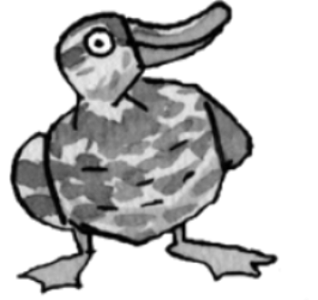
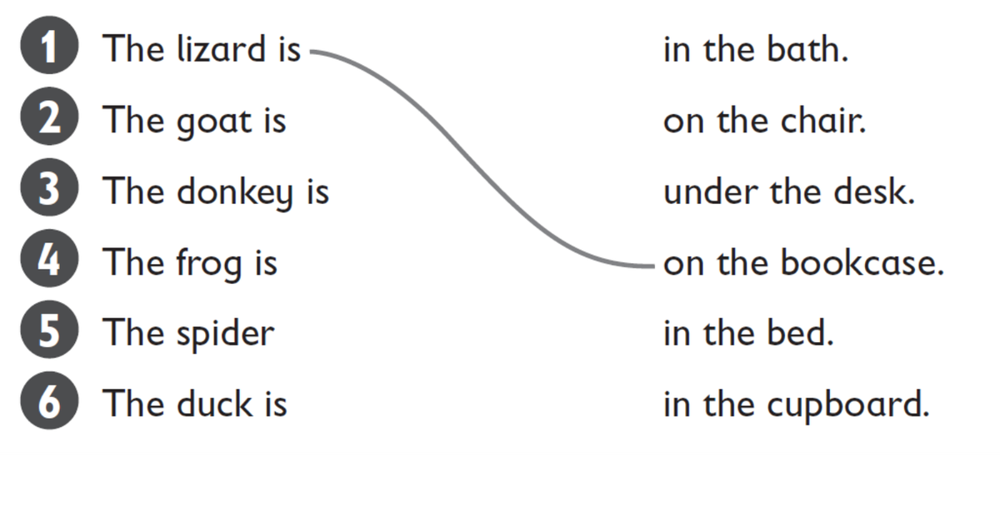
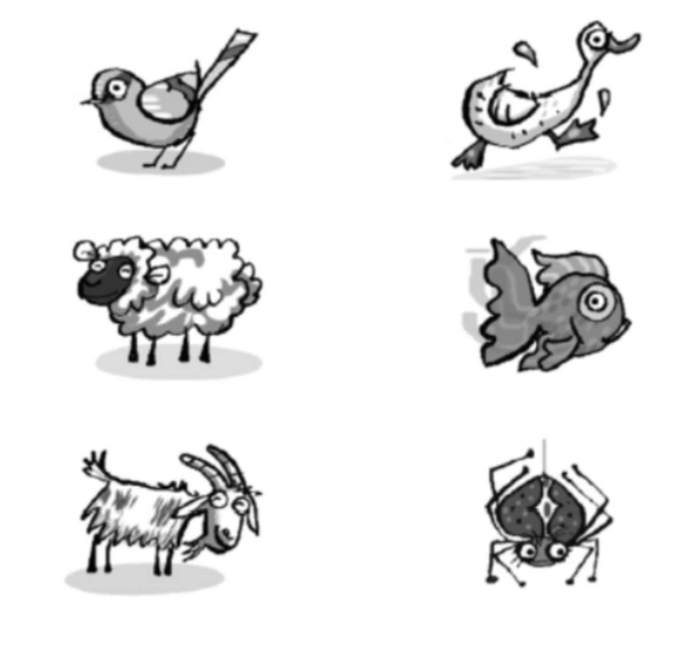
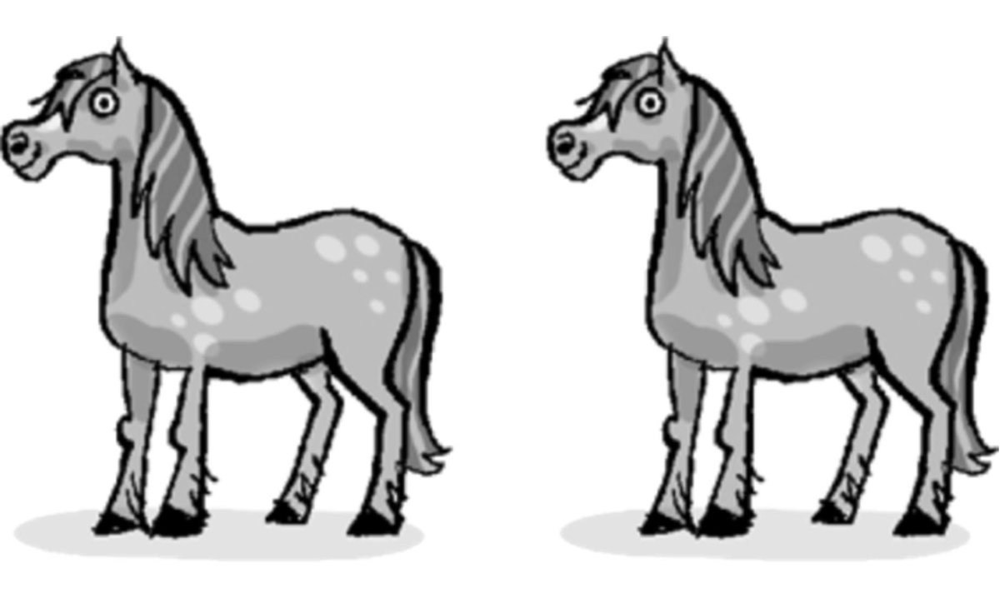

**[Vocabulary]{.underline}**

**1. Look and write. There is one example.   (one point each)**

1\. c \_\_\_\_\_\_\_\_\_\_\_\_

2\. h \_\_\_\_\_\_\_\_\_\_\_\_

3\. s \_\_\_\_\_\_\_\_\_\_\_\_

4\. d \_\_\_\_\_\_\_\_\_\_\_\_

5\. *[donkey]{.underline}*

6\. l \_\_\_\_\_\_\_\_\_\_\_\_

**2. Look, read and draw lines. There is one example.   (one point
each)**

**3. Read and write. There are two examples.   (one point each)**

~~ducks~~ \| sheep \| birds \| fish \| spiders \| goats

They can swim. *[ducks]{.underline}*, \_\_\_\_\_\_\_\_\_\_\_\_\_\_\_\_\_

They can fly. *[ducks]{.underline}*, \_\_\_\_\_\_\_\_\_\_\_\_\_\_\_\_\_

They've got four legs. \_\_\_\_\_\_\_\_\_\_\_\_\_\_\_\_\_,
\_\_\_\_\_\_\_\_\_\_\_\_\_\_\_\_\_

They've got eight legs. \_\_\_\_\_\_\_\_\_\_\_\_\_\_\_\_\_

**[Grammar]{.underline}**

**4. Read and circle. There is one example.   (one point each)**

1\. Horses *are* / *can* / *[have got]{.underline}* four legs.

2\. Sheep *are* / *can* / *have got* white.

3\. Frogs *are* / *can* / *have got* swim.

4\. Donkeys *are* / *can* / *have got* long ears.

5\. Mice *are* / *can* / *have got* small.

6\. Chickens *aren't* / *haven't got* / *can't* fly.

**5. Look and read. Write So *do I* or *I don't*. There is one
example.   (one point each)**

1\. I like sheep. ✓    *[So do I]{.underline}*.

2\. I like donkeys. ✓    \_\_\_\_\_\_\_\_\_\_\_\_\_\_

3\. I like mice. ✗ \_\_\_\_\_\_\_\_\_\_\_\_\_\_

4\. I like lizards. ✗    \_\_\_\_\_\_\_\_\_\_\_\_\_\_

5\. I love birds. ✓    \_\_\_\_\_\_\_\_\_\_\_\_\_\_

6\. I love spiders. ✗    \_\_\_\_\_\_\_\_\_\_\_\_\_\_

**[Listening]{.underline}**

**6. Listen and tick or cross. There is one example.   (one point
each)**

**7. Listen and number. There is one example.   (one point each)**

**[Reading]{.underline}**

**8. Read and write the words. There are two extra words. There is one
example.   (one point each)**

My cousin's mum and dad are farmers and they live on a big **(1)**
*[farm]{.underline}*. I love visiting them at the weekend. They've got
lots of animals. They've got cows, chickens, **(2)**
\_\_\_\_\_\_\_\_\_\_\_\_\_\_\_\_\_\_\_\_\_ and horses.

The horses are my favourite animals. I sometimes ride my cousin's
**(3)** \_\_\_\_\_\_\_\_\_\_\_\_\_\_\_\_\_\_\_\_\_. Her name is
Chocolate Biscuit. She's brown and **(4)**
\_\_\_\_\_\_\_\_\_\_\_\_\_\_\_\_\_\_\_\_\_. She's very beautiful.

I always get eggs from the **(5)**
\_\_\_\_\_\_\_\_\_\_\_\_\_\_\_\_\_\_\_\_\_ to take home. My mum loves
eggs for **(6)** \_\_\_\_\_\_\_\_\_\_\_\_\_\_\_\_\_\_\_\_\_ but I don't!

