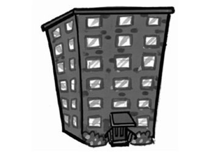
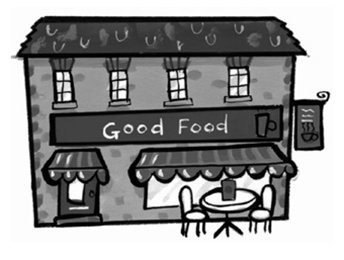
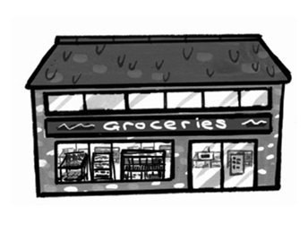
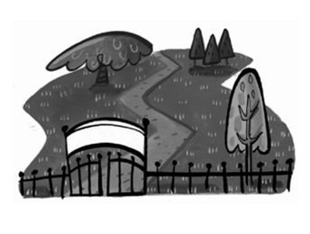
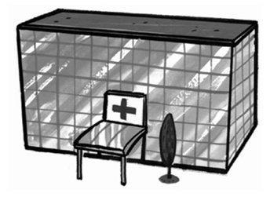
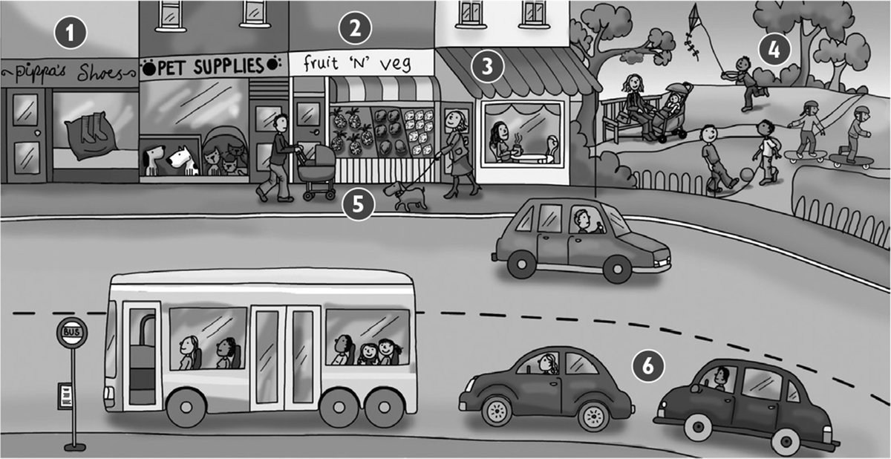
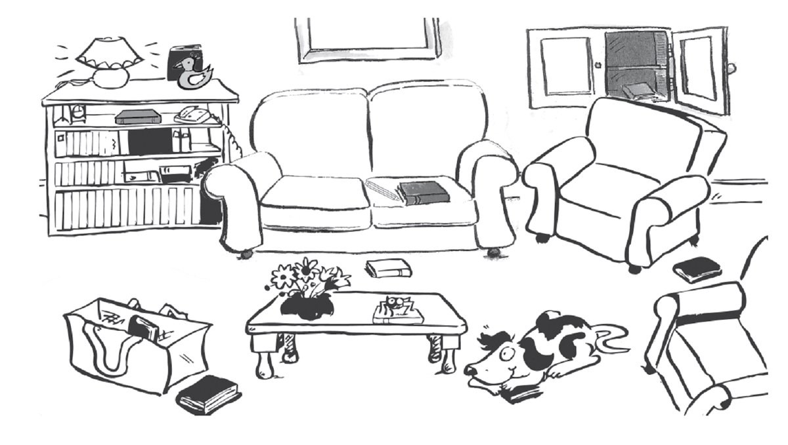

**[Vocabulary]{.underline}**

**1. Look and circle. There is one example.   (one point each)**

1\. *[flat]{.underline}* / shop

2\. street / park

*street*

3\. flat / café

*café*

4\. hospital / shop

*shop*

5\. street / park

*park*

6\. shop / hospital

*hospital*

**2. Look and tick. There is one example.   (one point each)**

1\. People live here.      café      ☐      flat      ✓

2\. Children play
here.      hospital      café      ☐      park      café      ☐

*in front of*

3\. People drink coffee here.      café      ☐      pet shop      ☐

*between*

4\. You go shopping here.      shop      ☐      school      ☐

*behind*

5\. You go here when you are ill.      town      ☐      hospital      ☐

*in*

6\. You see cars and buses here.      street      ☐      house      ☐

*next to*

**3. Look and circle. There is one example.   (one point each)**

Where are the cars?

1\. behind / *[under]{.underline}*

2\. in front of / next to

*park ✓*

3\. between / on

*café ✓*

4\. under / behind

*shop ✓*

5\. between / in

*hospital ✓*

6\. next to / under

*street ✓*

**[Grammar]{.underline}**

**4. Look and tick or cross. There is one example.   (one point each)**

1\. The shoe shop is behind the pet shop. ✗

2\. The cafe is between the fruit shop and the park. ⬜

*✗*

3\. The café is next to the park. ⬜

*✓*

4\. There are children in the park. ⬜

*✓*

5\. The dog is in front of the fruit shop. ⬜

*✓*

6\. There are two cars behind the bus. ⬜

*✓*

**5. Read and circle. There is one example.   (one point each)**

1\. Where *is* / *[are]{.underline}* the shops?     They're in the town.

2\. Where *is* / *are* the toys?     They're in the shop.

*are*

3\. Where *is* / *are* the bus?     It's behind the car.

*is*

4\. Where *is* / *are* the park?     It's next to the school.

*is*

5\. Where *is* / *are* the cars?     They're on the street.

*are*

6\. Where *is* / *are* your sister?     She's in the park.

*is*

**[Listening]{.underline}**

**6. Listen and draw lines. There is one example.   (one point each)**

*1. Jack*

*3. Fred*

*4. Zoe*

*5. Peter*

*6. Daisy*

**Audio script**

1\. **Teacher:** Where's your book, Vicky?

    **Vicky:** It's on my head.

2\. **Teacher:** Where's your pencil, Peter?

    **Peter:** It's behind my ear!

3\. **Teacher:** Where's your pencil, Zoe?

    **Zoe:** It's between my two books.

4\. **Teacher:** Where's your book, Jack?

    **Jack:** It's next to my blue book.

5\. **Teacher:** Where's your book, Daisy?

    **Daisy:** It's in front of my face!

6\. **Teacher:** Where's your book, Fred?

    **Fred:** I'm putting it under the chair.

**7. Listen and colour. There is one example.   (one point each)**

*book in cupboard -- red, book in front of sofa -- blue, book next to
bag -- orange, book behind duck -- green, book between 2 armchairs --
pink*

**Audio script**

1\. The book on the sofa is yellow.

2\. The book in the cupboard is red.

3\. The book in front of the sofa is blue.

4\. The book next to the bag is orange.

5\. The book behind the duck is green.

6\. The book between the two armchairs is pink.

**[Reading]{.underline}**

**8. Read and write the words. There is one example.   (one point
each)**

This is a street in my town. There are some (1) *toy* trees in front of
my school.

My school is next to a (2) *shoe* shop.

The toy shop is between my school and the (3) *park* shop.

There is a bus station in my town. It's behind the (4) *hospital*.

The park is between the (5) *café* and the (6) .

The café is next to my flat!

