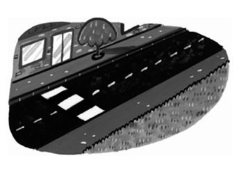
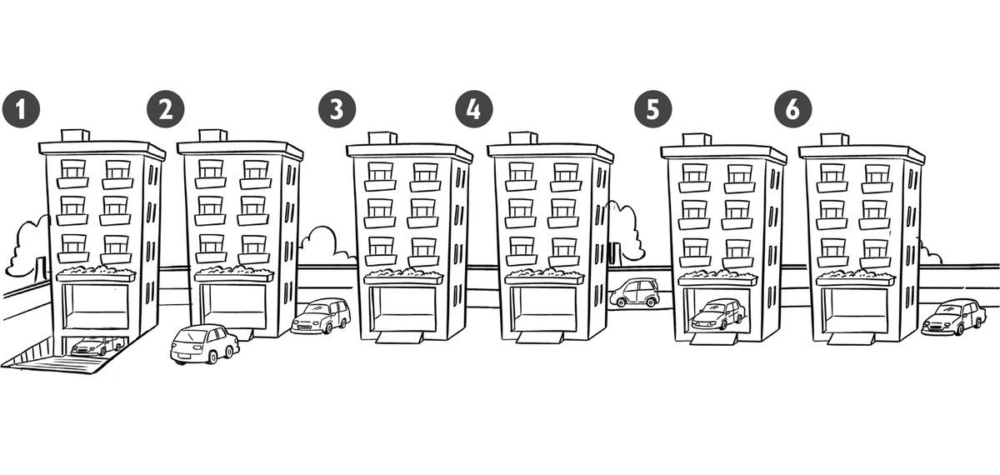
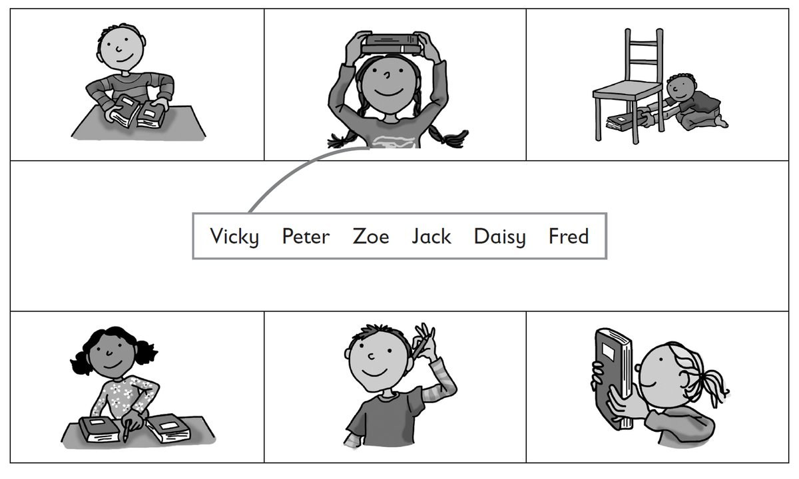

**[Vocabulary]{.underline}**

**1. Look and circle. There is one example.   (one point each)**

1\. *[flat]{.underline}* / shop

2\. street / park

3\. flat / café

4\. hospital / shop

5\. street / park

6\. shop / hospital

**2. Look and tick. There is one example.   (one point each)**

1\. People live here.      café      ☐      flat      ✓

2\. Children play
here.      hospital      café      ☐      park      café      ☐

3\. People drink coffee here.      café      ☐      pet shop      ☐

4\. You go shopping here.      shop      ☐      school      ☐

5\. You go here when you are ill.      town      ☐      hospital      ☐

6\. You see cars and buses here.      street      ☐      house      ☐

**3. Look and circle. There is one example.   (one point each)**

Where are the cars?

1\. behind / *[under]{.underline}*

2\. in front of / next to

3\. between / on

4\. under / behind

5\. between / in

6\. next to / under

**[Grammar]{.underline}**

**4. Look and tick or cross. There is one example.   (one point each)**

1\. The shoe shop is behind the pet shop. ✗

2\. The cafe is between the fruit shop and the park. ⬜

3\. The café is next to the park. ⬜

4\. There are children in the park. ⬜

5\. The dog is in front of the fruit shop. ⬜

6\. There are two cars behind the bus. ⬜

**5. Read and circle. There is one example.   (one point each)**

1\. Where *is* / *[are]{.underline}* the shops?     They're in the town.

2\. Where *is* / *are* the toys?     They're in the shop.

3\. Where *is* / *are* the bus?     It's behind the car.

4\. Where *is* / *are* the park?     It's next to the school.

5\. Where *is* / *are* the cars?     They're on the street.

6\. Where *is* / *are* your sister?     She's in the park.

**[Listening]{.underline}**

**6. Listen and draw lines. There is one example.   (one point each)**

**7. Listen and colour. There is one example.   (one point each)**

**[Reading]{.underline}**

**8. Read and write the words. There is one example.   (one point
each)**

This is a street in my town. There are some (1)
\_\_\_\_\_\_\_\_\_\_\_\_\_\_\_ trees in front of my school.

My school is next to a (2) \_\_\_\_\_\_\_\_\_\_\_\_\_\_\_ shop.

The toy shop is between my school and the (3)
\_\_\_\_\_\_\_\_\_\_\_\_\_\_\_ shop.

There is a bus station in my town. It's behind the (4)
\_\_\_\_\_\_\_\_\_\_\_\_\_\_\_.

The park is between the (5) \_\_\_\_\_\_\_\_\_\_\_\_\_\_\_ and the (6)
\_\_\_\_\_\_\_\_\_\_\_\_\_\_\_.

The café is next to my flat!

