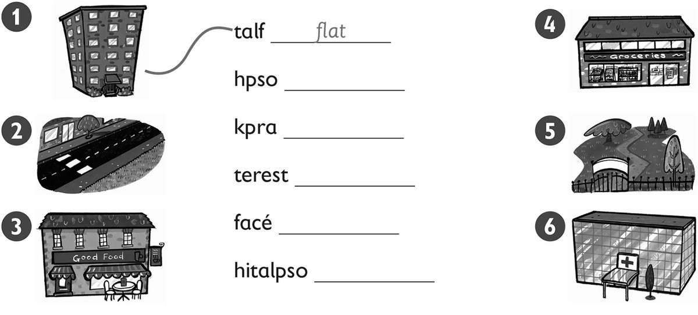
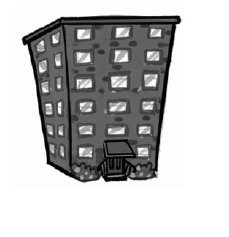
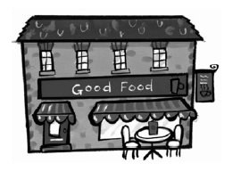
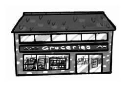
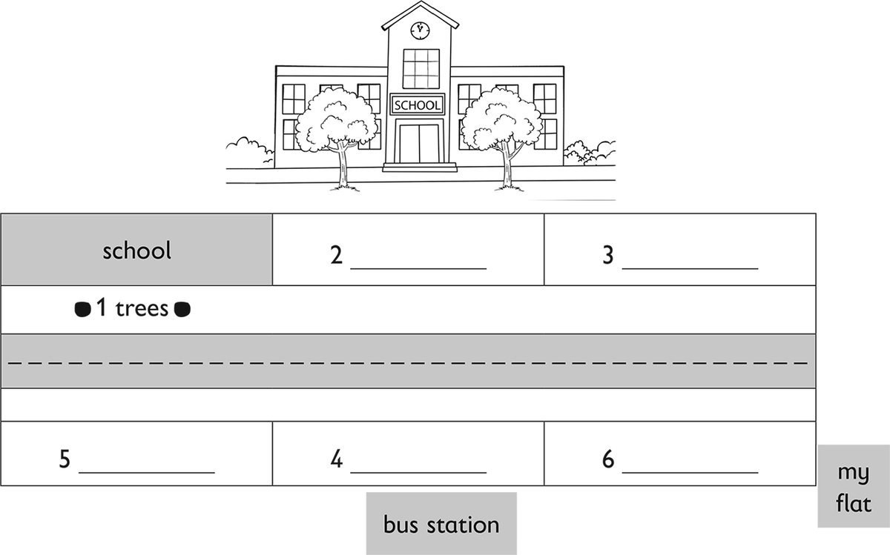

**[Vocabulary]{.underline}**

**1. Unscramble and draw lines. There is one example.   (one point
each)**

*shop -- 4*

*park -- 5*

*street -- 2*

*café -- 3*

*hospital -- 6*

**2. Look and read. Write the words. There is one example.   (one point
each)**

1\. People live here.      *[flat]{.underline}*

2\. Children play here.      \_\_\_\_\_\_\_\_\_\_\_\_

*in front of*

3\. People drink coffee here.      \_\_\_\_\_\_\_\_\_\_\_\_

*between*

4\. You go shopping here.      \_\_\_\_\_\_\_\_\_\_\_\_

*behind*

5\. You go here when youare ill.      \_\_\_\_\_\_\_\_\_\_\_\_

*in*

6\. You see cars and buses here.      \_\_\_\_\_\_\_\_\_\_\_\_

*next to*

**3. Look and write. There is one example.   (one point each)**

1\. *[under]{.underline}*

2\. *park*

3\. *cafe*

4\. *shop*

5\. *hospital*

6\. *street*

**[Grammar]{.underline}**

**4. Look and complete the sentences. There is one example.   (one point
each)**

There [are]{.underline} children in the park.

1\. The café is *next to* the park.

2\. The pet shop is *between* the fruit shop and the shoe shop.

3\. There are two cars *behind* the bus.

4\. The dog is *in front of* the fruit shop.

5\. There *is* a shoe shop next to the pet shop.

**5. Read and write *is* or *are*. There is one example.   (one point
each)**

1\. Where *[are]{.underline}* the shops?      in the town

2\. Where *are* the toys?      in the shop

3\. Where *is* the bus?      behind the car

4\. Where *is* the park?      next to the school

5\. Where *are* the cars?      on the street

6\. Where *is* your sister?      in the park

**[Listening]{.underline}**

**6. Listen and write the name. There is one example.   (one point
each)**

Daisy \| Fred \| Jack \| Peter \| ~~Vicky~~ \| Zoe

*1. Jack*

*3. Fred*

*4. Zoe*

*5. Peter*

*6. Daisy*

**Audio script**

**1. Teacher:** Where's your book, Vicky?

    **Vicky:** It's on my head.

**2. Teacher:** Where's your pencil, Peter?

    **Peter:** It's behind my ear!

**3. Teacher:** Where's your pencil, Zoe?

    **Zoe:** It's between my two books.

**4. Teacher:** Where's your book, Jack?

    **Jack:** It's next to my blue book.

**5. Teacher:** Where's your book, Daisy?

    **Daisy:** It's in front of my face!

**6. Teacher:** Where's your book, Fred?

    **Fred:** I'm putting it under the chair.

**7. Listen and write the words. There is one example.   (one point
each)**

1\. Where's the yellow book? -- on the *[sofa]{.underline}*.

2\. Where's the red book? -- in the \_\_\_\_\_\_\_\_\_\_\_\_.

*cupboard*

3\. Where's the blue book? -- in front of the \_\_\_\_\_\_\_\_\_\_\_\_.

*sofa*

4\. Where's the orange book? -- next to the \_\_\_\_\_\_\_\_\_\_\_\_.

*bag*

5\. Where's the green book? -- behind the \_\_\_\_\_\_\_\_\_\_\_\_.

*duck*

6\. Where's the pink book? -- between the \_\_\_\_\_\_\_\_\_\_\_\_.

*(two) armchairs*

**Audio script**

1\. The book on the sofa is yellow.

2\. The book in the cupboard is red.

3\. The book in front of the sofa is blue.

4\. The book next to the bag is orange.

5\. The book behind the duck is green.

6\. The book between the two armchairs is pink.

**[Reading]{.underline}**

**8. Read and write the words. There is one example.   (one point
each)**

This is a street in my town. There are some trees in front of my school.

My school is next to a toy shop.

The toy shop is between my school and the shoe shop.

There is a bus station in my town. It's behind the park.

The park is between the hospital and the café.

The café is next to my flat!

*2. toy shop*

*3. shoe shop*

*4. park*

*5. hospital*

*6. café*

