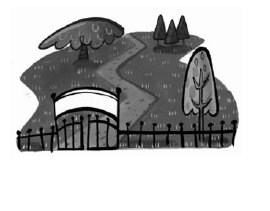
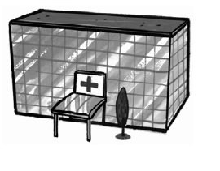
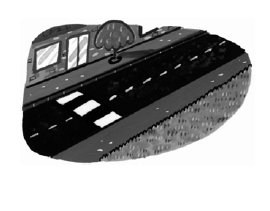
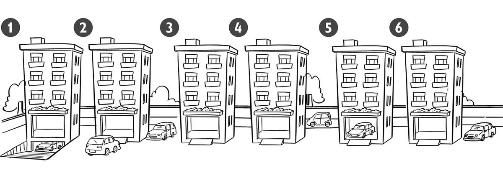
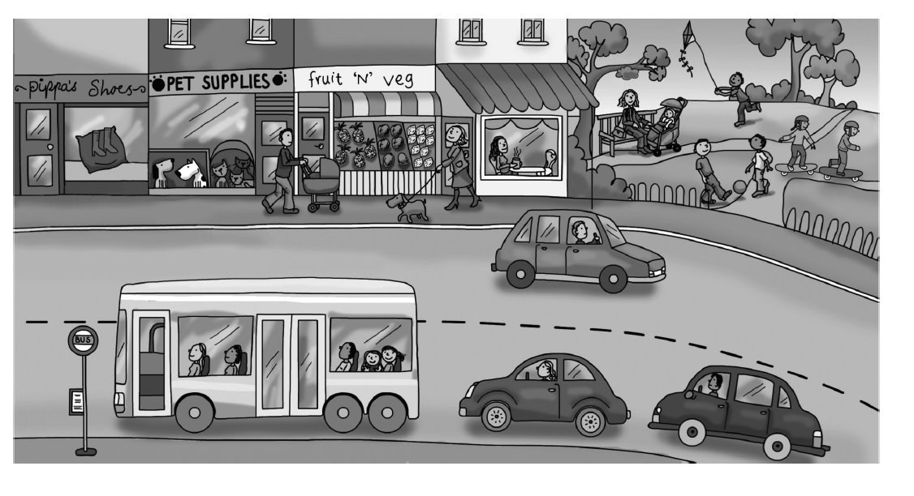
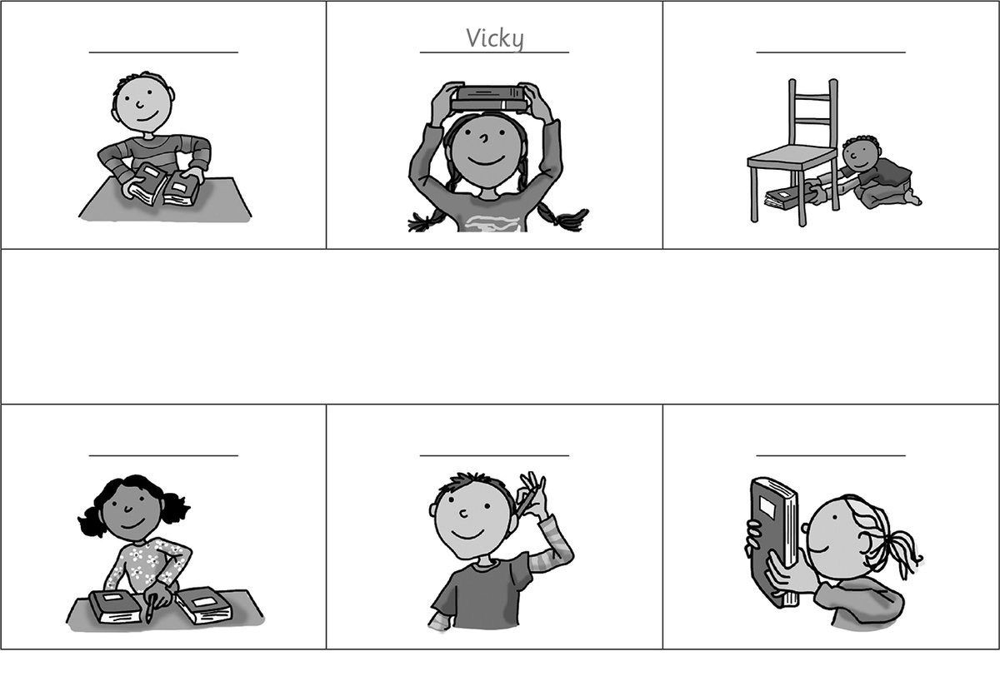
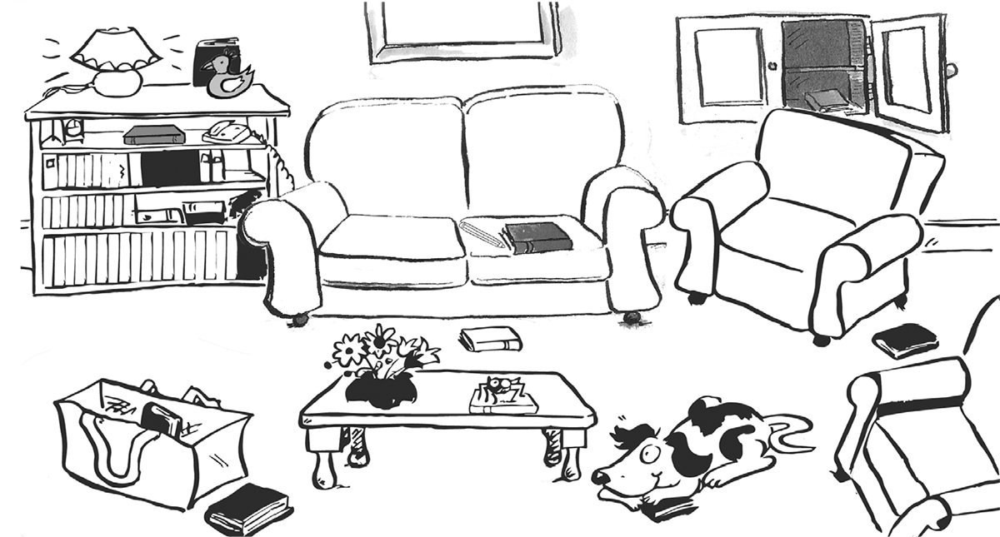

**[Vocabulary]{.underline}**

**1. Unscramble and draw lines. There is one example.   (one point
each)**

**2. Look and read. Write the words. There is one example.   (one point
each)**

1\. People live here.      *[flat]{.underline}*

2\. Children play here.      \_\_\_\_\_\_\_\_\_\_\_\_

3\. People drink coffee here.      \_\_\_\_\_\_\_\_\_\_\_\_

4\. You go shopping here.      \_\_\_\_\_\_\_\_\_\_\_\_

5\. You go here when youare ill.      \_\_\_\_\_\_\_\_\_\_\_\_

6\. You see cars and buses here.      \_\_\_\_\_\_\_\_\_\_\_\_

**3. Look and write. There is one example.   (one point each)**

1\. *[under]{.underline}*

2\. \_\_\_\_\_\_\_\_\_\_\_\_\_\_\_

3\. \_\_\_\_\_\_\_\_\_\_\_\_\_\_\_

4\. \_\_\_\_\_\_\_\_\_\_\_\_\_\_\_

5\. \_\_\_\_\_\_\_\_\_\_\_\_\_\_\_

6\. \_\_\_\_\_\_\_\_\_\_\_\_\_\_\_

**[Grammar]{.underline}**

**4. Look and complete the sentences. There is one example.   (one point
each)**

1\. There *[are]{.underline}* children in the park.

2\. The café is \_\_\_\_\_\_\_\_\_\_\_\_\_\_\_\_\_\_ the park.

3\. The pet shop is \_\_\_\_\_\_\_\_\_\_\_\_\_\_\_\_\_\_ the fruit shop
and the shoe shop.

4\. There are two cars \_\_\_\_\_\_\_\_\_\_\_\_\_\_\_\_\_\_ the bus.

5\. The dog is \_\_\_\_\_\_\_\_\_\_\_\_\_\_\_\_\_\_ the fruit shop.

6\. There \_\_\_\_\_\_\_\_\_\_\_\_\_\_\_\_\_\_ a shoe shop next to the
pet shop.

**5. Read and write *is* or *are*. There is one example.   (one point
each)**

1\. Where *[are]{.underline}* the shops?      in the town

2\. Where \_\_\_\_\_\_\_\_\_\_ the toys?      in the shop

3\. Where \_\_\_\_\_\_\_\_\_\_ the bus?      behind the car

4\. Where \_\_\_\_\_\_\_\_\_\_ the park?      next to the school

5\. Where \_\_\_\_\_\_\_\_\_\_ the cars?      on the street

6\. Where \_\_\_\_\_\_\_\_\_\_ your sister?      in the park

**[Listening]{.underline}**

**6. Listen and write the name. There is one example.   (one point
each)**

Daisy \| Fred \| Jack \| Peter \| ~~Vicky~~ \| Zoe

**7. Listen and write the words. There is one example.   (one point
each)**

1\. Where's the yellow book? -- on the *[sofa]{.underline}*.

2\. Where's the red book? -- in the \_\_\_\_\_\_\_\_\_\_\_\_.

3\. Where's the blue book? -- in front of the \_\_\_\_\_\_\_\_\_\_\_\_.

4\. Where's the orange book? -- next to the \_\_\_\_\_\_\_\_\_\_\_\_.

5\. Where's the green book? -- behind the \_\_\_\_\_\_\_\_\_\_\_\_.

6\. Where's the pink book? -- between the \_\_\_\_\_\_\_\_\_\_\_\_.

**[Reading]{.underline}**

**8. Read and write the words. There is one example.   (one point
each)**

This is a street in my town. There are some trees in front of my school.

My school is next to a toy shop.

The toy shop is between my school and the shoe shop.

There is a bus station in my town. It's behind the park.

The park is between the hospital and the café.

The café is next to my flat!

