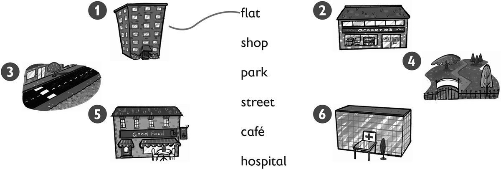
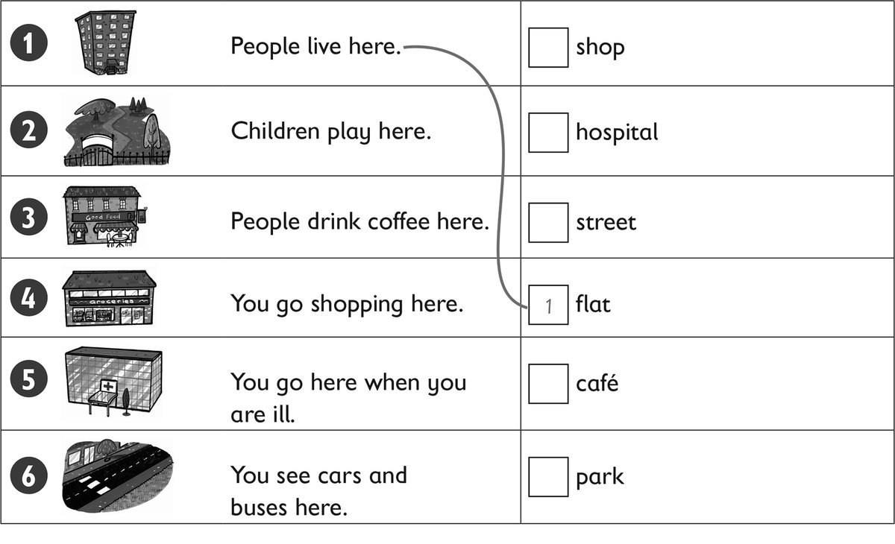
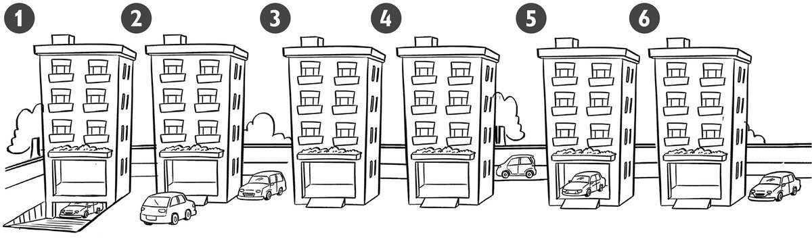
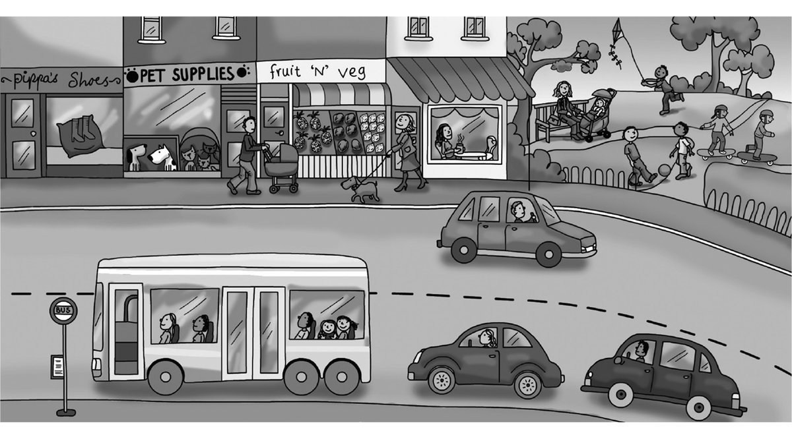
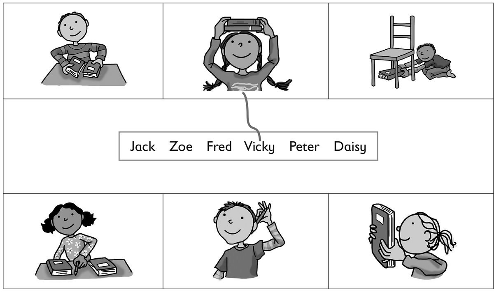
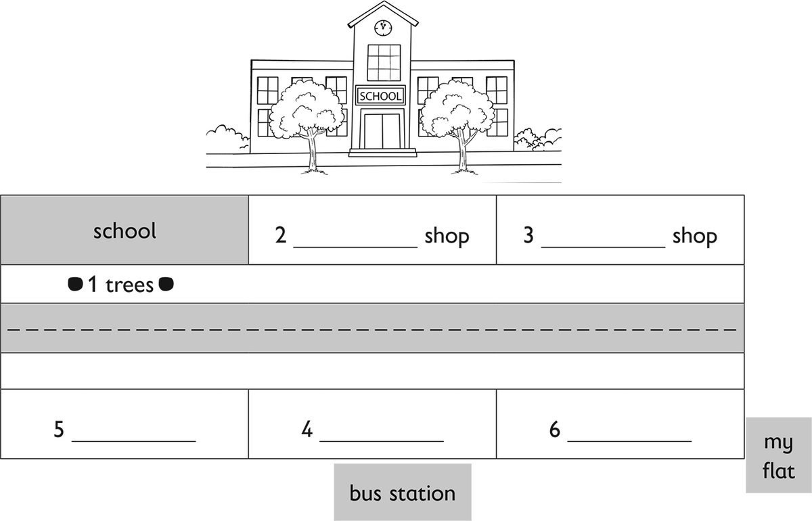

**[Vocabulary]{.underline}**

**1. Draw lines. There is one example.   (one point each)**

*shop -- 2*

*park -- 4*

*street -- 3*

*café -- 5*

*hospital -- 6*

**2. Look and draw lines. Write the number. There is one example.   (one
point each)**

*2. in front of*

*3. between*

*4. behind*

*5. in*

*6. next to*

**3. Look and write the number. There is one example.   (one point
each)**

Where is the car?

\_\_\_\_\_\_\_\_\_\_\_\_
behind         [          *1*           ]{.underline} under

\_\_\_\_\_\_\_\_\_\_\_\_ in                 \_\_\_\_\_\_\_\_\_\_\_ next
to

\_\_\_\_\_\_\_\_\_\_\_\_ in frontof      \_\_\_\_\_\_\_\_\_\_\_ between

*2. park*

*3. café*

*4. shop*

*5. hospital*

*6. street*

**[Grammar]{.underline}**

**4. Look and tick or cross. There is one example.   (one point each)**

1\. There are ten shops. *[✗]{.underline}*

2\. The café is next to the park. ⬜

*✓*

3\. The cafe is between the fruit shop and the park. ⬜

*✗*

4\. There are two cars behind the bus. ⬜

*✓*

5\. The dog is in front of the fruit shop. ⬜

*✓*

6\. There are two cars. ⬜

*✗*

**5. Read and write *is* or *are*. There is one example.   (one point
each)**

1\. Where *[are]{.underline}* the shops?      They're in the town.

2\. Where \_\_\_\_\_\_\_\_\_\_\_\_ the toys?      They're in the shop.

*are*

3\. Where \_\_\_\_\_\_\_\_\_\_\_\_ the bus?      It's behind the car.

*is*

4\. Where \_\_\_\_\_\_\_\_\_\_\_\_ the park?      It's next to the
school.

*is*

5\. Where \_\_\_\_\_\_\_\_\_\_\_\_ the cars?      They're on the street.

*are*

6\. Where \_\_\_\_\_\_\_\_\_\_\_\_ your sister?      She's in the park.

*is*

**[Listening]{.underline}**

**6. Listen and draw lines. There is one example.   (one point each)**

*1. Jack*

*3. Fred*

*4. Zoe*

*5. Peter*

*6. Daisy*

**Audio script**

**1. Teacher:** Where's your book, Vicky?

    **Vicky:** It's on my head.

**2. Teacher:** Where's your pencil, Peter?

    **Peter:** It's behind my ear!

**3. Teacher:** Where's your pencil, Zoe?

    **Zoe:** It's between my two books.

**4. Teacher:** Where's your book, Jack?

    **Jack:** It's next to my blue book.

**5. Teacher:** Where's your book, Daisy?

    **Daisy:** It's in front of my face!

**6. Teacher:** Where's your book, Fred?

    **Fred:** I'm putting it under the chair.

**7. Listen and write the colour. There is one example.   (one point
each)**

The book on the sofa is *[yellow]{.underline}*.

The book in the cupboard is \_\_\_\_\_\_\_\_\_\_\_\_.

The book in front of the sofa is \_\_\_\_\_\_\_\_\_\_\_\_.

The book next to the bag is \_\_\_\_\_\_\_\_\_\_\_\_.

The book behind the duck is \_\_\_\_\_\_\_\_\_\_\_\_.

The book between the two armchairs is \_\_\_\_\_\_\_\_\_\_\_\_.

*1. red, book in front of sofa*

*2. blue, book next to bag*

*3. orange, book behind duck*

*4. green, book between 2 armchairs*

*5. pink*

**Audio script**

1\. The book on the sofa is yellow.

2\. The book in the cupboard is red.

3\. The book in front of the sofa is blue.

4\. The book next to the bag is orange.

5\. The book behind the duck is green.

6\. The book between the two armchairs is pink.

**[Reading]{.underline}**

**8. Read and write the words. There is one example.   (one point
each)**

This is a street in my town. There are some trees in front of my school.

My school is next to a toy shop.

The toy shop is between my school and the shoe shop.

There is a bus station in my town. It's behind the park.

The park is between the hospital and the café.

The café is next to my flat!

*2. toy*

*3. shoe*

*4. park*

*5. hospital*

*6. café*

