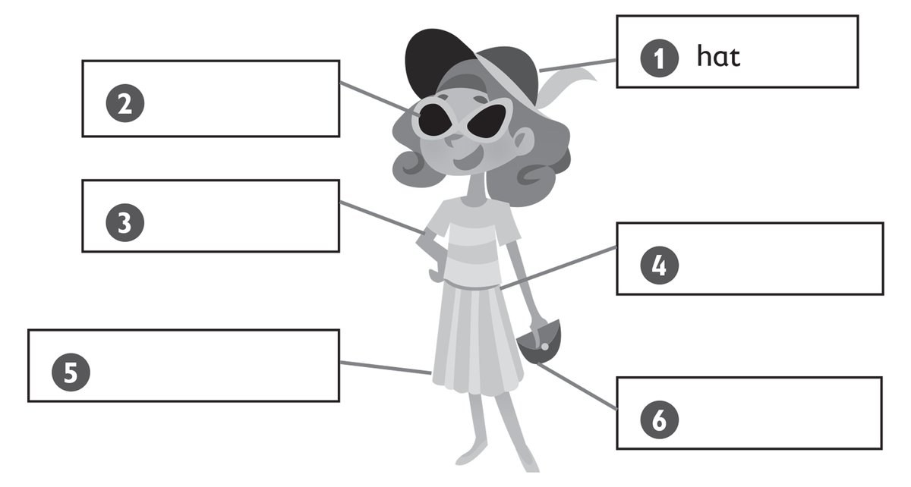
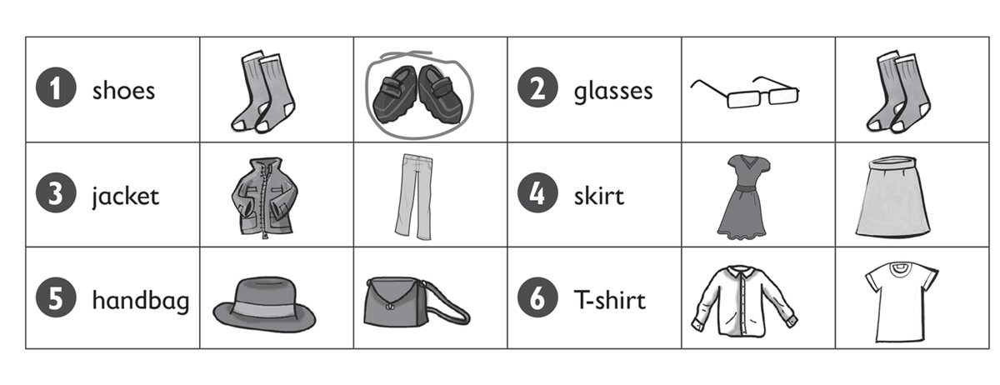
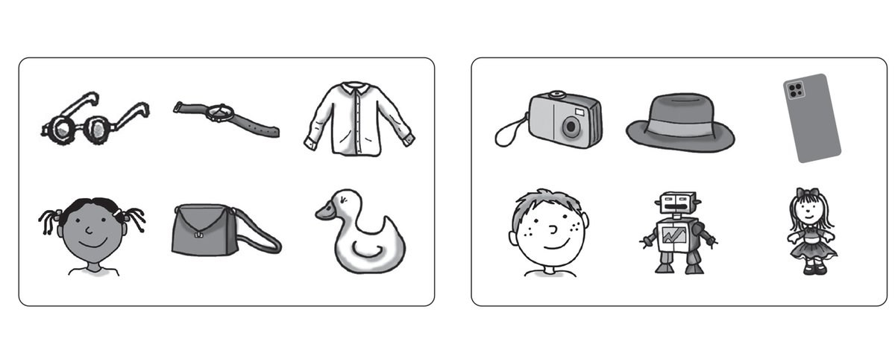
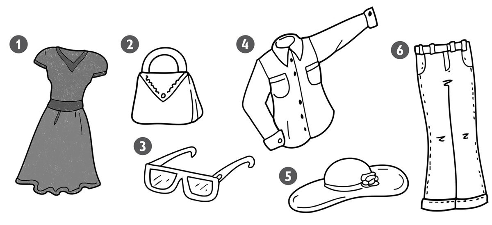
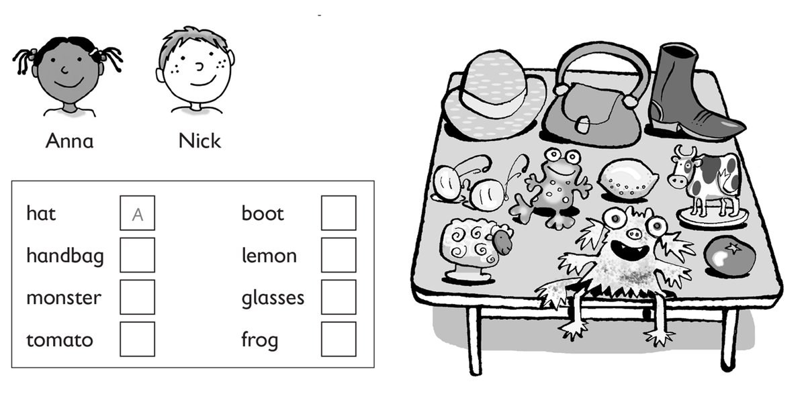

**[Vocabulary]{.underline}**

**1. Look and write. There is one example.   (one point each)**

~~hat~~ \| shirt \| dress \| jeans \| handbag \| glasses

*glasses*

*shirt*

*dress*

*handbag*

*jeans*

**2. Look and circle. There is one example.   (one point each)**

*glasses*

*jacket*

*skirt*

*handbag*

*T-shirt*

**3. VCB-03_Look and draw. There is one example.   (one point each)**

*Ben's got -- a small dog a garden a big car*

*Dan's got -- a big cat a small car*

**[Grammar]{.underline}**

**4. Read and answer the questions. There are two examples.   (one point
each)**

1\. Has he got a robot? *[Yes, he has]{.underline}*.

2\. Has she got a doll? *[No, she hasn't]{.underline}*.

3\. Has he got a shirt? *No, he hasn't.*

4\. Has she got a watch? *Yes, she has.*

5\. Has he got a duck? *No, he hasn't.*

6\. Has she got a camera? *No, she hasn't.*

7\. Has he got a phone? *Yes, he has.*

**5. Read and circle. There is one example.   (one point each)**

1\. *He's wearing* / *[He's got]{.underline}* a lizard.

2\. *She's wearing* / *She's got* a dress.

*She's wearing*

3\. *She's wearing* / *She's got* a handbag.

*She's got*

4\. *He's wearing* / *He's got* jeans.

*He's wearing*

5\. *He's wearing* / *He's got* a camera.

*He's got*

6\. *She's wearing* / *She's got* a phone.

*She's got a phone.*

**[Listening]{.underline}**

**6. Listen and colour. There is one example.   (one point each)**

*a red hand bag*

*black glasses*

*a yellow shirt*

*a purple hat*

*blue jeans*

**Audio script**

I'm wearing a grey dress.

I've got a red handbag.

I'm wearing black glasses.

I'm wearing a yellow shirt.

I'm wearing a purple hat.

I'm wearing blue jeans.

**7. Listen and write *A* for Anna or *N* for Nick. There is one
example.   (one point each)**

*A: glasses a lemon*

*N: boot frog monster*

**Audio script**

**Anna:** Hi. I'm Anna. I've got a hat and glasses.

**Nick:** Have you got a tomato?

**Anna:** No, I haven't. I've got a lemon.

**Nick:** Hi, I'm Nick. I've got a boot and a frog.

**Anna:** Have you got a monster?

**[Reading]{.underline}**

**8. Read and circle. There is one example.   (one point each)**

1\. How many sisters has Tom got?    *[one]{.underline}* / *two*

2\. Is he wearing jeans or trousers?    *jeans* / *trousers*

*trousers*

3\. What colour is Clare's dress?    *pink* / *purple*

*pink*

4\. How many books has Tom got?    *one* / *two*

*two*

5\. Has he got an orange?    *Yes, he has.* / *No, he hasn't*.

*No, he hasn't*

6\. Where are Clare's sunglasses?     *in her handbag* / *in her school
bag*

*in her handbag*

