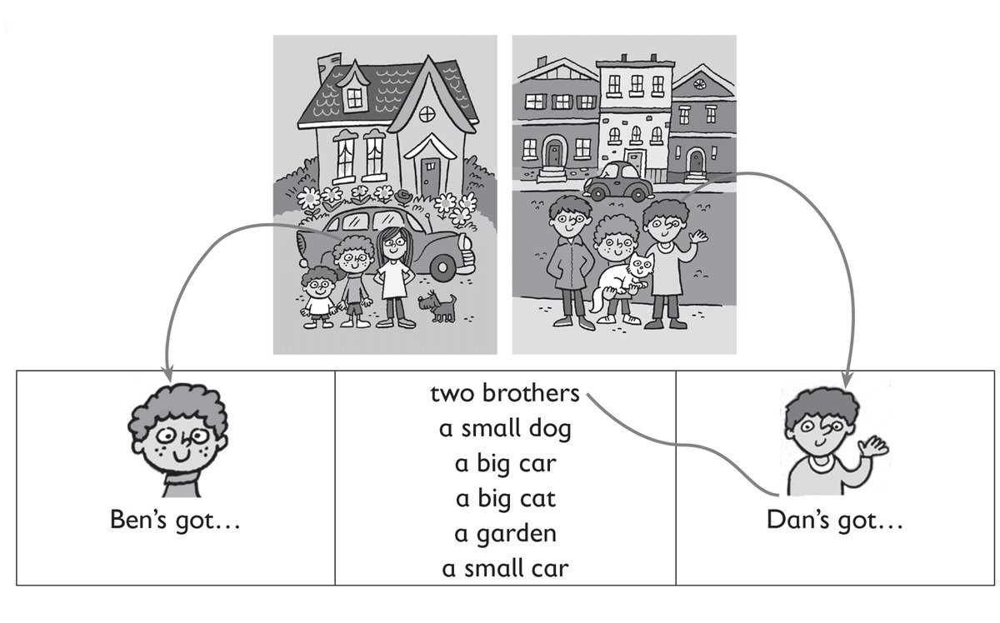
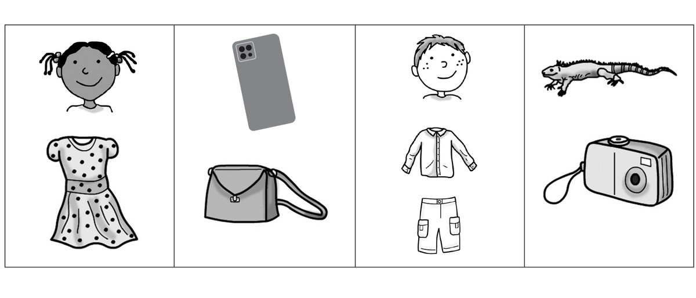
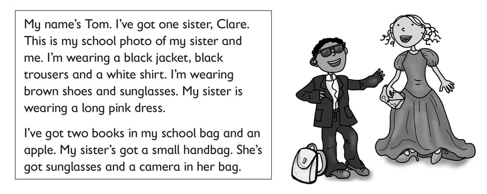

**[Vocabulary]{.underline}**

**1. Look and write. There is one example.   (one point each)**

~~hat~~ \| shirt \| dress \| jeans \| handbag \| glasses

**2. Look and circle. There is one example.   (one point each)**

**3. VCB-03_Look and draw. There is one example.   (one point each)**

**[Grammar]{.underline}**

**4. Read and answer the questions. There are two examples.   (one point
each)**

1\. Has he got a robot? *[Yes, he has]{.underline}*.

2\. Has she got a doll? *[No, she hasn't]{.underline}*.

3\. Has he got a shirt? \_\_\_\_\_\_\_\_\_\_\_\_\_\_\_\_\_\_\_\_\_\_

4\. Has she got a watch? \_\_\_\_\_\_\_\_\_\_\_\_\_\_\_\_\_\_\_\_\_\_

5\. Has he got a duck? \_\_\_\_\_\_\_\_\_\_\_\_\_\_\_\_\_\_\_\_\_\_

6\. Has she got a camera? \_\_\_\_\_\_\_\_\_\_\_\_\_\_\_\_\_\_\_\_\_\_

7\. Has he got a phone? \_\_\_\_\_\_\_\_\_\_\_\_\_\_\_\_\_\_\_\_\_\_

**5. Read and circle. There is one example.   (one point each)**

1\. *He's wearing* / *[He's got]{.underline}* a lizard.

2\. *She's wearing* / *She's got* a dress.

3\. *She's wearing* / *She's got* a handbag.

4\. *He's wearing* / *He's got* jeans.

5\. *He's wearing* / *He's got* a camera.

6\. *She's wearing* / *She's got* a phone.

**[Listening]{.underline}**

**6. Listen and colour. There is one example.   (one point each)**

**7. Listen and write *A* for Anna or *N* for Nick. There is one
example.   (one point each)**

**[Reading]{.underline}**

**8. Read and circle. There is one example.   (one point each)**

1\. How many sisters has Tom got?    *[one]{.underline}* / *two*

2\. Is he wearing jeans or trousers?    *jeans* / *trousers*

3\. What colour is Clare's dress?    *pink* / *purple*

4\. How many books has Tom got?    *one* / *two*

5\. Has he got an orange?    *Yes, he has.* / *No, he hasn't*.

6\. Where are Clare's sunglasses?     *in her handbag* / *in her school
bag*

