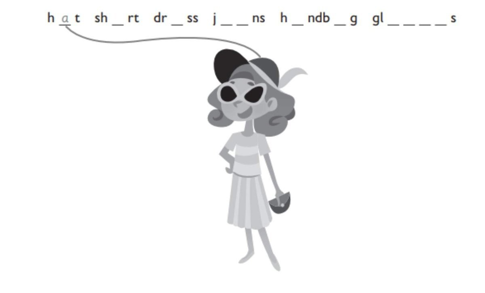
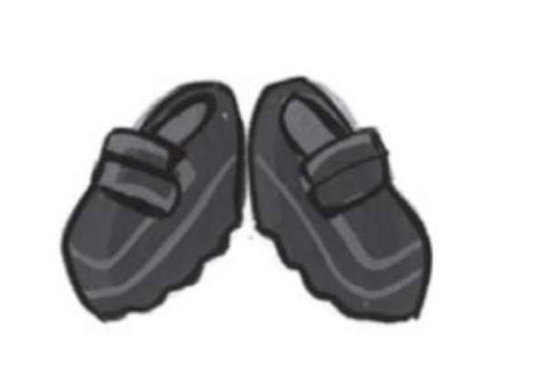
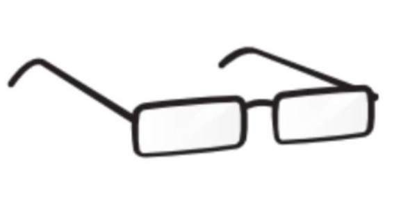
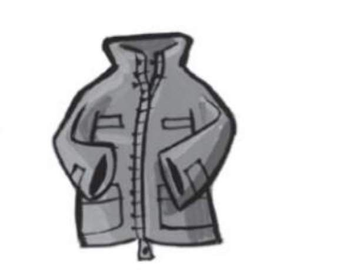
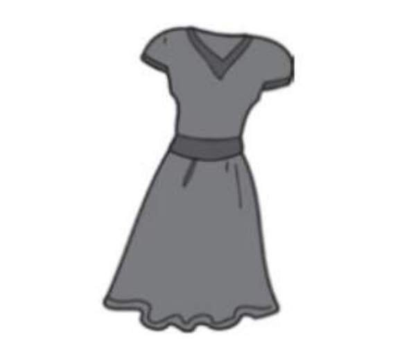
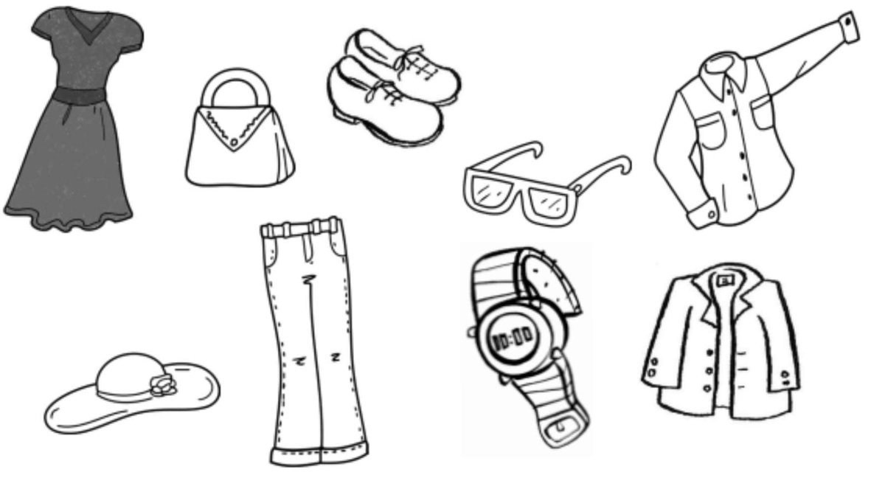

**[Vocabulary]{.underline}**

**1. Look and complete the words. Draw the lines. There is one
example.   (one point each)**

*Match -- glasses*

*shirt*

*dress*

*jeans and handbag to picture.*

**2. Look and circle. There is one example.   (one point each)**

  -------------------------------------------------------------------------------------------------------------------------------------------------------------------------------------------------------------------- -- ----------------------------------------------------------------------------------------------------------------------------------------------------------------------------------------------------------------- -- -----------------------------------------------------------------------------------------------------------------------------------------------------------------------------------------------------------------
   1.            
  shirt / *[shoes]{.underline}* / socks                                                                                                                                                                                   2. glasses / hat / sunglasses                                                                                                                                                                                        3. jeans / jacket / trousers

  -------------------------------------------------------------------------------------------------------------------------------------------------------------------------------------------------------------------- -- ----------------------------------------------------------------------------------------------------------------------------------------------------------------------------------------------------------------- -- -----------------------------------------------------------------------------------------------------------------------------------------------------------------------------------------------------------------

  ----------------------------------------------------------------------------------------------------------------------------------------------------------------------------------------------------------------- -- ----------------------------------------------------------------------------------------------------------------------------------------------------------------------------------------------------------------- -- -----------------------------------------------------------------------------------------------------------------------------------------------------------------------------------------------------------------
              
  4. skirt / shirt / dress                                                                                                                                                                                             5. handbag / hat / skirt                                                                                                                                                                                             6. shirt / shoes / T-shirt

  ----------------------------------------------------------------------------------------------------------------------------------------------------------------------------------------------------------------- -- ----------------------------------------------------------------------------------------------------------------------------------------------------------------------------------------------------------------- -- -----------------------------------------------------------------------------------------------------------------------------------------------------------------------------------------------------------------

**3. Look and write Ben or Dan. There is one example.   (one point
each)**

  ------------------------------- --- -----------------------------------
  1\. He's got two brothers.          *[Dan]{.underline}*

  ------------------------------- --- -----------------------------------

  ------------------------------- --- -----------------------------------
  2\. He's got a small dog            *Ben*

  ------------------------------- --- -----------------------------------

  ------------------------------- --- -----------------------------------
  3\. He's got a big cat              *Dan*

  ------------------------------- --- -----------------------------------

  ------------------------------- --- -----------------------------------
  4\. He's got a small car            *Dan*

  ------------------------------- --- -----------------------------------

  ------------------------------- --- -----------------------------------
  5\. He's got a big car              *Ben*

  ------------------------------- --- -----------------------------------

  ------------------------------- --- -----------------------------------
  6\. He's got a beautiful garden     *Ben*

  ------------------------------- --- -----------------------------------

**[Grammar]{.underline}**

**4. Read and answer the questions. There are two examples.   (one point
each)**

  ------------------------------- --- -----------------------------------
  1\. Has he got a robot?             *[Yes, he has.]{.underline}*

  ------------------------------- --- -----------------------------------

  ------------------------------- --- -----------------------------------
  2\. Has she got sunglasses?         *[Yes, she has.]{.underline}*

  ------------------------------- --- -----------------------------------

  ------------------------------- --- -----------------------------------
  3\. Has she got a duck?             *Yes, she has.*

  ------------------------------- --- -----------------------------------

  ------------------------------- --- -----------------------------------
  4\. Has he got a watch?             *No, he hasn't.*

  ------------------------------- --- -----------------------------------

  ------------------------------- --- -----------------------------------
  5\. Has he got a shirt?             *No, he hasn't.*

  ------------------------------- --- -----------------------------------

  ------------------------------- --- -----------------------------------
  6\. Has he got a duck?              *Yes, she has.*

  ------------------------------- --- -----------------------------------

  ------------------------------- --- -----------------------------------
  7\. Has she got a watch?            *No, he hasn't.*

  ------------------------------- --- -----------------------------------

**5. Read and write He / She's wearing or He / She's got. There is one
example.   (one point each)**

1\. *[He's got]{.underline}* a lizard.

2\. *She's wearing* a dress.

3\. *She's got,* a handbag.

4\. *He's wearing* jeans.

5\. *He's got* a camera.

6\. *She's got* a phone.

**[Listening]{.underline}**

**6. Listen and colour. There are three extra pictures. There is one
example.   (one point each)**

*handbag -- red*

*glasses -- black*

*shirt -- yellow*

*hat -- purple*

*jeans -- blue*

**Audio script**

I'm wearing a grey dress.

I've got a red handbag.

I'm wearing black glasses.

I'm wearing a yellow shirt.

I'm wearing a purple hat.

I'm wearing blue jeans.

**7. Listen. Write A for Anna or N for Nick. There is one
example.   (one point each)**

*A: glasses*

*a lemon; N: boot*

*frog*

*monster*

**Audio script**

Anna: Hi. I'm Anna. I've got a hat and glasses.

Nick: Have you got a tomato?

Anna: No, I haven't. I've got a lemon.

Nick: Hi, I'm Nick. I've got a boot and a frog.

Anna: Have you got a monster?

Nick: Yes, I have!

**[Reading]{.underline}**

**8. Read and match. Write the answer. There is one example.   (one
point each)**

  ------------------------------- --- ---------------------------------
  1\. How many sisters has Tom        They're in her
  got?                                \_\_\_\_\_\_\_\_\_\_\_\_\_\_\_.

  ------------------------------- --- ---------------------------------

*He's got [one]{.underline}.*

  ------------------------------- --- ---------------------------------
  2\. Is he wearing jeans or          He's wearing
  trousers?                           \_\_\_\_\_\_\_\_\_\_\_\_\_\_\_.

  ------------------------------- --- ---------------------------------

*He's wearing trousers,*

  ------------------------------- --- -------------------------------
  3\. What colour is Clare's          He's got *[one]{.underline}*.
  dress?                              

  ------------------------------- --- -------------------------------

*Her dress is pink*

  ------------------------------- --- ---------------------------------
  4\. How many books has Tom got?     Her dress is
                                      \_\_\_\_\_\_\_\_\_\_\_\_\_\_\_.

  ------------------------------- --- ---------------------------------

*He's got two*

  ------------------------------- --- ---------------------------------
  5\. Has he got an orange?           No, he
                                      \_\_\_\_\_\_\_\_\_\_\_\_\_\_\_.

  ------------------------------- --- ---------------------------------

*No, he hasn't,*

  ------------------------------- --- ---------------------------------
  6\. Where are Clare's               He's got
  sunglasses?                         \_\_\_\_\_\_\_\_\_\_\_\_\_\_\_.

  ------------------------------- --- ---------------------------------

*They're in her handbag*

