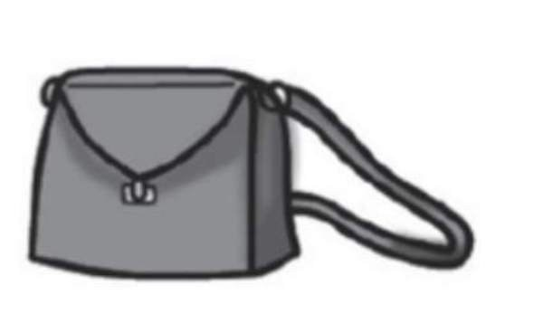
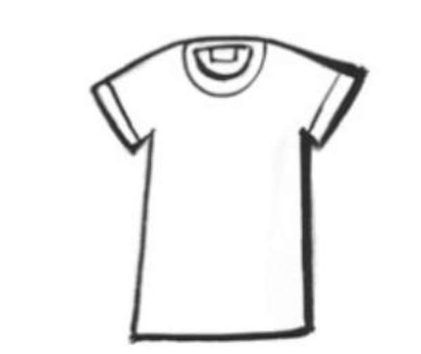
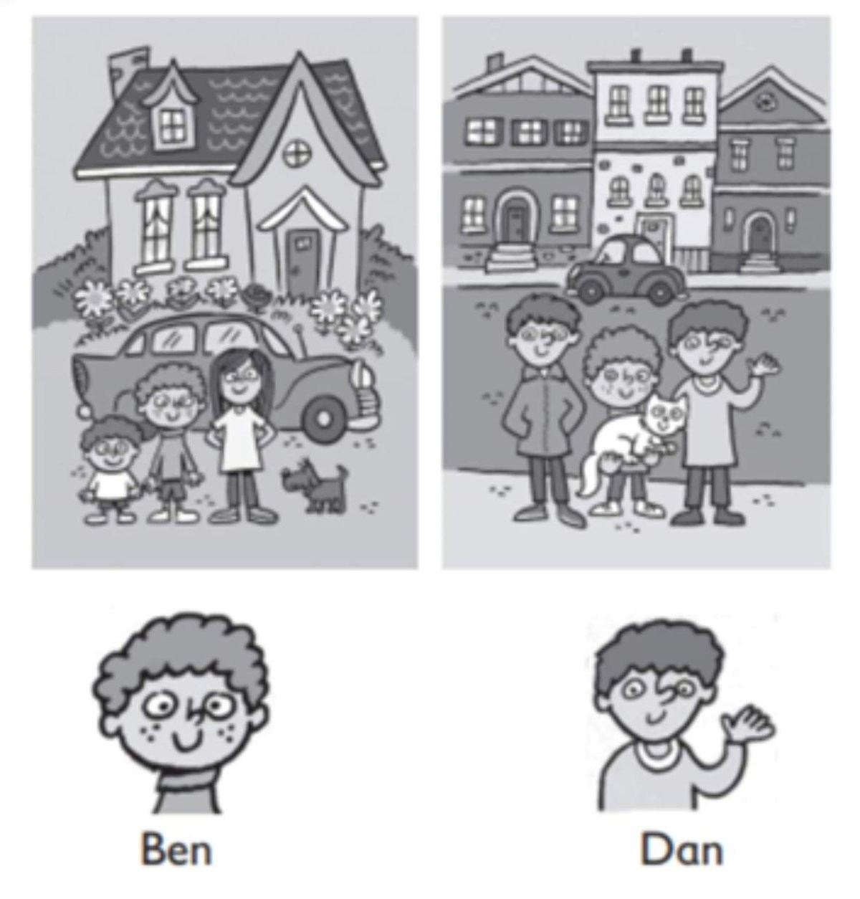
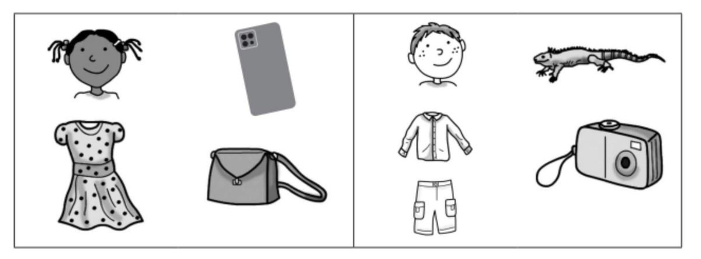
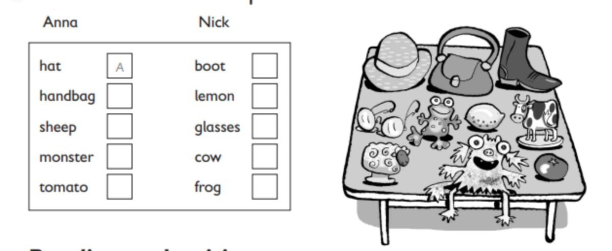
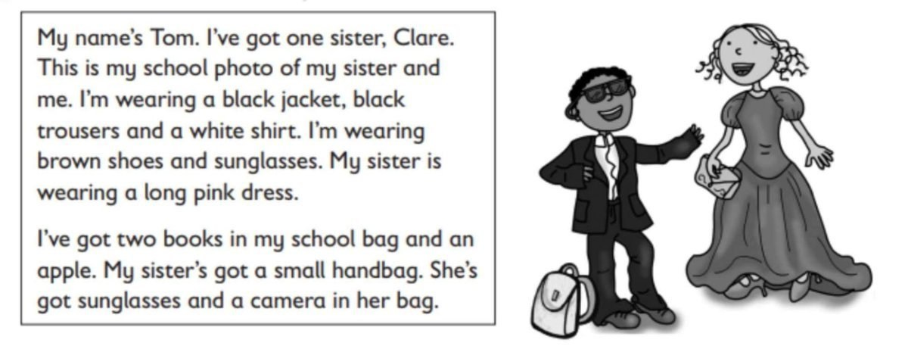

**[Vocabulary]{.underline}**

**1. Look and complete the words. Draw the lines. There is one
example.   (one point each)**

**2. Look and circle. There is one example.   (one point each)**

  ----------------------------------------------------------------------------------------------------------------------------------------------------------------------------------------------------------------------- -- -------------------------------------------------------------------------------------------------------------------------------------------------------------------------------------------------------------------- -- --------------------------------------------------------------------------------------------------------------------------------------------------------------------------------------------------------------------
   1.            
  shirt / *[shoes]{.underline}* / socks                                                                                                                                                                                      2. glasses / hat / sunglasses                                                                                                                                                                                           3. jeans / jacket / trousers

  ----------------------------------------------------------------------------------------------------------------------------------------------------------------------------------------------------------------------- -- -------------------------------------------------------------------------------------------------------------------------------------------------------------------------------------------------------------------- -- --------------------------------------------------------------------------------------------------------------------------------------------------------------------------------------------------------------------

  -------------------------------------------------------------------------------------------------------------------------------------------------------------------------------------------------------------------- -- -------------------------------------------------------------------------------------------------------------------------------------------------------------------------------------------------------------------- -- --------------------------------------------------------------------------------------------------------------------------------------------------------------------------------------------------------------------
              
  4. skirt / shirt / dress                                                                                                                                                                                                5. handbag / hat / skirt                                                                                                                                                                                                6. shirt / shoes / T-shirt

  -------------------------------------------------------------------------------------------------------------------------------------------------------------------------------------------------------------------- -- -------------------------------------------------------------------------------------------------------------------------------------------------------------------------------------------------------------------- -- --------------------------------------------------------------------------------------------------------------------------------------------------------------------------------------------------------------------

**3. Look and write Ben or Dan. There is one example.   (one point
each)**

  ------------------------------- --- -----------------------------------
  1\. He's got two brothers.          *[Dan]{.underline}*

  ------------------------------- --- -----------------------------------

  ------------------------------- --- -----------------------------------
  2\. He's got a small dog            \_\_\_\_\_\_\_\_\_\_\_\_\_\_\_

  ------------------------------- --- -----------------------------------

  ------------------------------- --- -----------------------------------
  3\. He's got a big cat              \_\_\_\_\_\_\_\_\_\_\_\_\_\_\_

  ------------------------------- --- -----------------------------------

  ------------------------------- --- -----------------------------------
  4\. He's got a small car            \_\_\_\_\_\_\_\_\_\_\_\_\_\_\_

  ------------------------------- --- -----------------------------------

  ------------------------------- --- -----------------------------------
  5\. He's got a big car              \_\_\_\_\_\_\_\_\_\_\_\_

  ------------------------------- --- -----------------------------------

  ------------------------------- --- -----------------------------------
  6\. He's got a beautiful garden     \_\_\_\_\_\_\_\_\_\_\_\_

  ------------------------------- --- -----------------------------------

**[Grammar]{.underline}**

**4. Read and answer the questions. There are two examples.   (one point
each)**

  ------------------------------- --- -----------------------------------
  1\. Has he got a robot?             *[Yes, he has.]{.underline}*

  ------------------------------- --- -----------------------------------

  ------------------------------- --- -----------------------------------
  2\. Has she got sunglasses?         *[Yes, she has.]{.underline}*

  ------------------------------- --- -----------------------------------

  ------------------------------- --- -----------------------------------
  3\. Has she got a duck?             \_\_\_\_\_\_\_\_\_\_\_\_

  ------------------------------- --- -----------------------------------

  ------------------------------- --- -----------------------------------
  4\. Has he got a watch?             \_\_\_\_\_\_\_\_\_\_\_\_

  ------------------------------- --- -----------------------------------

  ------------------------------- --- -----------------------------------
  5\. Has he got a shirt?             \_\_\_\_\_\_\_\_\_\_\_\_

  ------------------------------- --- -----------------------------------

  ------------------------------- --- -----------------------------------
  6\. Has he got a duck?              \_\_\_\_\_\_\_\_\_\_\_\_

  ------------------------------- --- -----------------------------------

  ------------------------------- --- -----------------------------------
  7\. Has she got a watch?            \_\_\_\_\_\_\_\_\_\_\_\_

  ------------------------------- --- -----------------------------------

**5. Read and write He / She's wearing or He / She's got. There is one
example.   (one point each)**

1\. *[He's got]{.underline}* a lizard.

2\. \_\_\_\_\_\_\_\_\_\_\_\_\_\_\_\_\_\_\_\_ a dress.

3\. \_\_\_\_\_\_\_\_\_\_\_\_\_\_\_\_\_\_\_\_ a handbag.

4\. \_\_\_\_\_\_\_\_\_\_\_\_\_\_\_\_\_\_\_\_ jeans.

5\. \_\_\_\_\_\_\_\_\_\_\_\_\_\_\_\_\_\_\_\_ a camera.

6\. \_\_\_\_\_\_\_\_\_\_\_\_\_\_\_\_\_\_\_\_ a phone.

**[Listening]{.underline}**

**6. Listen and colour. There are three extra pictures. There is one
example.   (one point each)**

**7. Listen. Write A for Anna or N for Nick. There is one
example.   (one point each)**

**[Reading]{.underline}**

**8. Read and match. Write the answer. There is one example.   (one
point each)**

  ------------------------------- --- ---------------------------------
  1\. How many sisters has Tom        He's wearing
  got?                                \_\_\_\_\_\_\_\_\_\_\_\_\_\_\_.

  ------------------------------- --- ---------------------------------

  ------------------------------- --- ---------------------------------
  2\. Is he wearing jeans or          They're in her
  trousers?                           \_\_\_\_\_\_\_\_\_\_\_\_\_\_\_.

  ------------------------------- --- ---------------------------------

  ------------------------------- --- ---------------------------------
  3\. What colour is Clare's          He's got
  dress?                              \_\_\_\_\_\_\_\_\_\_\_\_\_\_\_.

  ------------------------------- --- ---------------------------------

  ------------------------------- --- -------------------------------
  4\. How many books has Tom got?     He's got *[one]{.underline}*.

  ------------------------------- --- -------------------------------

  ------------------------------- --- ---------------------------------
  5\. Has he got an orange?           Her dress is
                                      \_\_\_\_\_\_\_\_\_\_\_\_\_\_\_.

  ------------------------------- --- ---------------------------------

  ------------------------------- --- ---------------------------------
  6\. Where are Clare's               No, he
  sunglasses?                         \_\_\_\_\_\_\_\_\_\_\_\_\_\_\_.

  ------------------------------- --- ---------------------------------

