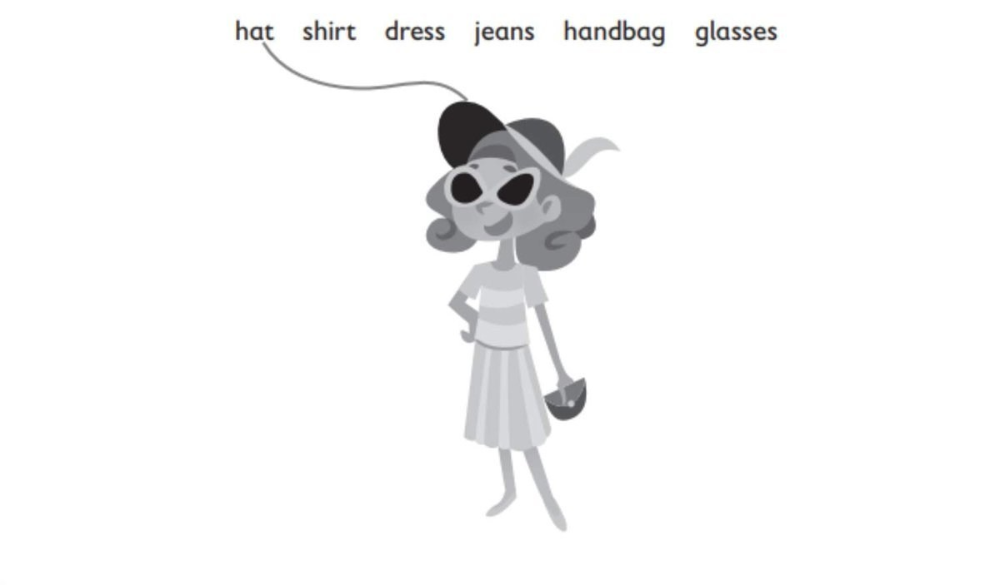
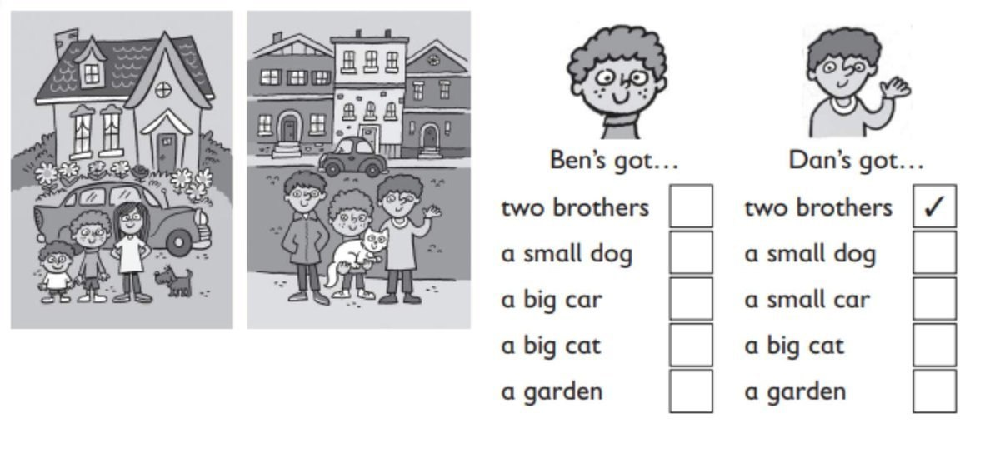
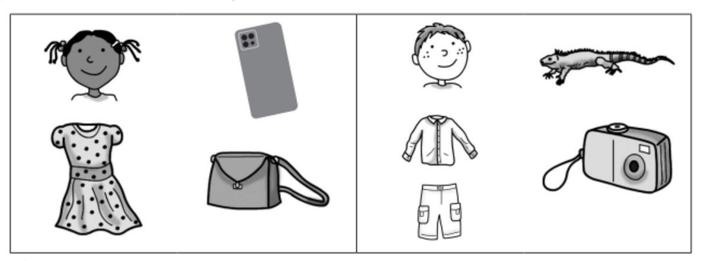
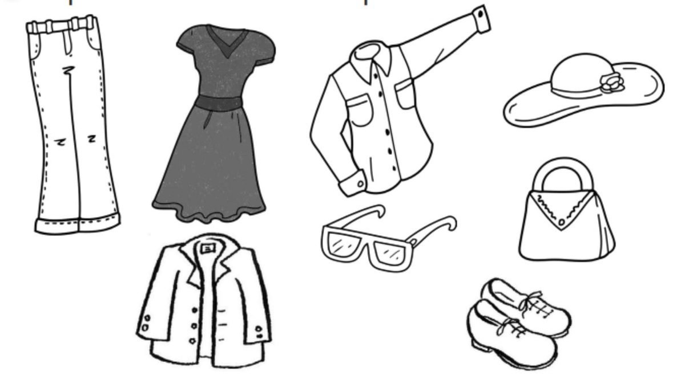
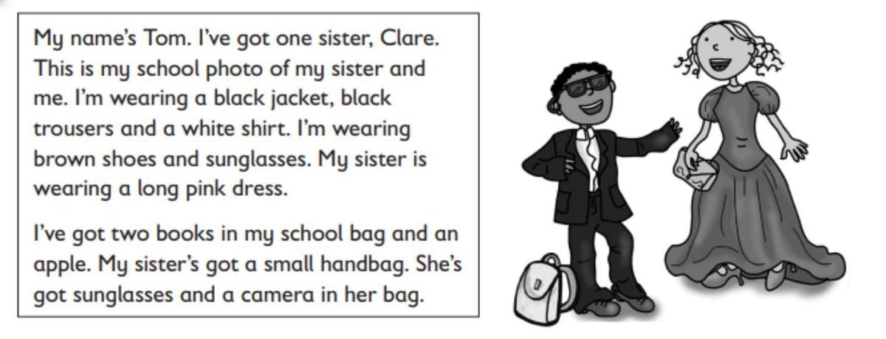

**[Vocabulary]{.underline}**

**1. Answer the following questions in your own words according to the
information given in the text.**

*(Match -- shirt, dress, jeans, glasses and handbag to picture.)*

**2. Look and circle. There is one example.   (one point each)**

*glasses*

*jacket*

*dress*

*handbag*

*T-shirt*

**3. Look and tick. There is one example.   (one point each)**

*Ben: a big car, a small dog, a garden*

*Dan: a big cat , a small car*

**[Grammar]{.underline}**

**4. Follow the lines. Answer the questions. There are two
examples.   (one point each)**

1\. Has he got a robot? *[Yes, he has.]{.underline}*

2\. Has she got a doll? *[Yes, she has.]{.underline}*

3\. Has he got a shirt? *No, he hasn't.*

4\. Has she got a watch? *Yes, she has.*

5\. Has he got a duck? *No, he hasn't.*

6\. Has she got sunglasses? *Yes, she has.*

7\. Has he got a watch? *No, he hasn't.*

**5. Read and write wearing or got. There is one example.   (one point
each)**

1\. He's *[got]{.underline}* a lizard.

2\. She's *wearing* a dress.

3\. She's *got* a handbag.

4\. He's *wearing* jeans.

5\. He's *got* a camera.

6\. She's *got* a phone.

**[Listening]{.underline}**

**6. Listen and colour. There are two extra pictures. There is one
example.   (one point each)**

*handbag -- red*

*glasses -- black*

*shirt -- yellow*

*hat -- purple*

*jeans -- blue*

I'm wearing a grey dress.

I've got a red handbag.

I'm wearing black glasses.

I'm wearing a yellow shirt.

I'm wearing a purple hat.

I'm wearing blue jeans.

**7. Listen and write A for Anna or N for Nick. There is one
example.   (one point each)**

*A: glasses, a lemon; N: boot, frog, monster*

Anna: Hi. I'm Anna. I've got a hat and glasses.

Nick: Have you got a tomato?

Anna: No, I haven't. I've got a lemon.

Nick: Hi, I'm Nick. I've got a boot and a frog.

Anna: Have you got a monster?

Nick: Yes, I have!

**[Reading]{.underline}**

**8. Read and write. There is one example.   (one point each)**

1\. How many sisters has Tom got?          *[     one     ]{.underline}*

2\. Is he wearing jeans or
trousers?          \_\_\_\_\_\_\_\_\_\_\_\_\_\_\_

*trousers*

3\. What colour is Clare's
dress?          \_\_\_\_\_\_\_\_\_\_\_\_\_\_\_

*pink*

4\. How many books has Tom got?          \_\_\_\_\_\_\_\_\_\_\_\_\_\_\_

*two*

5\. Has he got an orange?          \_\_\_\_\_\_\_\_\_\_\_\_\_\_\_

*no*

6\. Where are Clare's sunglasses?          in her
\_\_\_\_\_\_\_\_\_\_\_\_\_\_\_

*handbag*

