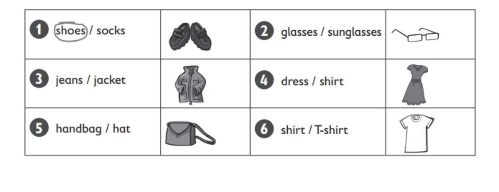
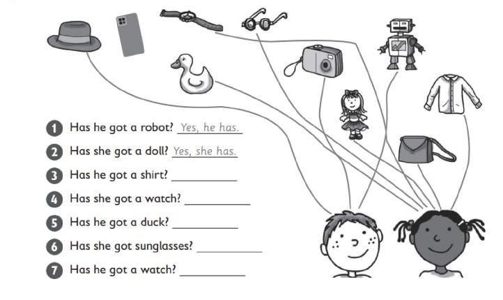
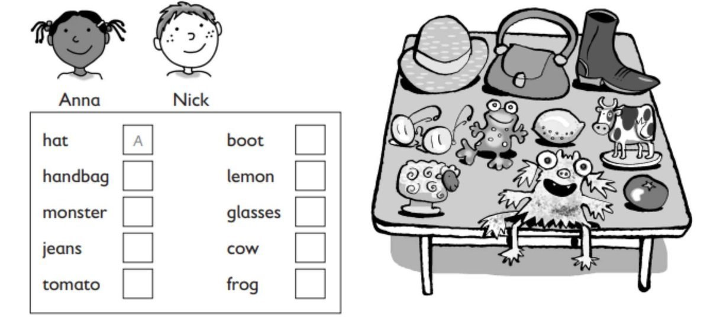

**[Vocabulary]{.underline}**

**1. Answer the following questions in your own words according to the
information given in the text.**

**2. Look and circle. There is one example.   (one point each)**

**3. Look and tick. There is one example.   (one point each)**

**[Grammar]{.underline}**

**4. Follow the lines. Answer the questions. There are two
examples.   (one point each)**

1\. Has he got a robot? *[Yes, he has.]{.underline}*

2\. Has she got a doll? *[Yes, she has.]{.underline}*

3\. Has he got a shirt? \_\_\_\_\_\_\_\_\_\_\_\_\_\_\_\_\_\_\_\_\_

4\. Has she got a watch? \_\_\_\_\_\_\_\_\_\_\_\_\_\_\_\_\_\_\_\_\_

5\. Has he got a duck? \_\_\_\_\_\_\_\_\_\_\_\_\_\_\_\_\_\_\_\_\_

6\. Has she got sunglasses? \_\_\_\_\_\_\_\_\_\_\_\_\_\_\_\_\_\_\_\_\_

7\. Has he got a watch? \_\_\_\_\_\_\_\_\_\_\_\_\_\_\_\_\_\_\_\_\_

**5. Read and write wearing or got. There is one example.   (one point
each)**

1\. He's *[got]{.underline}* a lizard.

2\. She's \_\_\_\_\_\_\_\_\_\_\_\_\_\_ a dress.

3\. She's \_\_\_\_\_\_\_\_\_\_\_\_\_\_ a handbag.

4\. He's \_\_\_\_\_\_\_\_\_\_\_\_\_\_ jeans.

5\. He's \_\_\_\_\_\_\_\_\_\_\_\_\_\_ a camera.

6\. She's \_\_\_\_\_\_\_\_\_\_\_\_\_\_ a phone.

**[Listening]{.underline}**

**6. Listen and colour. There are two extra pictures. There is one
example.   (one point each)**

**7. Listen and write A for Anna or N for Nick. There is one
example.   (one point each)**

**[Reading]{.underline}**

**8. Read and write. There is one example.   (one point each)**

1\. How many sisters has Tom got?          *[     one     ]{.underline}*

2\. Is he wearing jeans or
trousers?          \_\_\_\_\_\_\_\_\_\_\_\_\_\_\_

3\. What colour is Clare's
dress?          \_\_\_\_\_\_\_\_\_\_\_\_\_\_\_

4\. How many books has Tom got?          \_\_\_\_\_\_\_\_\_\_\_\_\_\_\_

5\. Has he got an orange?          \_\_\_\_\_\_\_\_\_\_\_\_\_\_\_

6\. Where are Clare's sunglasses?          in her
\_\_\_\_\_\_\_\_\_\_\_\_\_\_\_

