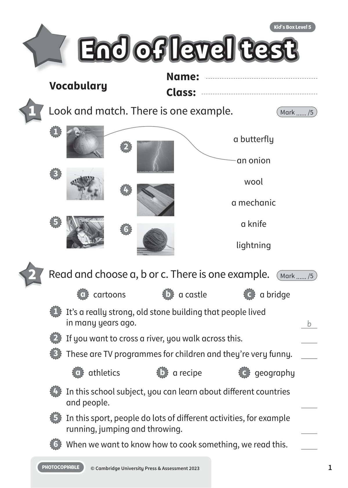
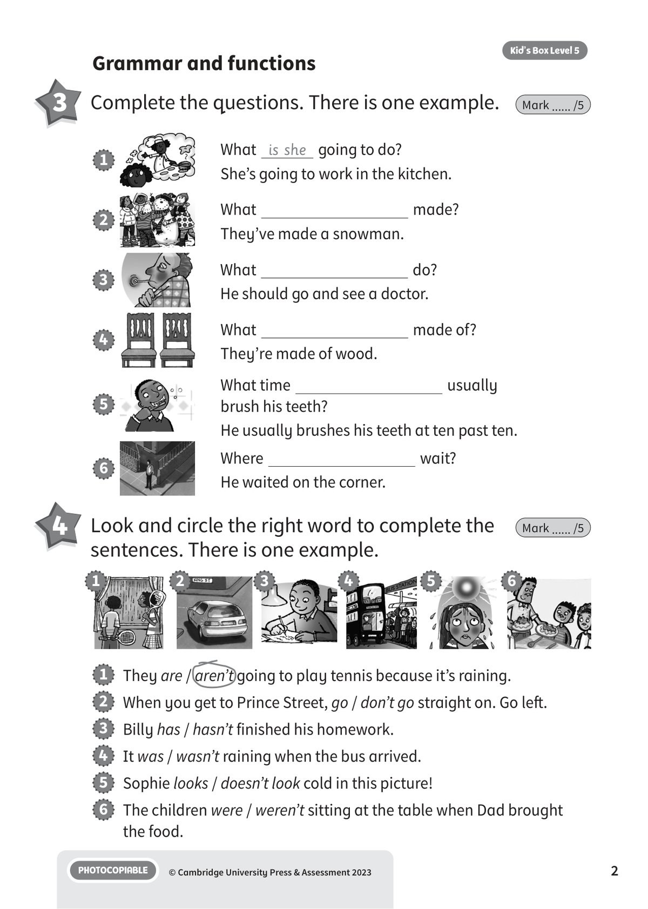
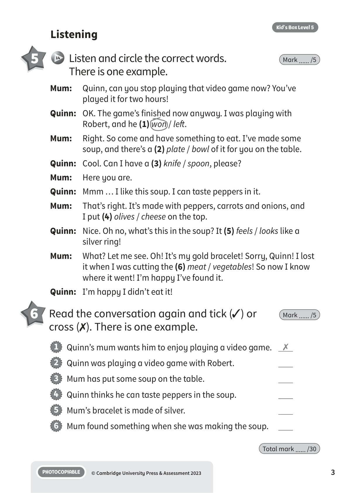
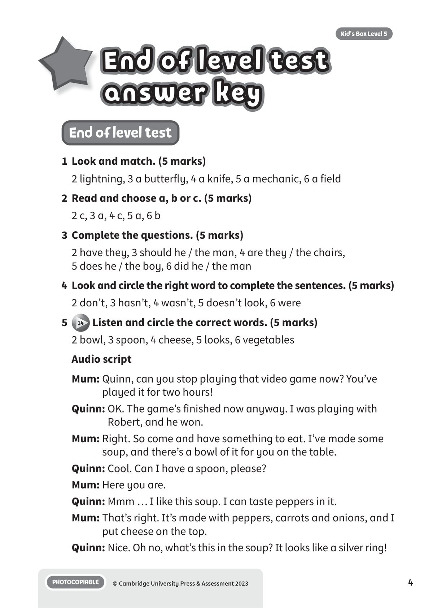
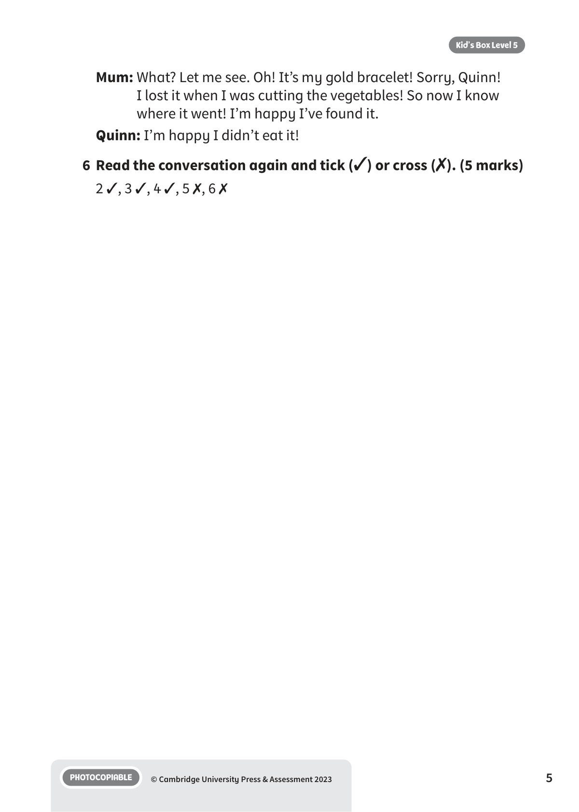

## 音频文件

- 🎧 [KBX_L5_FT_audio_T14.mp3](KBX_L5_FT_audio_T14.mp3)

## 第 1 页

Name:
Class:
PHOTOCOPIABLE
© Cambridge University Press & Assessment 2023
Kid’s Box Level 5
1
End of level test
End of level test
End of level test
Vocabulary
1 	 Look and match. There is one example.
Mark ...... /5
a   cartoons
b   a castle
c   a bridge
a   athletics
b   a recipe
c   geography
1   It’s a really strong, old stone building that people lived
in many years ago.
b
2   If you want to cross a river, you walk across this.
3   These are TV programmes for children and they’re very funny.
4   In this school subject, you can learn about different countries
and people.
5   In this sport, people do lots of different activities, for example
running, jumping and throwing.
6   When we want to know how to cook something, we read this.
2 	 Read and choose a, b or c. There is one example.
Mark ...... /5
a butterfly
an onion
wool
a mechanic
a knife
lightning
3
5
1
2
4
6

## 第 2 页

PHOTOCOPIABLE
© Cambridge University Press & Assessment 2023
2
Kid’s Box Level 5
Grammar and functions
3 	 Complete the questions. There is one example.
Mark ...... /5
4 	 Look and circle the right word to complete the
sentences. There is one example.
Mark ...... /5
What is she going to do?
She’s going to work in the kitchen.
1
What
made of?
They’re made of wood.
4
What time
usually
brush his teeth?
He usually brushes his teeth at ten past ten.
5
What
made?
They’ve made a snowman.
2
What
do?
He should go and see a doctor.
3
Where
wait?
He waited on the corner.
6
1   They are / aren’t going to play tennis because it’s raining.
2   When you get to Prince Street, go / don’t go straight on. Go left.
3   Billy has / hasn’t finished his homework.
4   It was / wasn’t raining when the bus arrived.
5   Sophie looks / doesn’t look cold in this picture!
6   The children were / weren’t sitting at the table when Dad brought
the food.
1
3
5
2
4
6

## 第 3 页

PHOTOCOPIABLE
© Cambridge University Press & Assessment 2023
3
Kid’s Box Level 5
6 	Read the conversation again and tick (✓) or
cross (✗). There is one example.
Mark ...... /5
1   Quinn’s mum wants him to enjoy playing a video game.
✗
2   Quinn was playing a video game with Robert.
3   Mum has put some soup on the table.
4   Quinn thinks he can taste peppers in the soup.
5   Mum’s bracelet is made of silver.
6   Mum found something when she was making the soup.
Listening
5 	  14 	 Listen and circle the correct words.
There is one example.
Mark ...... /5
Mum:
Quinn, can you stop playing that video game now? You’ve
played it for two hours!
Quinn: 	 OK. The game’s finished now anyway. I was playing with
Robert, and he (1) won / left.
Mum: 	 Right. So come and have something to eat. I’ve made some
soup, and there’s a (2) plate / bowl of it for you on the table.
Quinn: 	 Cool. Can I have a (3) knife / spoon, please?
Mum: 	 Here you are.
Quinn: 	 Mmm … I like this soup. I can taste peppers in it.
Mum: 	 That’s right. It’s made with peppers, carrots and onions, and
I put (4) olives / cheese on the top.
Quinn: 	 Nice. Oh no, what’s this in the soup? It (5) feels / looks like a
silver ring!
Mum: 	 What? Let me see. Oh! It’s my gold bracelet! Sorry, Quinn! I lost
it when I was cutting the (6) meat / vegetables! So now I know
where it went! I’m happy I’ve found it.
Quinn: 	 I’m happy I didn’t eat it!
Total mark ...... /30

## 第 4 页

PHOTOCOPIABLE
© Cambridge University Press & Assessment 2023
4
Kid’s Box Level 5
End of level test
answer key
End of level test
answer key
End of level test
answer key
End of level test
1	 Look and match. (5 marks)
2 lightning, 3 a butterfly, 4 a knife, 5 a mechanic, 6 a field
2	 Read and choose a, b or c. (5 marks)
2 c, 3 a, 4 c, 5 a, 6 b
3	 Complete the questions. (5 marks)
2 have they, 3 should he / the man, 4 are they / the chairs,
5 does he / the boy, 6 did he / the man
4	Look and circle the right word to complete the sentences. (5 marks)
2 don’t, 3 hasn’t, 4 wasn’t, 5 doesn’t look, 6 were
5
14 Listen and circle the correct words. (5 marks)
2 bowl, 3 spoon, 4 cheese, 5 looks, 6 vegetables
Audio script
Mum: Quinn, can you stop playing that video game now? You’ve
played it for two hours!
Quinn: OK. The game’s finished now anyway. I was playing with
Robert, and he won.
Mum: Right. So come and have something to eat. I’ve made some
soup, and there’s a bowl of it for you on the table.
Quinn: Cool. Can I have a spoon, please?
Mum: Here you are.
Quinn: Mmm … I like this soup. I can taste peppers in it.
Mum: That’s right. It’s made with peppers, carrots and onions, and I
put cheese on the top.
Quinn: Nice. Oh no, what’s this in the soup? It looks like a silver ring!

## 第 5 页

PHOTOCOPIABLE
© Cambridge University Press & Assessment 2023
5
Kid’s Box Level 5
Mum: What? Let me see. Oh! It’s my gold bracelet! Sorry, Quinn!
I lost it when I was cutting the vegetables! So now I know
where it went! I’m happy I’ve found it.
Quinn: I’m happy I didn’t eat it!
6	 Read the conversation again and tick (✓) or cross (✗). (5 marks)
2 ✓, 3 ✓, 4 ✓, 5 ✗, 6 ✗
