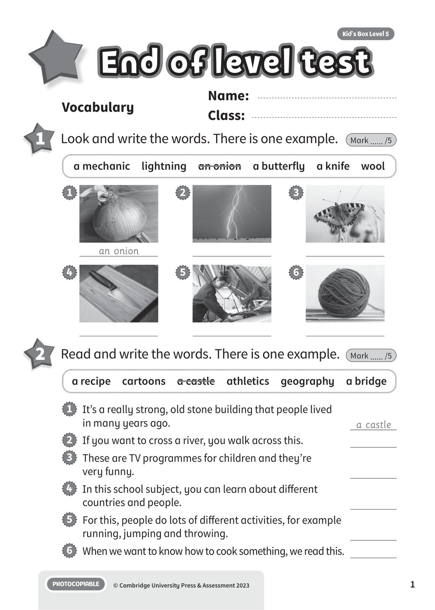
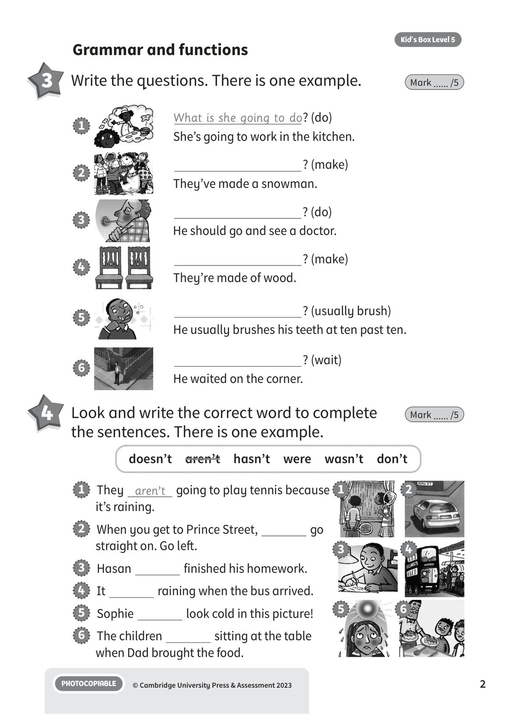
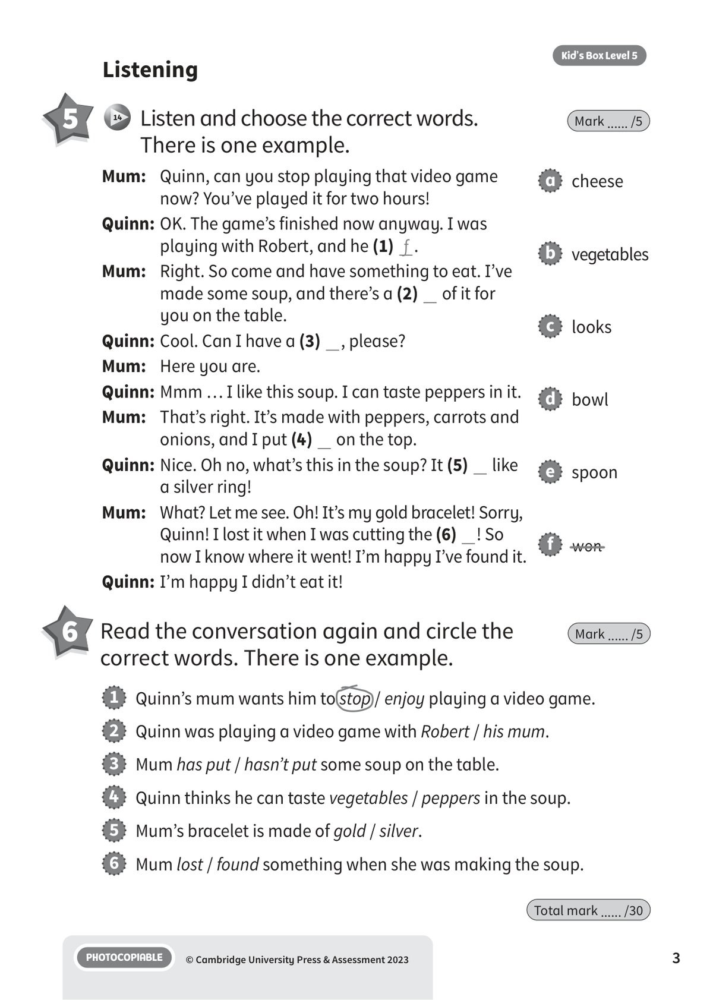

## 音频文件

- 🎧 [KBX_L5_FT_audio_T14.mp3](KBX_L5_FT_audio_T14.mp3)

## 第 1 页

Name:
Class:
PHOTOCOPIABLE
© Cambridge University Press & Assessment 2023
Kid’s Box Level 5
1
End of level test
End of level test
End of level test
Vocabulary
1 	 Look and write the words. There is one example.
Mark ...... /5
2 	 Read and write the words. There is one example.
Mark ...... /5
a mechanic  lightning  an onion  a butterfly  a knife  wool
a recipe  cartoons  a castle  athletics  geography  a bridge
1   It’s a really strong, old stone building that people lived
in many years ago.
a castle
2   If you want to cross a river, you walk across this.
3   These are TV programmes for children and they’re
very funny.
4   In this school subject, you can learn about different
countries and people.
5   For this, people do lots of different activities, for example
running, jumping and throwing.
6   When we want to know how to cook something, we read this.
1
an onion
2
3
4
5
6

## 第 2 页

PHOTOCOPIABLE
© Cambridge University Press & Assessment 2023
2
Kid’s Box Level 5
Grammar and functions
3 	 Write the questions. There is one example.
Mark ...... /5
4 	 Look and write the correct word to complete
the sentences. There is one example.
Mark ...... /5
What is she going to do? (do)
She’s going to work in the kitchen.
1
? (make)
They’re made of wood.
4
? (usually brush)
He usually brushes his teeth at ten past ten.
5
? (make)
They’ve made a snowman.
2
? (do)
He should go and see a doctor.
3
? (wait)
He waited on the corner.
6
doesn’t  aren’t  hasn’t  were  wasn’t  don’t
1   They aren’t going to play tennis because
it’s raining.
2   When you get to Prince Street,
go
straight on. Go left.
3   Hasan
finished his homework.
4   It
raining when the bus arrived.
5   Sophie
look cold in this picture!
6   The children
sitting at the table
when Dad brought the food.
1
3
5
2
4
6

## 第 3 页

PHOTOCOPIABLE
© Cambridge University Press & Assessment 2023
3
Kid’s Box Level 5
6 	Read the conversation again and circle the
correct words. There is one example.
Mark ...... /5
1   Quinn’s mum wants him to stop / enjoy playing a video game.
2   Quinn was playing a video game with Robert / his mum.
3   Mum has put / hasn’t put some soup on the table.
4   Quinn thinks he can taste vegetables / peppers in the soup.
5   Mum’s bracelet is made of gold / silver.
6   Mum lost / found something when she was making the soup.
Listening
5 	  14 	 Listen and choose the correct words.
There is one example.
Mark ...... /5
Total mark ...... /30
Mum:	 Quinn, can you stop playing that video game
now? You’ve played it for two hours!
Quinn: 	OK. The game’s finished now anyway. I was
playing with Robert, and he (1) f .
Mum: 	 Right. So come and have something to eat. I’ve
made some soup, and there’s a (2)   of it for
you on the table.
Quinn: 	Cool. Can I have a (3)  , please?
Mum: 	 Here you are.
Quinn: 	Mmm … I like this soup. I can taste peppers in it.
Mum: 	 That’s right. It’s made with peppers, carrots and
onions, and I put (4)   on the top.
Quinn: 	Nice. Oh no, what’s this in the soup? It (5)   like
a silver ring!
Mum: 	 What? Let me see. Oh! It’s my gold bracelet! Sorry,
Quinn! I lost it when I was cutting the (6)  ! So
now I know where it went! I’m happy I’ve found it.
Quinn: 	I’m happy I didn’t eat it!
a   cheese
b   vegetables
c   looks
d   bowl
e   spoon
f   won
