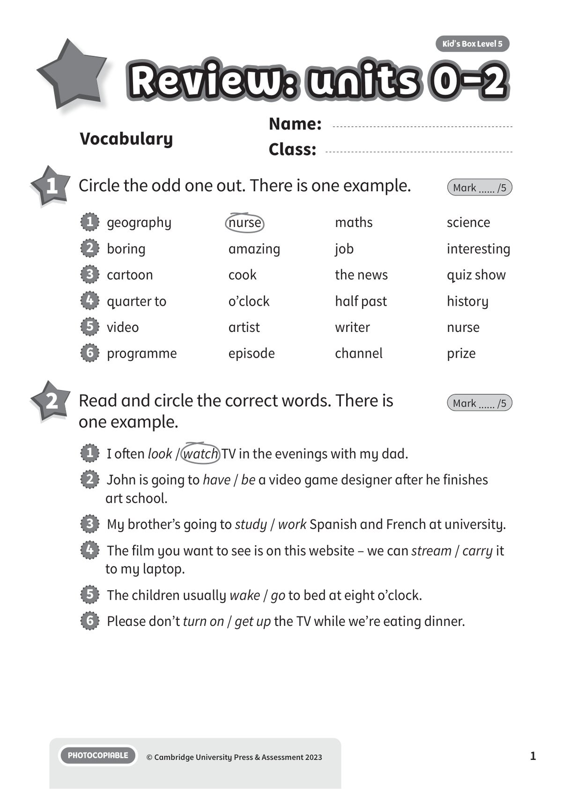
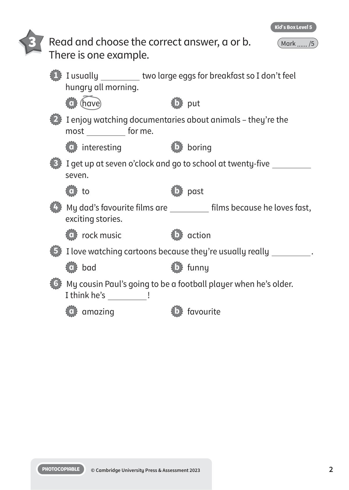
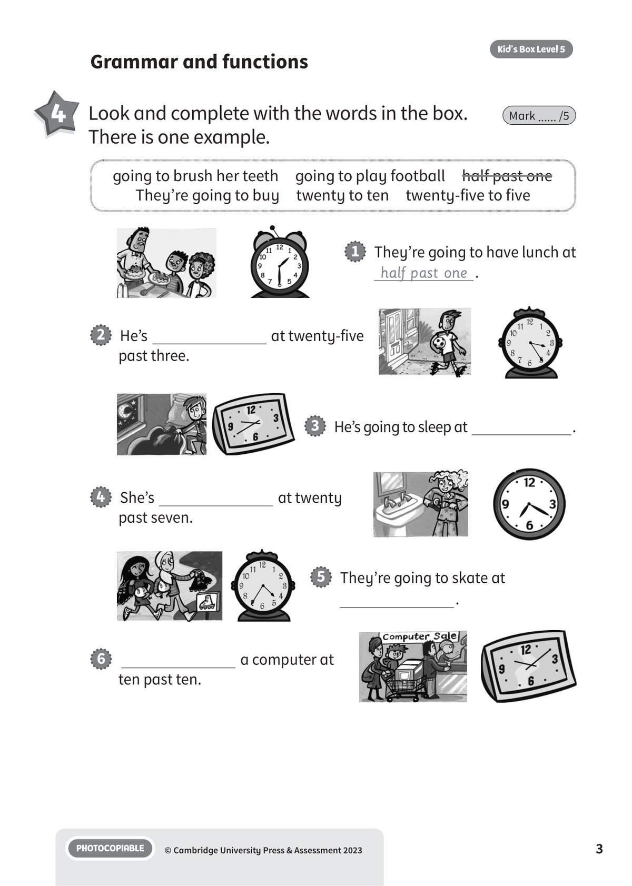
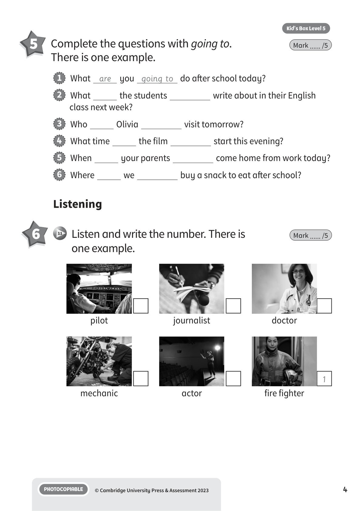
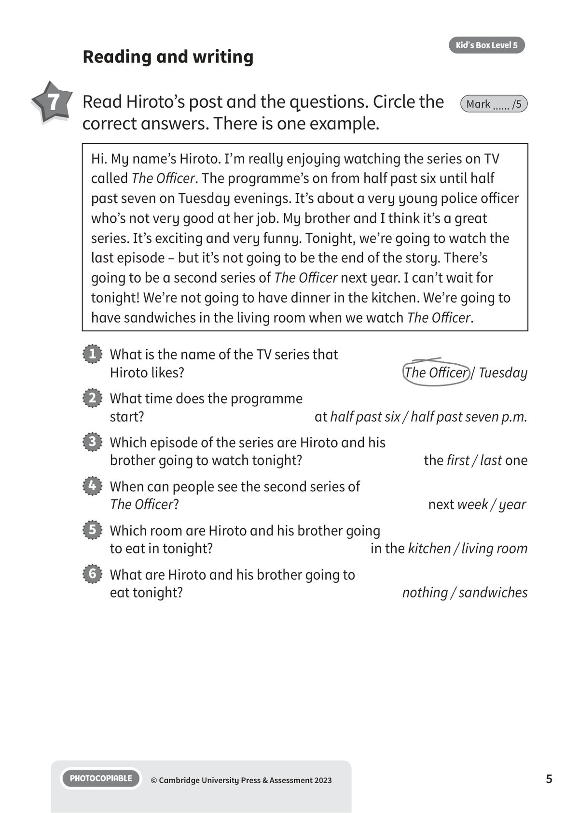
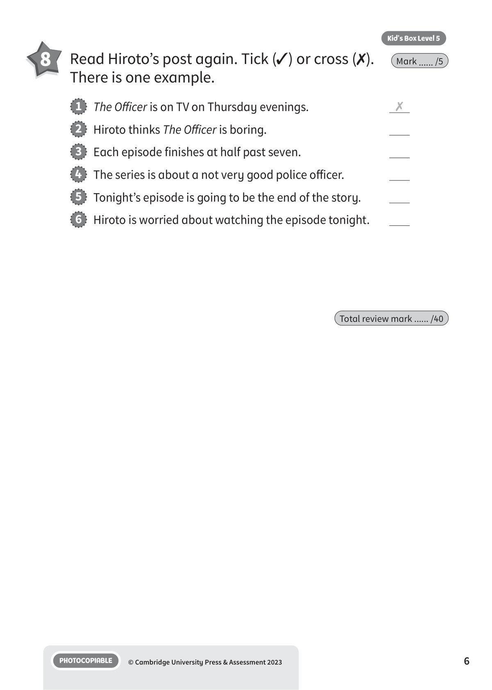

## 音频文件

- 🎧 [KBX_L5_RTU0-2_audio_T11.mp3](KBX_L5_RTU0-2_audio_T11.mp3)

## 第 1 页

Name:
Class:
PHOTOCOPIABLE
© Cambridge University Press & Assessment 2023
Kid’s Box Level 5
1
Vocabulary
Review: units 0-2
Review: units 0-2
Review: units 0-2
1 	 Circle the odd one out. There is one example.
Mark ...... /5
2 	 Read and circle the correct words. There is
one example.
Mark ...... /5
1   geography
nurse
maths
science
2   boring
amazing
job
interesting
3   cartoon
cook
the news
quiz show
4   quarter to
o’clock
half past
history
5   video
artist
writer
nurse
6   programme
episode
channel
prize
1   I often look / watch TV in the evenings with my dad.
2   John is going to have / be a video game designer after he finishes
art school.
3   My brother’s going to study / work Spanish and French at university.
4   The film you want to see is on this website – we can stream / carry it
to my laptop.
5   The children usually wake / go to bed at eight o’clock.
6   Please don’t turn on / get up the TV while we’re eating dinner.

## 第 2 页

PHOTOCOPIABLE
© Cambridge University Press & Assessment 2023
2
Kid’s Box Level 5
3 	 Read and choose the correct answer, a or b.
There is one example.
Mark ...... /5
1   I usually
two large eggs for breakfast so I don’t feel
hungry all morning.
a   have
b   put
2   I enjoy watching documentaries about animals – they’re the
most
for me.
a   interesting
b   boring
3   I get up at seven o’clock and go to school at twenty-five
seven.
a   to
b   past
4   My dad’s favourite films are
films because he loves fast,
exciting stories.
a   rock music
b   action
5   I love watching cartoons because they’re usually really
.
a   bad
b   funny
6   My cousin Paul’s going to be a football player when he’s older.
I think he’s
!
a   amazing
b   favourite

## 第 3 页

PHOTOCOPIABLE
© Cambridge University Press & Assessment 2023
3
Kid’s Box Level 5
PHOTOCOPIABLE
© Cambridge University Press & Assessment 2023
Kid’s Box Level 5
3
4 	 Look and complete with the words in the box.
There is one example.
Mark ...... /5
Grammar and functions
going to brush her teeth  going to play football  half past one
They’re going to buy  twenty to ten  twenty-five to five
1   They’re going to have lunch at
half past one .
2   He’s
at twenty-five
past three.
3   He’s going to sleep at
.
4   She’s
at twenty
past seven.
5   They’re going to skate at
.
6
a computer at
ten past ten.

## 第 4 页

PHOTOCOPIABLE
© Cambridge University Press & Assessment 2023
4
Kid’s Box Level 5
Listening
6 	  11 	 Listen and write the number. There is
one example.
Mark ...... /5
pilot
mechanic
journalist
actor
doctor
1
fire fighter
5 	 Complete the questions with going to.
There is one example.
Mark ...... /5
1   What are you going to do after school today?
2   What
the students
write about in their English
class next week?
3   Who
Olivia
visit tomorrow?
4   What time
the film
start this evening?
5   When
your parents
come home from work today?
6   Where
we
buy a snack to eat after school?

## 第 5 页

PHOTOCOPIABLE
© Cambridge University Press & Assessment 2023
5
Kid’s Box Level 5
Reading and writing
7 	 Read Hiroto’s post and the questions. Circle the
correct answers. There is one example.
Mark ...... /5
Hi. My name’s Hiroto. I’m really enjoying watching the series on TV
called The Officer. The programme’s on from half past six until half
past seven on Tuesday evenings. It’s about a very young police officer
who’s not very good at her job. My brother and I think it’s a great
series. It’s exciting and very funny. Tonight, we’re going to watch the
last episode – but it’s not going to be the end of the story. There’s
going to be a second series of The Officer next year. I can’t wait for
tonight! We’re not going to have dinner in the kitchen. We’re going to
have sandwiches in the living room when we watch The Officer.
1   What is the name of the TV series that
Hiroto likes?
The Officer / Tuesday
2   What time does the programme
start?
at half past six / half past seven p.m.
3   Which episode of the series are Hiroto and his
brother going to watch tonight?
the first / last one
4   When can people see the second series of
The Officer?
next week / year
5   Which room are Hiroto and his brother going
to eat in tonight?
in the kitchen / living room
6   What are Hiroto and his brother going to
eat tonight?
nothing / sandwiches

## 第 6 页

PHOTOCOPIABLE
© Cambridge University Press & Assessment 2023
6
Kid’s Box Level 5
8 	 Read Hiroto’s post again. Tick (✓) or cross (✗).
There is one example.
Mark ...... /5
1   The Officer is on TV on Thursday evenings.
✗
2   Hiroto thinks The Officer is boring.
3   Each episode finishes at half past seven.
4   The series is about a not very good police officer.
5   Tonight’s episode is going to be the end of the story.
6   Hiroto is worried about watching the episode tonight.
Total review mark ...... /40
