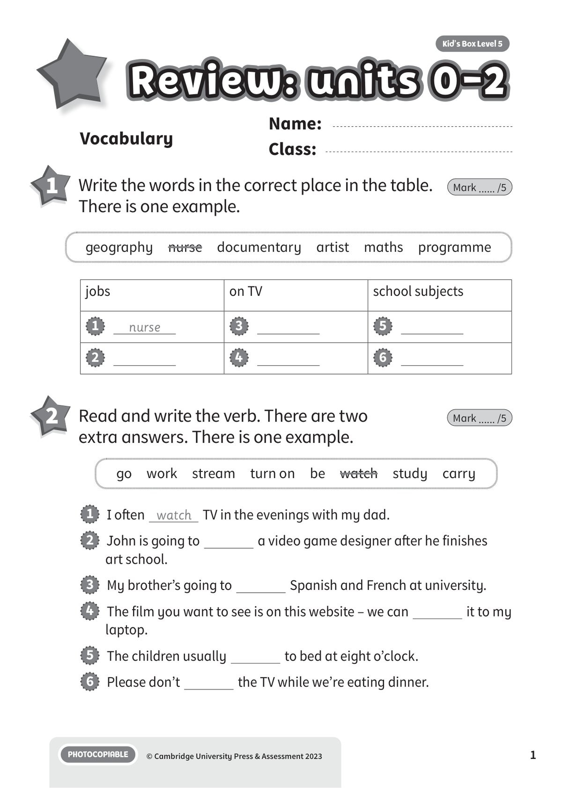
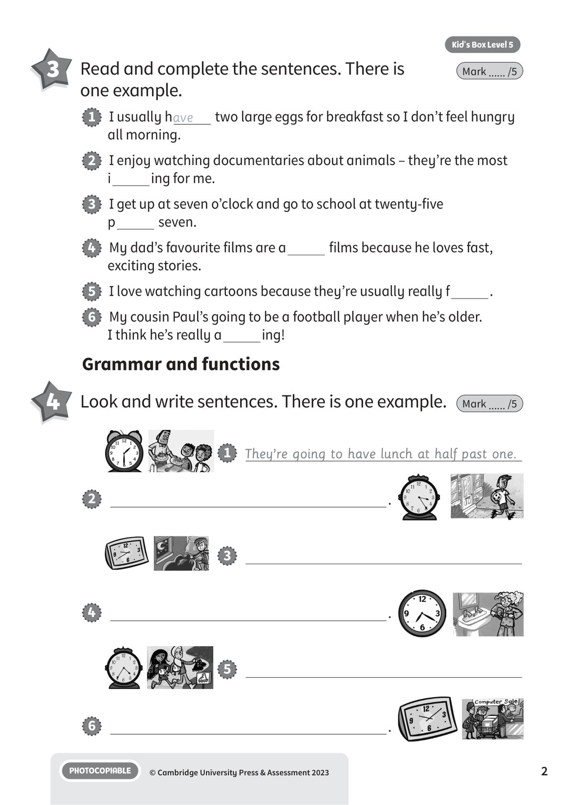
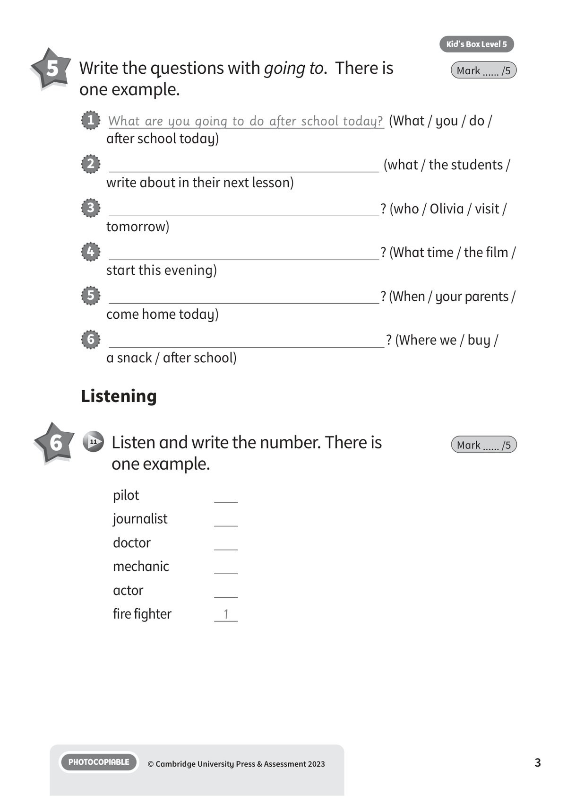
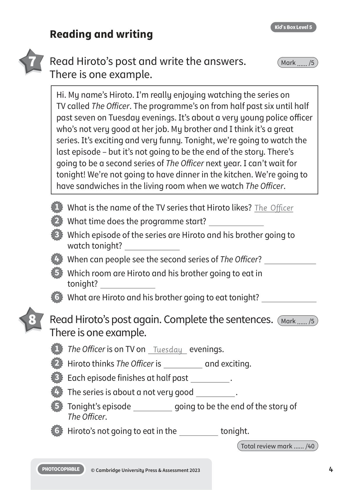

## 音频文件

- 🎧 [KBX_L5_RTU0-2_audio_T11.mp3](KBX_L5_RTU0-2_audio_T11.mp3)

## 第 1 页

Name:
Class:
PHOTOCOPIABLE
© Cambridge University Press & Assessment 2023
Kid’s Box Level 5
1
Vocabulary
Review: units 0-2
Review: units 0-2
Review: units 0-2
1 	 Write the words in the correct place in the table.
There is one example.
Mark ...... /5
2 	 Read and write the verb. There are two
extra answers. There is one example.
Mark ...... /5
1   I often watch TV in the evenings with my dad.
2   John is going to
a video game designer after he finishes
art school.
3   My brother’s going to
Spanish and French at university.
4   The film you want to see is on this website – we can
it to my
laptop.
5   The children usually
to bed at eight o’clock.
6   Please don’t
the TV while we’re eating dinner.
geography  nurse  documentary  artist  maths  programme
go  work  stream  turn on  be  watch  study  carry
jobs
on TV
school subjects
1
nurse
3
5
2
4
6

## 第 2 页

PHOTOCOPIABLE
© Cambridge University Press & Assessment 2023
2
Kid’s Box Level 5
3 	 Read and complete the sentences. There is
one example.
Mark ...... /5
4 	 Look and write sentences. There is one example.
Mark ...... /5
Grammar and functions
1   I usually have
two large eggs for breakfast so I don’t feel hungry
all morning.
2   I enjoy watching documentaries about animals – they’re the most
i
ing for me.
3   I get up at seven o’clock and go to school at twenty-five
p
seven.
4   My dad’s favourite films are a
films because he loves fast,
exciting stories.
5   I love watching cartoons because they’re usually really f
.
6   My cousin Paul’s going to be a football player when he’s older.
I think he’s really a
ing!
1   They’re going to have lunch at half past one.
3
5
2
.
6
.
4
.

## 第 3 页

PHOTOCOPIABLE
© Cambridge University Press & Assessment 2023
3
Kid’s Box Level 5
5 	 Write the questions with going to.  There is
one example.
Mark ...... /5
1   What are you going to do after school today? (What / you / do /
after school today)
2
(what / the students /
write about in their next lesson)
3
? (who / Olivia / visit /
tomorrow)
4
? (What time / the film /
start this evening)
5
? (When / your parents /
come home today)
6
? (Where we / buy /
a snack / after school)
Listening
6 	  11 	 Listen and write the number. There is
one example.
Mark ...... /5
pilot
journalist
doctor
mechanic
actor
fire fighter
1

## 第 4 页

PHOTOCOPIABLE
© Cambridge University Press & Assessment 2023
4
Kid’s Box Level 5
Reading and writing
7 	 Read Hiroto’s post and write the answers.
There is one example.
Mark ...... /5
8 	 Read Hiroto’s post again. Complete the sentences.
There is one example.
Mark ...... /5
Hi. My name’s Hiroto. I’m really enjoying watching the series on
TV called The Officer. The programme’s on from half past six until half
past seven on Tuesday evenings. It’s about a very young police officer
who’s not very good at her job. My brother and I think it’s a great
series. It’s exciting and very funny. Tonight, we’re going to watch the
last episode – but it’s not going to be the end of the story. There’s
going to be a second series of The Officer next year. I can’t wait for
tonight! We’re not going to have dinner in the kitchen. We’re going to
have sandwiches in the living room when we watch The Officer.
1   What is the name of the TV series that Hiroto likes? The Officer
2   What time does the programme start?
3   Which episode of the series are Hiroto and his brother going to
watch tonight?
4   When can people see the second series of The Officer?
5   Which room are Hiroto and his brother going to eat in
tonight?
6   What are Hiroto and his brother going to eat tonight?
1   The Officer is on TV on Tuesday evenings.
2   Hiroto thinks The Officer is
and exciting.
3   Each episode finishes at half past
.
4   The series is about a not very good
.
5   Tonight’s episode
going to be the end of the story of
The Officer.
6   Hiroto’s not going to eat in the
tonight.
Total review mark ...... /40
