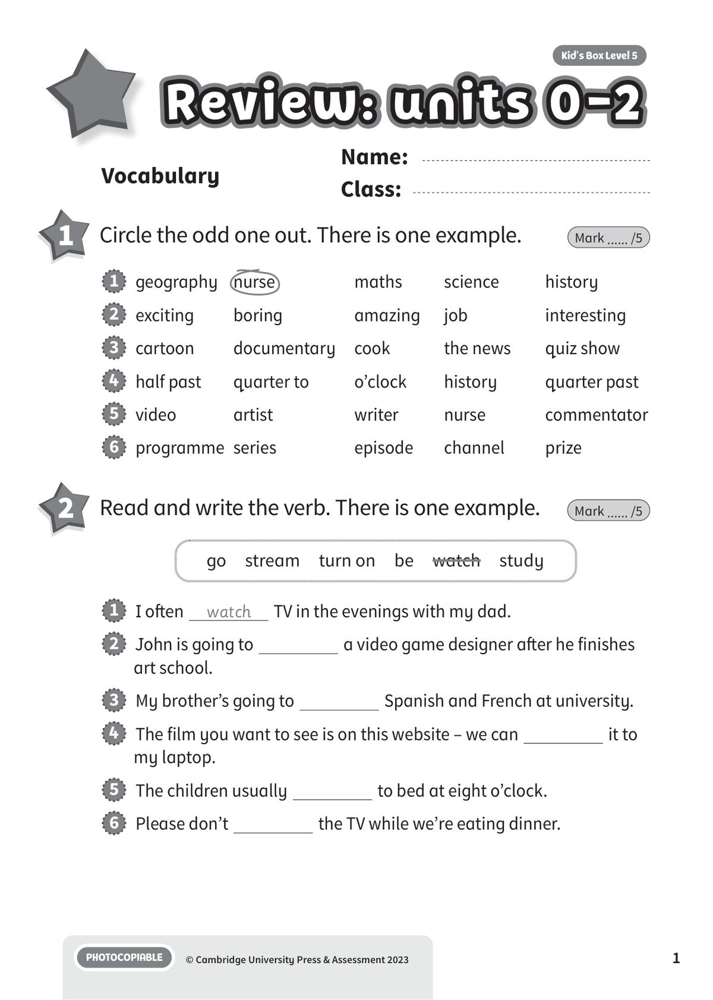
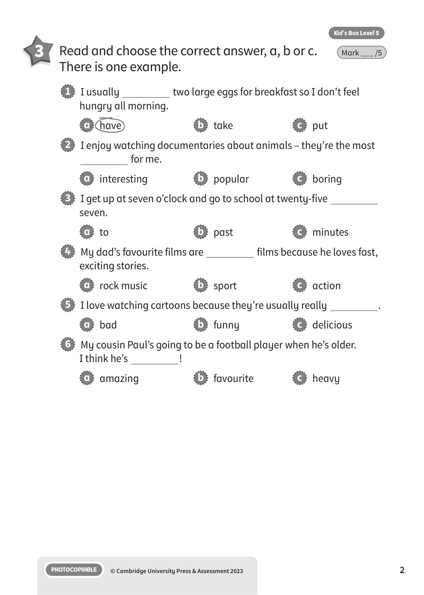
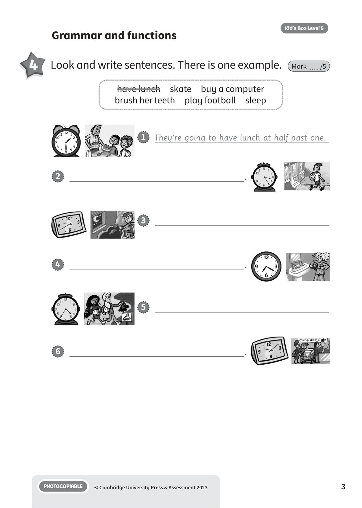
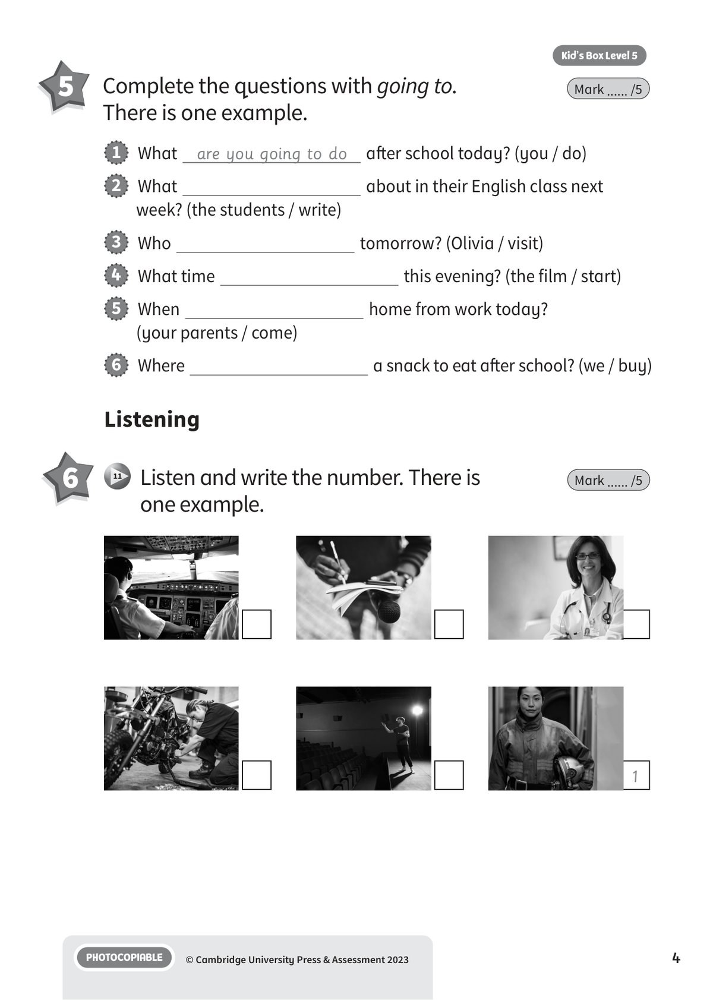
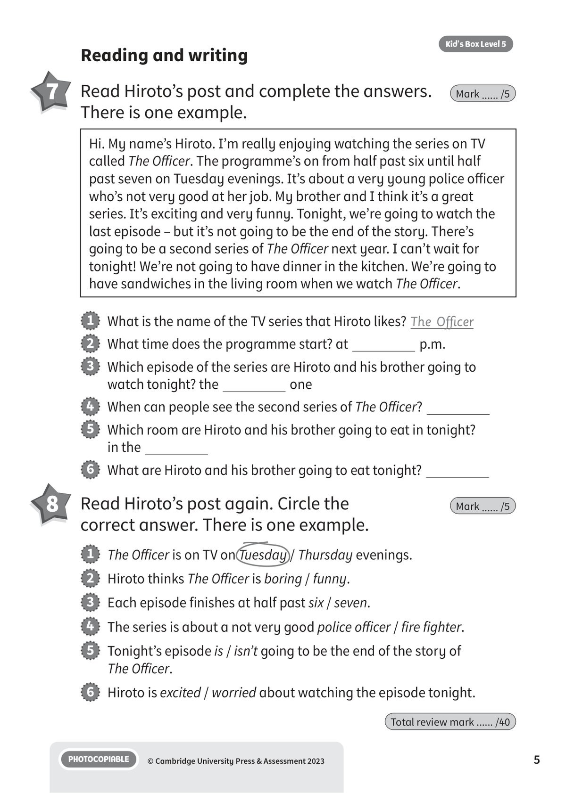

## 音频文件

- 🎧 [KBX_L5_RTU0-2_audio_T11.mp3](KBX_L5_RTU0-2_audio_T11.mp3)

## 第 1 页

Name:
Class:
PHOTOCOPIABLE
© Cambridge University Press & Assessment 2023
Kid’s Box Level 5
1
Vocabulary
Review: units 0-2
Review: units 0-2
Review: units 0-2
1 	 Circle the odd one out. There is one example.
Mark ...... /5
2 	 Read and write the verb. There is one example.
Mark ...... /5
1   geography	 nurse
maths
science
history
2   exciting
boring
amazing
job
interesting
3   cartoon
documentary
cook
the news
quiz show
4   half past
quarter to
o’clock
history
quarter past
5   video
artist
writer
nurse
commentator
6   programme	 series
episode
channel
prize
1   I often
watch
TV in the evenings with my dad.
2   John is going to
a video game designer after he finishes
art school.
3   My brother’s going to
Spanish and French at university.
4   The film you want to see is on this website – we can
it to
my laptop.
5   The children usually
to bed at eight o’clock.
6   Please don’t
the TV while we’re eating dinner.
go  stream  turn on  be  watch  study

## 第 2 页

PHOTOCOPIABLE
© Cambridge University Press & Assessment 2023
2
Kid’s Box Level 5
3 	 Read and choose the correct answer, a, b or c.
There is one example.
Mark ...... /5
1   I usually
two large eggs for breakfast so I don’t feel
hungry all morning.
a   have
b   take
c   put
2   I enjoy watching documentaries about animals – they’re the most
for me.
a   interesting
b   popular
c   boring
3   I get up at seven o’clock and go to school at twenty-five
seven.
a   to
b   past
c   minutes
4   My dad’s favourite films are
films because he loves fast,
exciting stories.
a   rock music
b   sport
c   action
5   I love watching cartoons because they’re usually really
.
a   bad
b   funny
c   delicious
6   My cousin Paul’s going to be a football player when he’s older.
I think he’s
!
a   amazing
b   favourite
c   heavy

## 第 3 页

PHOTOCOPIABLE
© Cambridge University Press & Assessment 2023
3
Kid’s Box Level 5
4 	 Look and write sentences. There is one example.
Mark ...... /5
Grammar and functions
have lunch  skate  buy a computer
brush her teeth  play football  sleep
1   They’re going to have lunch at half past one.
3
5
2
.
6
.
4
.

## 第 4 页

PHOTOCOPIABLE
© Cambridge University Press & Assessment 2023
4
Kid’s Box Level 5
Listening
6 	  11 	 Listen and write the number. There is
one example.
Mark ...... /5
5 	  Complete the questions with going to.
There is one example.
Mark ...... /5
1   What
are you going to do
after school today? (you / do)
2   What
about in their English class next
week? (the students / write)
3   Who
tomorrow? (Olivia / visit)
4   What time
this evening? (the film / start)
5   When
home from work today?
(your parents / come)
6   Where
a snack to eat after school? (we / buy)
1

## 第 5 页

PHOTOCOPIABLE
© Cambridge University Press & Assessment 2023
5
Kid’s Box Level 5
Reading and writing
7 	 Read Hiroto’s post and complete the answers.
There is one example.
Mark ...... /5
Hi. My name’s Hiroto. I’m really enjoying watching the series on TV
called The Officer. The programme’s on from half past six until half
past seven on Tuesday evenings. It’s about a very young police officer
who’s not very good at her job. My brother and I think it’s a great
series. It’s exciting and very funny. Tonight, we’re going to watch the
last episode – but it’s not going to be the end of the story. There’s
going to be a second series of The Officer next year. I can’t wait for
tonight! We’re not going to have dinner in the kitchen. We’re going to
have sandwiches in the living room when we watch The Officer.
1   What is the name of the TV series that Hiroto likes? The Officer
2   What time does the programme start? at
p.m.
3   Which episode of the series are Hiroto and his brother going to
watch tonight? the
one
4   When can people see the second series of The Officer?
5   Which room are Hiroto and his brother going to eat in tonight?
in the
6   What are Hiroto and his brother going to eat tonight?
8 	 Read Hiroto’s post again. Circle the
correct answer. There is one example.
Mark ...... /5
1   The Officer is on TV on Tuesday / Thursday evenings.
2   Hiroto thinks The Officer is boring / funny.
3   Each episode finishes at half past six / seven.
4   The series is about a not very good police officer / fire fighter.
5   Tonight’s episode is / isn’t going to be the end of the story of
The Officer.
6   Hiroto is excited / worried about watching the episode tonight.
Total review mark ...... /40
