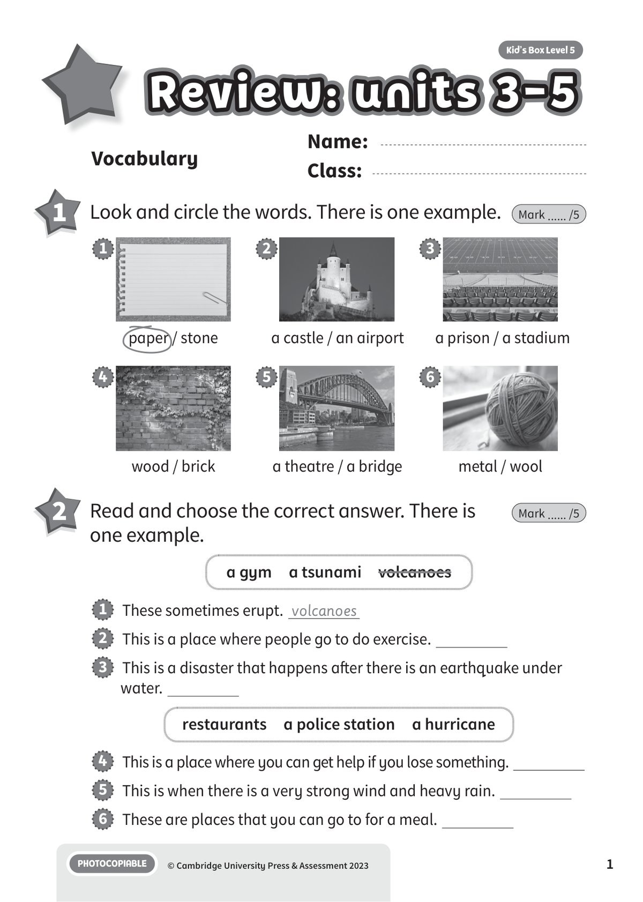
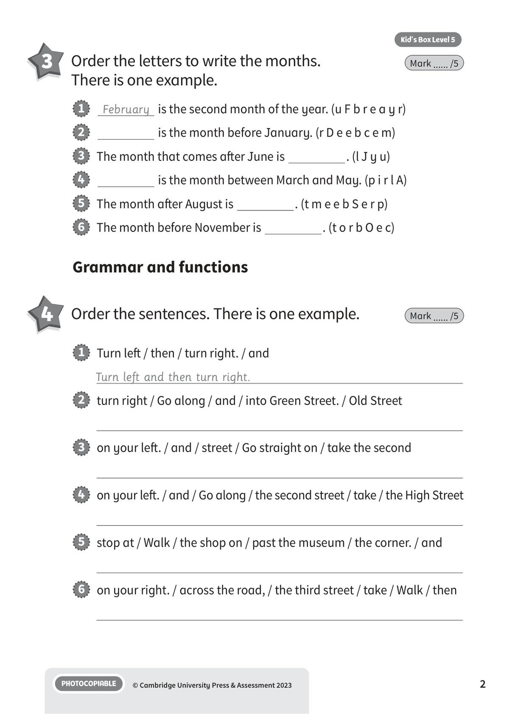
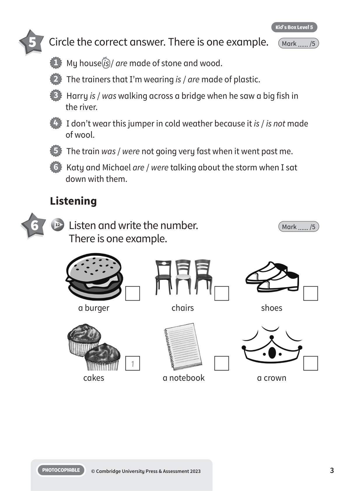
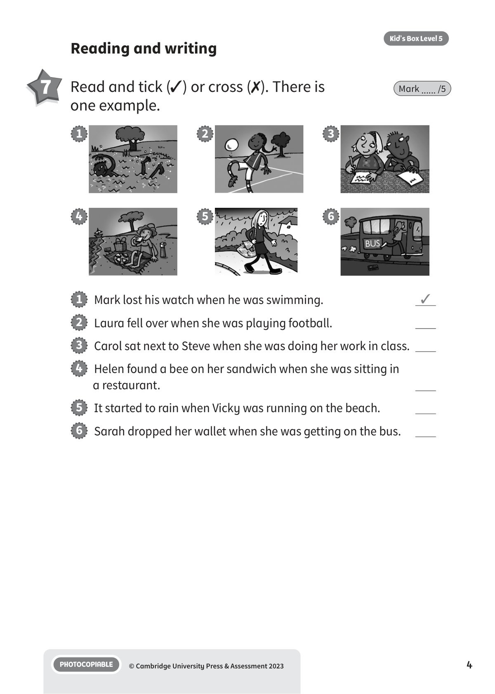
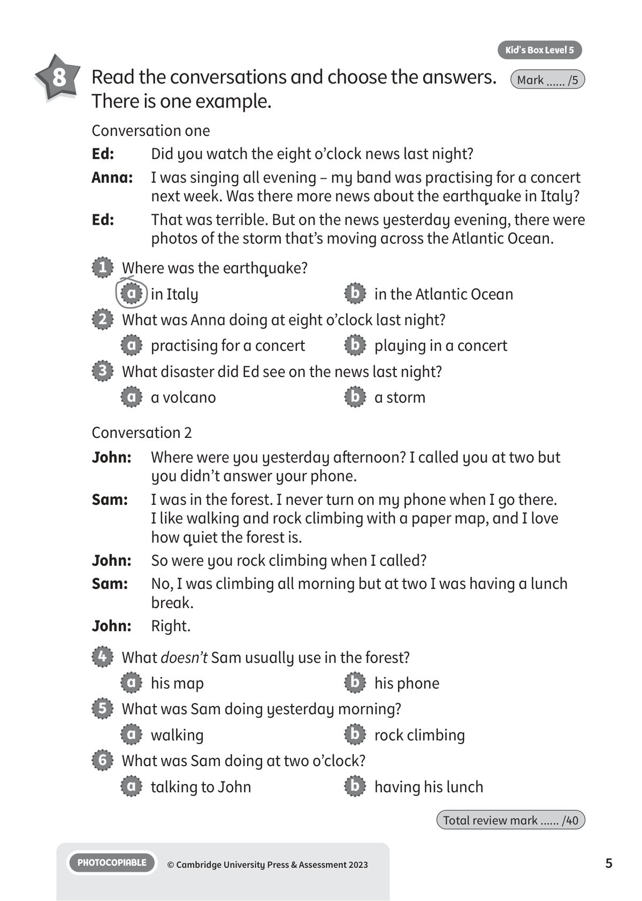

## 音频文件

- 🎧 [KBX_L5_RTU3-5_audio_T12.mp3](KBX_L5_RTU3-5_audio_T12.mp3)

## 第 1 页

Name:
Class:
PHOTOCOPIABLE
© Cambridge University Press & Assessment 2023
Kid’s Box Level 5
1
Vocabulary
Review: units 3-5
Review: units 3-5
Review: units 3-5
1 	 Look and circle the words. There is one example.
Mark ...... /5
2 	 Read and choose the correct answer. There is
one example.
Mark ...... /5
paper / stone
1
wood / brick
4
a castle / an airport
2
a theatre / a bridge
5
a prison / a stadium
3
metal / wool
6
a gym  a tsunami  volcanoes
restaurants  a police station  a hurricane
1   These sometimes erupt. volcanoes
2   This is a place where people go to do exercise.
3   This is a disaster that happens after there is an earthquake under
water.
4   This is a place where you can get help if you lose something.
5   This is when there is a very strong wind and heavy rain.
6   These are places that you can go to for a meal.

## 第 2 页

PHOTOCOPIABLE
© Cambridge University Press & Assessment 2023
2
Kid’s Box Level 5
3 	 Order the letters to write the months.
There is one example.
Mark ...... /5
4 	 Order the sentences. There is one example.
Mark ...... /5
Grammar and functions
1   February is the second month of the year. (u F b r e a y r)
2
is the month before January. (r D e e b c e m)
3   The month that comes after June is
. (l J y u)
4
is the month between March and May. (p i r l A)
5   The month after August is
. (t m e e b S e r p)
6   The month before November is
. (t o r b O e c)
1   Turn left / then / turn right. / and
Turn left and then turn right.
2   turn right / Go along / and / into Green Street. / Old Street
3   on your left. / and / street / Go straight on / take the second
4   on your left. / and / Go along / the second street / take / the High Street
5   stop at / Walk / the shop on / past the museum / the corner. / and
6   on your right. / across the road, / the third street / take / Walk / then

## 第 3 页

PHOTOCOPIABLE
© Cambridge University Press & Assessment 2023
3
Kid’s Box Level 5
5 	 Circle the correct answer. There is one example.
Mark ...... /5
Listening
1   My house is / are made of stone and wood.
2   The trainers that I’m wearing is / are made of plastic.
3   Harry is / was walking across a bridge when he saw a big fish in
the river.
4   I don’t wear this jumper in cold weather because it is / is not made
of wool.
5   The train was / were not going very fast when it went past me.
6   Katy and Michael are / were talking about the storm when I sat
down with them.
6 	  12 	 Listen and write the number.
There is one example.
Mark ...... /5
1
a burger
cakes
chairs
a notebook
shoes
a crown

## 第 4 页

PHOTOCOPIABLE
© Cambridge University Press & Assessment 2023
4
Kid’s Box Level 5
Reading and writing
7 	 Read and tick (✓) or cross (✗). There is
one example.
Mark ...... /5
3
2
1
4
6
1   Mark lost his watch when he was swimming.
✓
2   Laura fell over when she was playing football.
3   Carol sat next to Steve when she was doing her work in class.
4   Helen found a bee on her sandwich when she was sitting in
a restaurant.
5   It started to rain when Vicky was running on the beach.
6   Sarah dropped her wallet when she was getting on the bus.
5

## 第 5 页

PHOTOCOPIABLE
© Cambridge University Press & Assessment 2023
5
Kid’s Box Level 5
8 	 Read the conversations and choose the answers.
There is one example.
Mark ...... /5
Conversation one
Ed:
Did you watch the eight o’clock news last night?
Anna: 	 I was singing all evening – my band was practising for a concert
next week. Was there more news about the earthquake in Italy?
Ed:
That was terrible. But on the news yesterday evening, there were
photos of the storm that’s moving across the Atlantic Ocean.
Conversation 2
John:
Where were you yesterday afternoon? I called you at two but
you didn’t answer your phone.
Sam:
I was in the forest. I never turn on my phone when I go there.
I like walking and rock climbing with a paper map, and I love
how quiet the forest is.
John:
So were you rock climbing when I called?
Sam:
No, I was climbing all morning but at two I was having a lunch
break.
John:
Right.
1   Where was the earthquake?
a   in Italy
b   in the Atlantic Ocean
2   What was Anna doing at eight o’clock last night?
a   practising for a concert
b   playing in a concert
3   What disaster did Ed see on the news last night?
a   a volcano
b   a storm
4   What doesn’t Sam usually use in the forest?
a   his map
b   his phone
5   What was Sam doing yesterday morning?
a   walking
b   rock climbing
6   What was Sam doing at two o’clock?
a   talking to John
b   having his lunch
Total review mark ...... /40
