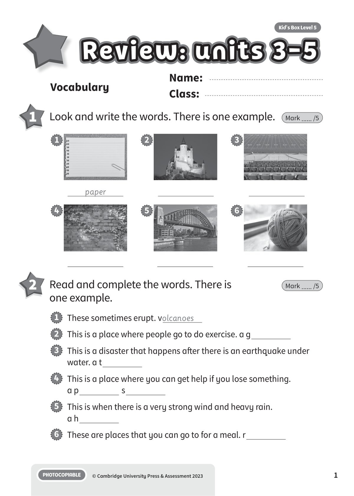
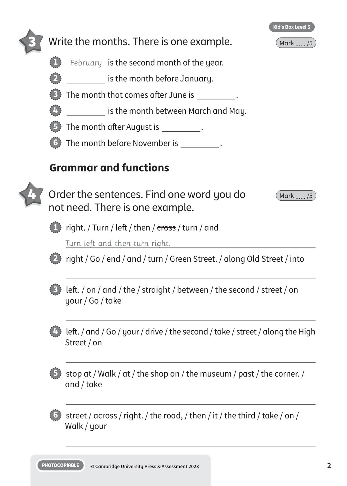
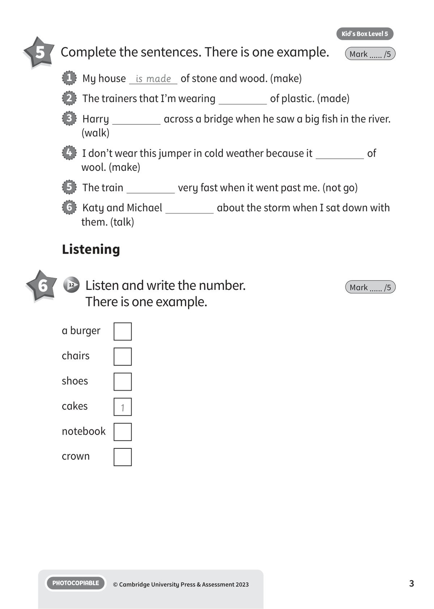
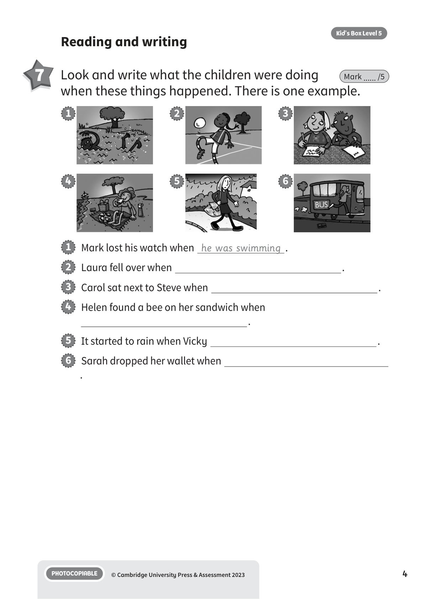
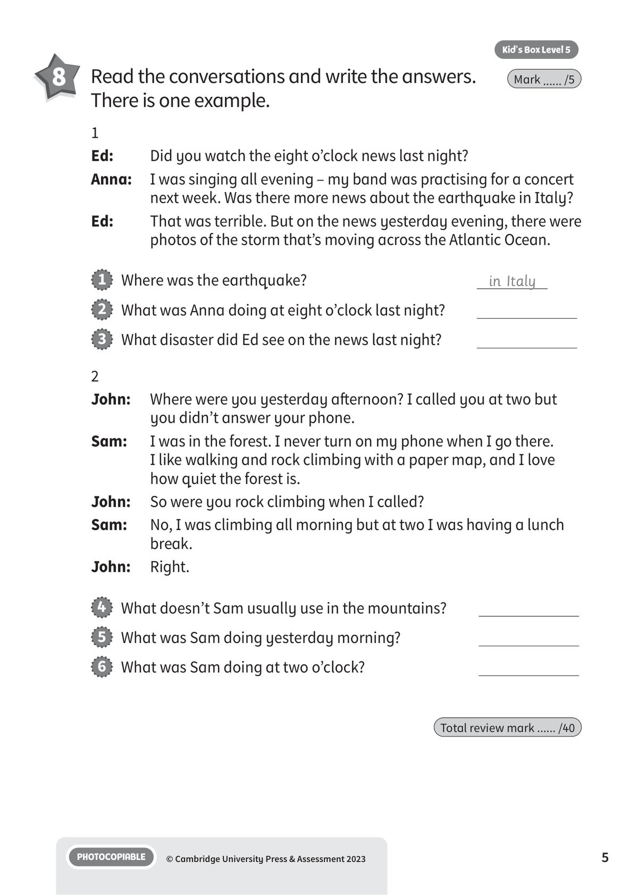

## 音频文件

- 🎧 [KBX_L5_RTU3-5_audio_T12.mp3](KBX_L5_RTU3-5_audio_T12.mp3)

## 第 1 页

Name:
Class:
PHOTOCOPIABLE
© Cambridge University Press & Assessment 2023
Kid’s Box Level 5
1
Vocabulary
1 	 Look and write the words. There is one example.
Mark ...... /5
2 	 Read and complete the words. There is
one example.
Mark ...... /5
paper
1
4
2
5
3
6
1   These sometimes erupt. volcanoes
2   This is a place where people go to do exercise. a g
3   This is a disaster that happens after there is an earthquake under
water. a t
4   This is a place where you can get help if you lose something.
a p
s
5   This is when there is a very strong wind and heavy rain.
a h
6   These are places that you can go to for a meal. r
Review: units 3-5
Review: units 3-5
Review: units 3-5

## 第 2 页

PHOTOCOPIABLE
© Cambridge University Press & Assessment 2023
2
Kid’s Box Level 5
3 	 Write the months. There is one example.
Mark ...... /5
4 	 Order the sentences. Find one word you do
not need. There is one example.
Mark ...... /5
Grammar and functions
1   February is the second month of the year.
2
is the month before January.
3   The month that comes after June is
.
4
is the month between March and May.
5   The month after August is
.
6   The month before November is
.
1   right. / Turn / left / then / cross / turn / and
Turn left and then turn right.
2   right / Go / end / and / turn / Green Street. / along Old Street / into
3   left. / on / and / the / straight / between / the second / street / on
your / Go / take
4   left. / and / Go / your / drive / the second / take / street / along the High
Street / on
5   stop at / Walk / at / the shop on / the museum / past / the corner. /
and / take
6   street / across / right. / the road, / then / it / the third / take / on /
Walk / your

## 第 3 页

PHOTOCOPIABLE
© Cambridge University Press & Assessment 2023
3
Kid’s Box Level 5
5 	 Complete the sentences. There is one example.
Mark ...... /5
Listening
1   My house is made of stone and wood. (make)
2   The trainers that I’m wearing
of plastic. (made)
3   Harry
across a bridge when he saw a big fish in the river.
(walk)
4   I don’t wear this jumper in cold weather because it
of
wool. (make)
5   The train
very fast when it went past me. (not go)
6   Katy and Michael
about the storm when I sat down with
them. (talk)
6 	  12 	 Listen and write the number.
There is one example.
Mark ...... /5
a burger
chairs
shoes
1
cakes
notebook
crown

## 第 4 页

PHOTOCOPIABLE
© Cambridge University Press & Assessment 2023
4
Kid’s Box Level 5
Reading and writing
7 	 Look and write what the children were doing
when these things happened. There is one example.
Mark ...... /5
3
2
1
5
4
6
1   Mark lost his watch when he was swimming .
2   Laura fell over when
.
3   Carol sat next to Steve when
.
4   Helen found a bee on her sandwich when
.
5   It started to rain when Vicky
.
6   Sarah dropped her wallet when
.

## 第 5 页

PHOTOCOPIABLE
© Cambridge University Press & Assessment 2023
5
Kid’s Box Level 5
8 	 Read the conversations and write the answers.
There is one example.
Mark ...... /5
1
Ed:
Did you watch the eight o’clock news last night?
Anna: 	 I was singing all evening – my band was practising for a concert
next week. Was there more news about the earthquake in Italy?
Ed:
That was terrible. But on the news yesterday evening, there were
photos of the storm that’s moving across the Atlantic Ocean.
2
John:
Where were you yesterday afternoon? I called you at two but
you didn’t answer your phone.
Sam:
I was in the forest. I never turn on my phone when I go there.
I like walking and rock climbing with a paper map, and I love
how quiet the forest is.
John:
So were you rock climbing when I called?
Sam:
No, I was climbing all morning but at two I was having a lunch
break.
John:
Right.
1   Where was the earthquake?
in Italy
2   What was Anna doing at eight o’clock last night?
3   What disaster did Ed see on the news last night?
4   What doesn’t Sam usually use in the mountains?
5   What was Sam doing yesterday morning?
6   What was Sam doing at two o’clock?
Total review mark ...... /40
