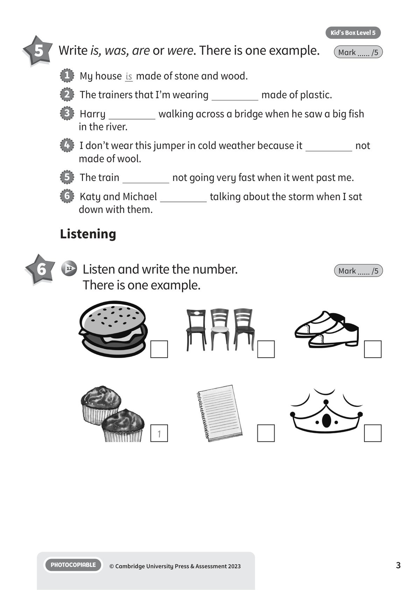
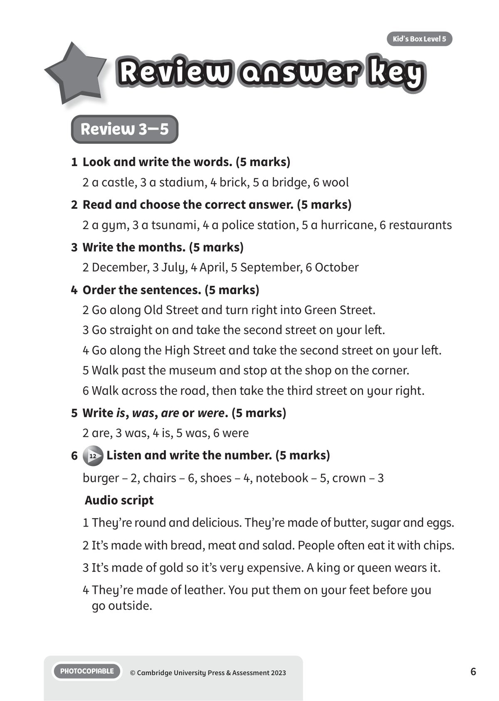
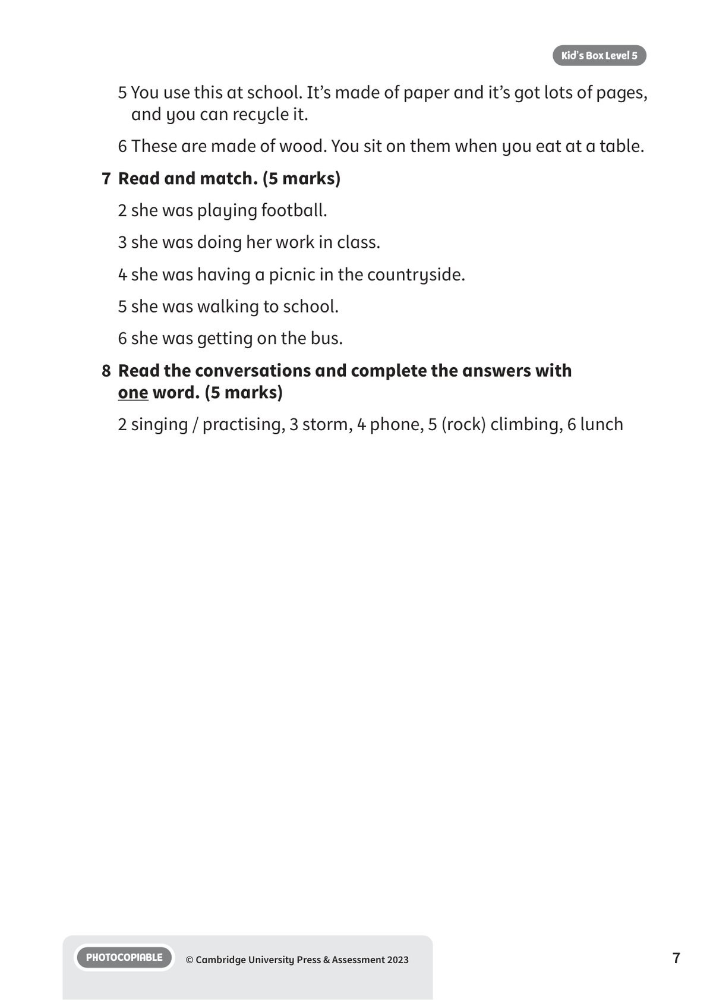

## 音频文件

- 🎧 [KBX_L5_RTU3-5_audio_T12.mp3](KBX_L5_RTU3-5_audio_T12.mp3)

## 第 1 页

Name:
Class:
PHOTOCOPIABLE
© Cambridge University Press & Assessment 2023
Kid’s Box Level 5
1
Vocabulary
1 	 Look and write the words. There is one example.
Mark ...... /5
2 	 Read and choose the correct answer. There is
one example.
Mark ...... /5
1   These sometimes erupt. volcanoes
2   This is a place where people go to do exercise.
3   This is a disaster that happens after there is an earthquake under
water.
4   This is a place where you can get help if you lose something.
5   This is when there is a very strong wind and heavy rain.
6   These are places that you can go to for a meal.
a stadium  wool  brick  paper  a castle  a bridge
a gym  a tsunami  a police station
volcanoes  restaurants  a hurricane
paper
1
4
2
5
3
6
Review: units 3-5
Review: units 3-5
Review: units 3-5

## 第 2 页

PHOTOCOPIABLE
© Cambridge University Press & Assessment 2023
2
Kid’s Box Level 5
3 	 Write the months. There is one example.
Mark ...... /5
4 	 Order the sentences. There is one example.
Mark ...... /5
Grammar and functions
1   February is the second month of the year.
2
is the month before January.
3   The month that comes after June is
.
4
is the month between March and May.
5   The month after August is
.
6   The month before November is
.
1   right. / Turn / left / then / turn / and
Turn left and then turn right.
2   right / Go / and / turn / Green Street. / along Old Street / into
3   left. / on / and / the / straight / the second / street / on your / Go / take
4   left. / and / Go / your / the second / take / street / along the High
Street / on
5   stop at / Walk / at / the shop on / the museum / past / the corner. / and
6   street / across the road, / right. / then / the third / take / on / Walk / your
April  October  February  December  July  September

## 第 3 页

PHOTOCOPIABLE
© Cambridge University Press & Assessment 2023
3
Kid’s Box Level 5
5 	 Write is, was, are or were. There is one example.
Mark ...... /5
Listening
1   My house is made of stone and wood.
2   The trainers that I’m wearing
made of plastic.
3   Harry
walking across a bridge when he saw a big fish
in the river.
4   I don’t wear this jumper in cold weather because it
not
made of wool.
5   The train
not going very fast when it went past me.
6   Katy and Michael
talking about the storm when I sat
down with them.
6 	  12 	 Listen and write the number.
There is one example.
Mark ...... /5
1

## 第 4 页

PHOTOCOPIABLE
© Cambridge University Press & Assessment 2023
4
Kid’s Box Level 5
Reading and writing
7 	 Read and match. There is one example.
Mark ...... /5
3
2
1
5
4
6
1   Mark lost his watch when
2   Laura fell over when
3   Carol sat next to Steve when
4   Helen found a bee on her
sandwich when
5   It started to rain when
6   Sarah dropped her wallet when
she was doing her work in class.
she was having a picnic in the
countryside.
he was swimming.
she was getting on the bus.
she was playing football.
she was walking to school.

## 第 5 页

PHOTOCOPIABLE
© Cambridge University Press & Assessment 2023
5
Kid’s Box Level 5
8 	 Read the conversations and complete the
answers with one word. There is one example.
Mark ...... /5
Ed:
Did you watch the eight o’clock news last night?
Anna: 	 I was singing all evening – my band was practising for a concert
next week. Was there more news about the earthquake in Italy?
Ed:
That was terrible. But on the news yesterday evening, there were
photos of the storm that’s moving across the Atlantic Ocean.
Conversation 2
John:
Where were you yesterday afternoon? I called you at two but
you didn’t answer your phone.
Sam:
I was in the forest. I never turn on my phone when I go there.
I like walking and rock climbing with a paper map, and I love
how quiet the forest is.
John:
So were you rock climbing when I called?
Sam:
No, I was climbing all morning but at two I was having a
lunch break.
John:
Right.
1   Where was the earthquake?
in Italy
2   What was Anna doing at eight o’clock last night?

with
her band
3   What disaster did Ed see on the news last night?
a
4   What doesn’t Sam usually use in the forest?	 his
5   What was Sam doing yesterday morning?
in the forest
6   What was Sam doing at two o’clock?
having his
Total review mark ...... /40

## 第 6 页

PHOTOCOPIABLE
© Cambridge University Press & Assessment 2023
6
Review answer key
Review answer key
Review answer key
Kid’s Box Level 5
Review 3–5
1	 Look and write the words. (5 marks)
2 a castle, 3 a stadium, 4 brick, 5 a bridge, 6 wool
2	 Read and choose the correct answer. (5 marks)
2 a gym, 3 a tsunami, 4 a police station, 5 a hurricane, 6 restaurants
3	 Write the months. (5 marks)
2 December, 3 July, 4 April, 5 September, 6 October
4	 Order the sentences. (5 marks)
2 Go along Old Street and turn right into Green Street.
3 Go straight on and take the second street on your left.
4 Go along the High Street and take the second street on your left.
5 Walk past the museum and stop at the shop on the corner.
6 Walk across the road, then take the third street on your right.
5	 Write is, was, are or were. (5 marks)
2 are, 3 was, 4 is, 5 was, 6 were
6
12 Listen and write the number. (5 marks)
burger – 2, chairs – 6, shoes – 4, notebook – 5, crown – 3
Audio script
1 They’re round and delicious. They’re made of butter, sugar and eggs.
2 It’s made with bread, meat and salad. People often eat it with chips.
3 It’s made of gold so it’s very expensive. A king or queen wears it.
4 They’re made of leather. You put them on your feet before you
go outside.

## 第 7 页

PHOTOCOPIABLE
© Cambridge University Press & Assessment 2023
7
Kid’s Box Level 5
5 You use this at school. It’s made of paper and it’s got lots of pages,
and you can recycle it.
6 These are made of wood. You sit on them when you eat at a table.
7	 Read and match. (5 marks)
2 she was playing football.
3 she was doing her work in class.
4 she was having a picnic in the countryside.
5 she was walking to school.
6 she was getting on the bus.
8	 Read the conversations and complete the answers with
one word. (5 marks)
2 singing / practising, 3 storm, 4 phone, 5 (rock) climbing, 6 lunch
