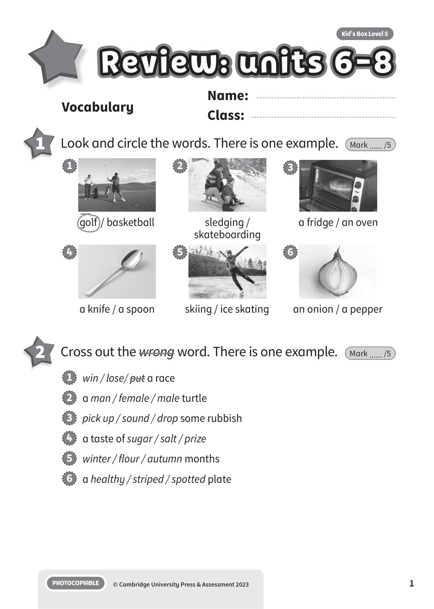
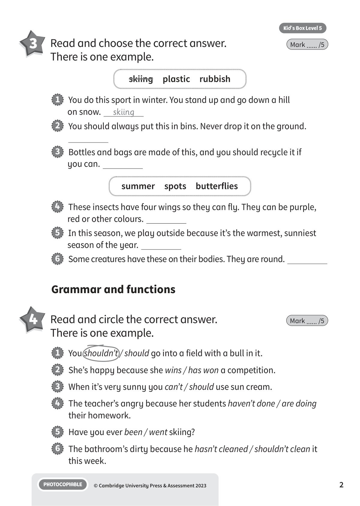
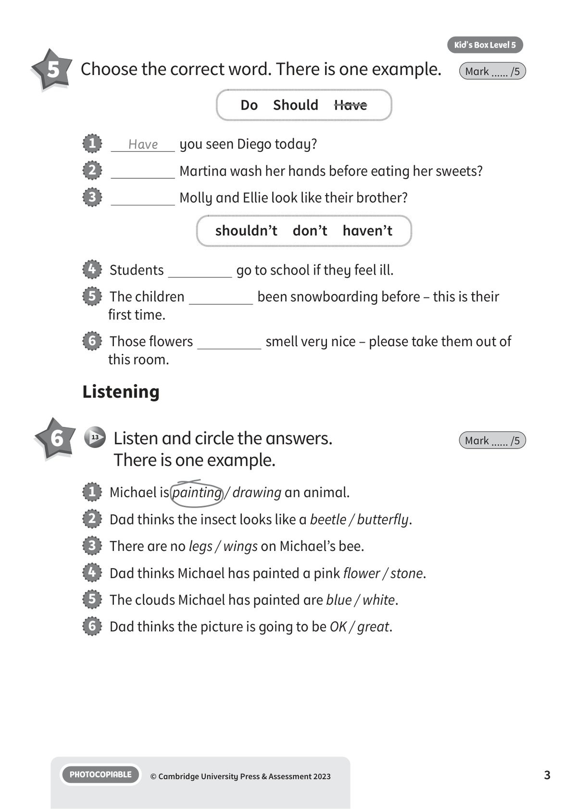
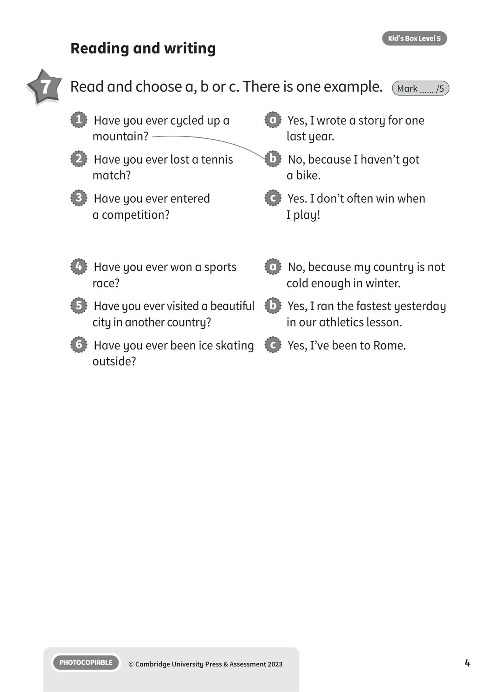
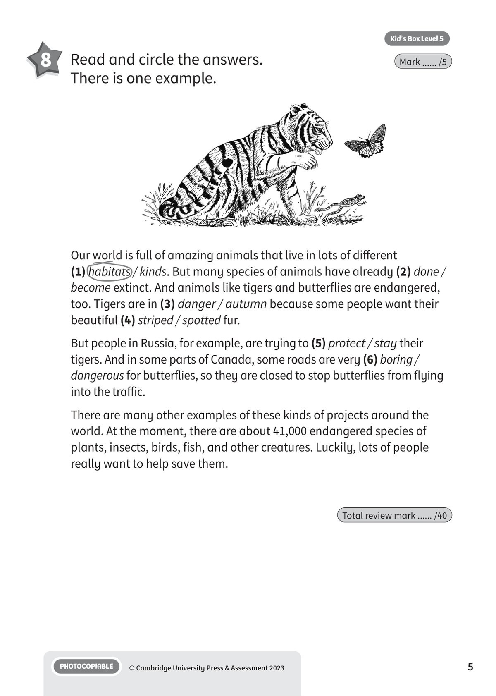
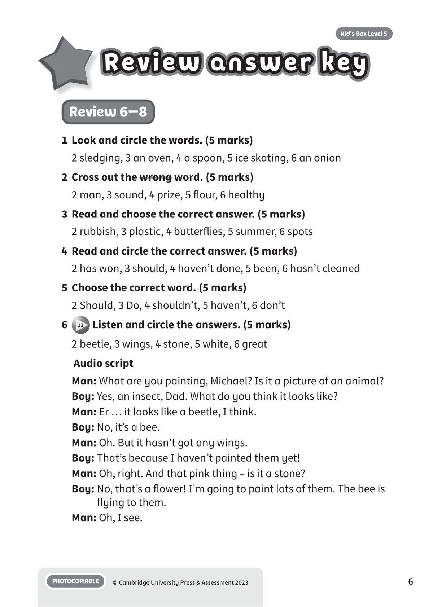
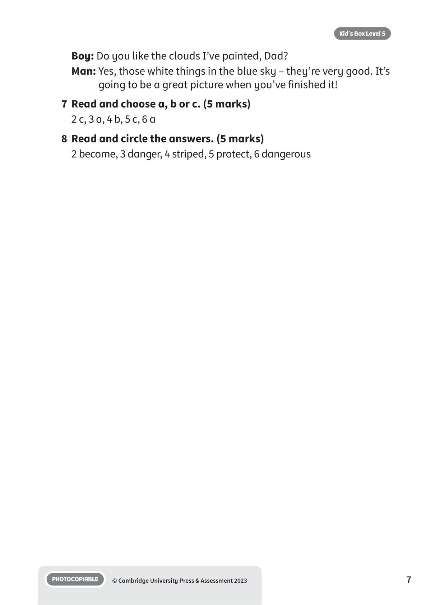

## 音频文件

- 🎧 [KBX_L5_RTU6-8_audio_T13.mp3](KBX_L5_RTU6-8_audio_T13.mp3)

## 第 1 页

Name:
Class:
PHOTOCOPIABLE
© Cambridge University Press & Assessment 2023
Kid’s Box Level 5
1
Vocabulary
Review: units 6-8
Review: units 6-8
Review: units 6-8
1 	 Look and circle the words. There is one example.
Mark ...... /5
golf  / basketball
1
sledging /
skateboarding
2
a fridge / an oven
3
a knife / a spoon
4
skiing / ice skating
5
an onion / a pepper
6
2 	 Cross out the wrong word. There is one example.
Mark ...... /5
1   win / lose/ put a race
2   a man / female / male turtle
3   pick up / sound / drop some rubbish
4   a taste of sugar / salt / prize
5   winter / flour / autumn months
6   a healthy / striped / spotted plate

## 第 2 页

PHOTOCOPIABLE
© Cambridge University Press & Assessment 2023
2
Kid’s Box Level 5
4 	 Read and circle the correct answer.
There is one example.
Mark ...... /5
Grammar and functions
1   You shouldn’t / should go into a field with a bull in it.
2   She’s happy because she wins / has won a competition.
3   When it’s very sunny you can’t / should use sun cream.
4   The teacher’s angry because her students haven’t done / are doing
their homework.
5   Have you ever been / went skiing?
6   The bathroom’s dirty because he hasn’t cleaned / shouldn’t clean it
this week.
3 	 Read and choose the correct answer.
There is one example.
Mark ...... /5
skiing  plastic  rubbish
summer  spots  butterflies
1   You do this sport in winter. You stand up and go down a hill
on snow.
skiing
2   You should always put this in bins. Never drop it on the ground.
3   Bottles and bags are made of this, and you should recycle it if
you can.
4   These insects have four wings so they can fly. They can be purple,
red or other colours.
5   In this season, we play outside because it’s the warmest, sunniest
season of the year.
6   Some creatures have these on their bodies. They are round.

## 第 3 页

PHOTOCOPIABLE
© Cambridge University Press & Assessment 2023
3
Kid’s Box Level 5
Listening
6 	  13 	 Listen and circle the answers.
There is one example.
Mark ...... /5
5 	 Choose the correct word. There is one example.
Mark ...... /5
Do  Should  Have
shouldn’t  don’t  haven’t
1
Have
you seen Diego today?
2
Martina wash her hands before eating her sweets?
3
Molly and Ellie look like their brother?
4   Students
go to school if they feel ill.
5   The children
been snowboarding before – this is their
first time.
6   Those flowers
smell very nice – please take them out of
this room.
1   Michael is painting / drawing an animal.
2   Dad thinks the insect looks like a beetle / butterfly.
3   There are no legs / wings on Michael’s bee.
4   Dad thinks Michael has painted a pink flower / stone.
5   The clouds Michael has painted are blue / white.
6   Dad thinks the picture is going to be OK / great.

## 第 4 页

PHOTOCOPIABLE
© Cambridge University Press & Assessment 2023
4
Kid’s Box Level 5
Reading and writing
7 	 Read and choose a, b or c. There is one example.
Mark ...... /5
1   Have you ever cycled up a
mountain?
2   Have you ever lost a tennis
match?
3   Have you ever entered
a competition?
a   Yes, I wrote a story for one
last year.
b   No, because I haven’t got
a bike.
c   Yes. I don’t often win when
I play!
4   Have you ever won a sports
race?
5   Have you ever visited a beautiful
city in another country?
6   Have you ever been ice skating
outside?
a   No, because my country is not
cold enough in winter.
b   Yes, I ran the fastest yesterday
in our athletics lesson.
c   Yes, I’ve been to Rome.

## 第 5 页

PHOTOCOPIABLE
© Cambridge University Press & Assessment 2023
5
Kid’s Box Level 5
8 	 Read and circle the answers.
There is one example.
Mark ...... /5
Our world is full of amazing animals that live in lots of different
(1) habitats / kinds. But many species of animals have already (2) done /
become extinct. And animals like tigers and butterflies are endangered,
too. Tigers are in (3) danger / autumn because some people want their
beautiful (4) striped / spotted fur.
But people in Russia, for example, are trying to (5) protect / stay their
tigers. And in some parts of Canada, some roads are very (6) boring /
dangerous for butterflies, so they are closed to stop butterflies from flying
into the traffic.
There are many other examples of these kinds of projects around the
world. At the moment, there are about 41,000 endangered species of
plants, insects, birds, fish, and other creatures. Luckily, lots of people
really want to help save them.
Total review mark ...... /40

## 第 6 页

PHOTOCOPIABLE
© Cambridge University Press & Assessment 2023
6
Review answer key
Review answer key
Review answer key
Kid’s Box Level 5
Review 6–8
1	 Look and circle the words. (5 marks)
2 sledging, 3 an oven, 4 a spoon, 5 ice skating, 6 an onion
2	 Cross out the wrong word. (5 marks)
2 man, 3 sound, 4 prize, 5 flour, 6 healthy
3	 Read and choose the correct answer. (5 marks)
2 rubbish, 3 plastic, 4 butterflies, 5 summer, 6 spots
4	 Read and circle the correct answer. (5 marks)
2 has won, 3 should, 4 haven’t done, 5 been, 6 hasn’t cleaned
5	 Choose the correct word. (5 marks)
2 Should, 3 Do, 4 shouldn’t, 5 haven’t, 6 don’t
6
13 Listen and circle the answers. (5 marks)
2 beetle, 3 wings, 4 stone, 5 white, 6 great
Audio script
Man: What are you painting, Michael? Is it a picture of an animal?
Boy: Yes, an insect, Dad. What do you think it looks like?
Man: Er … it looks like a beetle, I think.
Boy: No, it’s a bee.
Man: Oh. But it hasn’t got any wings.
Boy: That’s because I haven’t painted them yet!
Man: Oh, right. And that pink thing – is it a stone?
Boy: No, that’s a flower! I’m going to paint lots of them. The bee is
flying to them.
Man: Oh, I see.

## 第 7 页

PHOTOCOPIABLE
© Cambridge University Press & Assessment 2023
7
Kid’s Box Level 5
Boy: Do you like the clouds I’ve painted, Dad?
Man: Yes, those white things in the blue sky – they’re very good. It’s
going to be a great picture when you’ve finished it!
7	 Read and choose a, b or c. (5 marks)
2 c, 3 a, 4 b, 5 c, 6 a
8	 Read and circle the answers. (5 marks)
2 become, 3 danger, 4 striped, 5 protect, 6 dangerous
