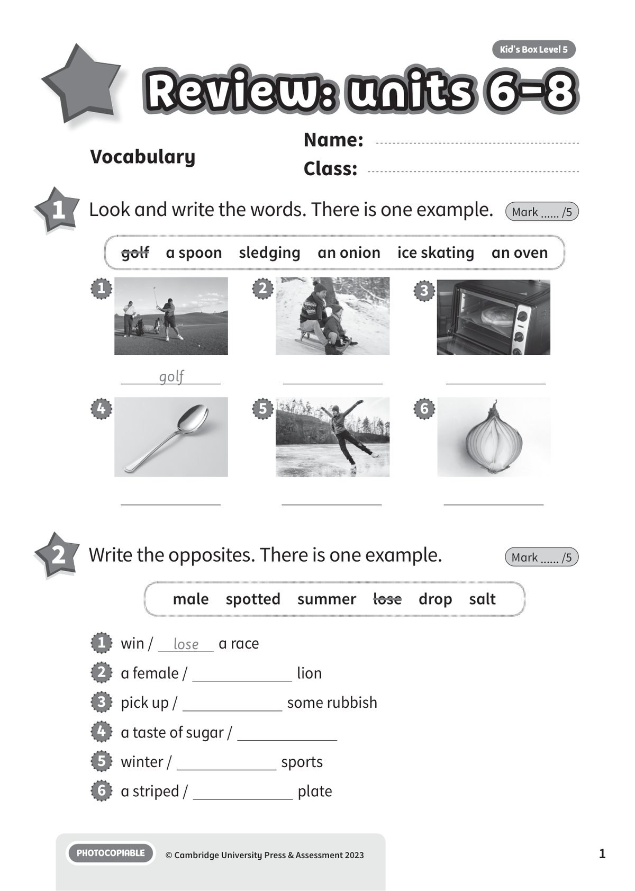
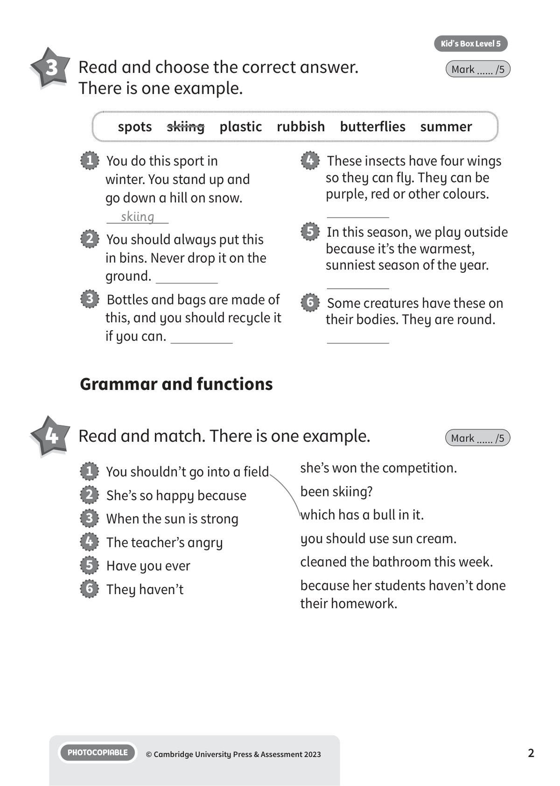
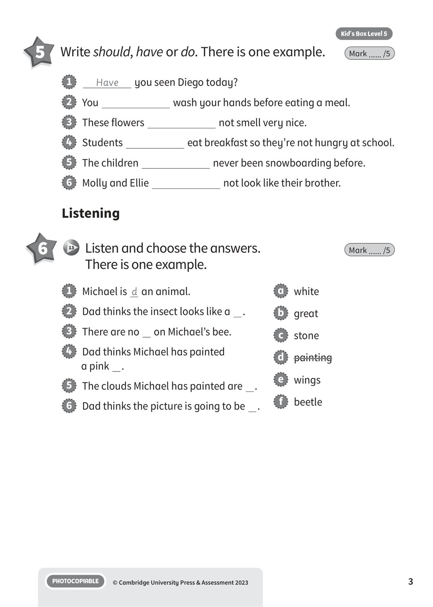
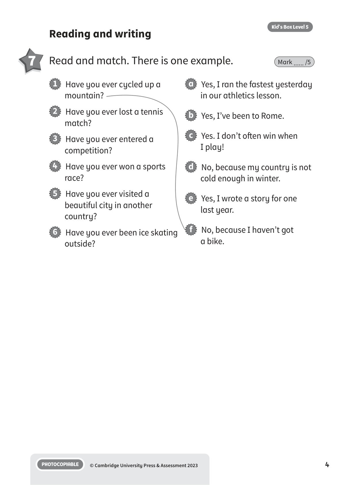
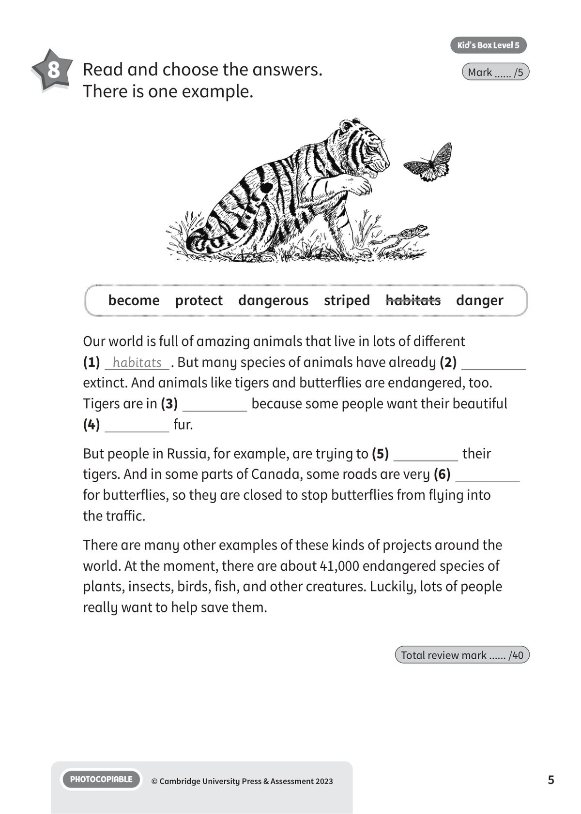

## 音频文件

- 🎧 [KBX_L5_RTU6-8_audio_T13.mp3](KBX_L5_RTU6-8_audio_T13.mp3)

## 第 1 页

Name:
Class:
PHOTOCOPIABLE
© Cambridge University Press & Assessment 2023
Kid’s Box Level 5
1
Vocabulary
1 	 Look and write the words. There is one example.
Mark ...... /5
golf
1
2
3
4
5
6
golf  a spoon  sledging  an onion  ice skating  an oven
2 	 Write the opposites. There is one example.
Mark ...... /5
1   win /
lose
a race
2   a female /
lion
3   pick up /
some rubbish
4   a taste of sugar /
5   winter /
sports
6   a striped /
plate
male  spotted  summer  lose  drop  salt
Review: units 6-8
Review: units 6-8
Review: units 6-8

## 第 2 页

PHOTOCOPIABLE
© Cambridge University Press & Assessment 2023
2
Kid’s Box Level 5
4 	 Read and match. There is one example.
Mark ...... /5
Grammar and functions
1   You shouldn’t go into a field
2   She’s so happy because
3   When the sun is strong
4   The teacher’s angry
5   Have you ever
6   They haven’t
she’s won the competition.
been skiing?
which has a bull in it.
you should use sun cream.
cleaned the bathroom this week.
because her students haven’t done
their homework.
3 	 Read and choose the correct answer.
There is one example.
Mark ...... /5
spots  skiing  plastic  rubbish  butterflies  summer
1   You do this sport in
winter. You stand up and
go down a hill on snow.
skiing
2   You should always put this
in bins. Never drop it on the
ground.
3   Bottles and bags are made of
this, and you should recycle it
if you can.
4   These insects have four wings
so they can fly. They can be
purple, red or other colours.
5   In this season, we play outside
because it’s the warmest,
sunniest season of the year.
6   Some creatures have these on
their bodies. They are round.

## 第 3 页

PHOTOCOPIABLE
© Cambridge University Press & Assessment 2023
3
Kid’s Box Level 5
Listening
6 	  13 	 Listen and choose the answers.
There is one example.
Mark ...... /5
5 	 Write should, have or do. There is one example.
Mark ...... /5
1
Have
you seen Diego today?
2   You
wash your hands before eating a meal.
3   These flowers
not smell very nice.
4   Students
eat breakfast so they’re not hungry at school.
5   The children
never been snowboarding before.
6   Molly and Ellie
not look like their brother.
1   Michael is d an animal.
2   Dad thinks the insect looks like a  .
3   There are no   on Michael’s bee.
4   Dad thinks Michael has painted
a pink  .
5   The clouds Michael has painted are  .
6   Dad thinks the picture is going to be  .
a   white
b   great
c   stone
d   painting
e   wings
f   beetle

## 第 4 页

PHOTOCOPIABLE
© Cambridge University Press & Assessment 2023
4
Kid’s Box Level 5
Reading and writing
7 	 Read and match. There is one example.
Mark ...... /5
1   Have you ever cycled up a
mountain?
2   Have you ever lost a tennis
match?
3   Have you ever entered a
competition?
4   Have you ever won a sports
race?
5   Have you ever visited a
beautiful city in another
country?
6   Have you ever been ice skating
outside?
a   Yes, I ran the fastest yesterday
in our athletics lesson.
b   Yes, I’ve been to Rome.
c   Yes. I don’t often win when
I play!
d   No, because my country is not
cold enough in winter.
e   Yes, I wrote a story for one
last year.
f   No, because I haven’t got
a bike.

## 第 5 页

PHOTOCOPIABLE
© Cambridge University Press & Assessment 2023
5
Kid’s Box Level 5
8 	 Read and choose the answers.
There is one example.
Mark ...... /5
Our world is full of amazing animals that live in lots of different
(1) habitats . But many species of animals have already (2)
extinct. And animals like tigers and butterflies are endangered, too.
Tigers are in (3)
because some people want their beautiful
(4)
fur.
But people in Russia, for example, are trying to (5)
their
tigers. And in some parts of Canada, some roads are very (6)
for butterflies, so they are closed to stop butterflies from flying into
the traffic.
There are many other examples of these kinds of projects around the
world. At the moment, there are about 41,000 endangered species of
plants, insects, birds, fish, and other creatures. Luckily, lots of people
really want to help save them.
Total review mark ...... /40
become  protect  dangerous  striped  habitats  danger
