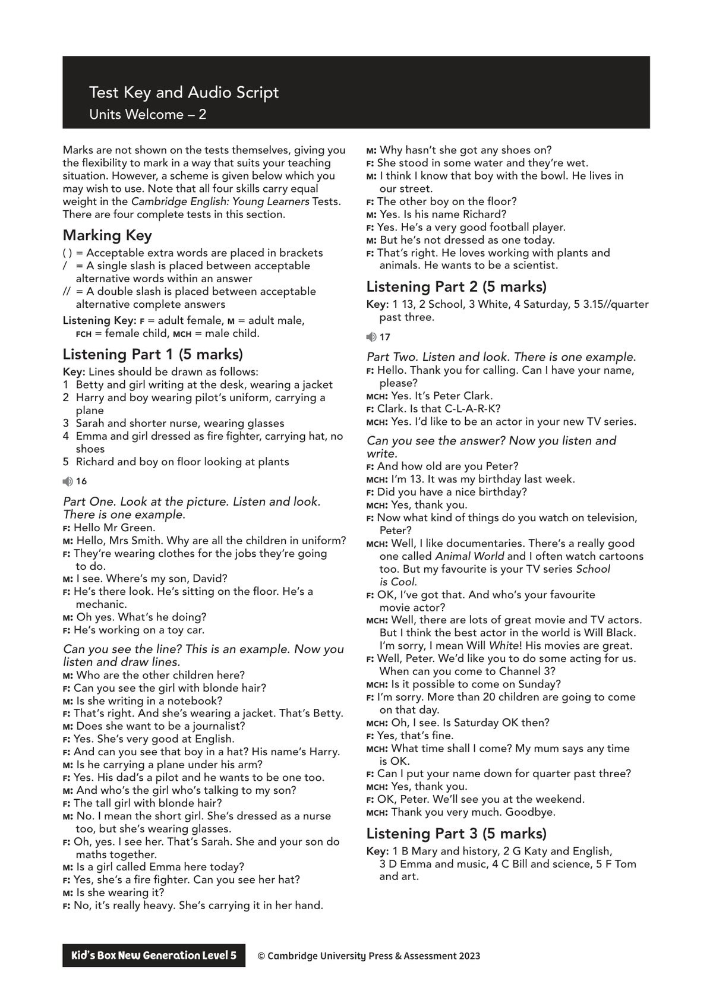
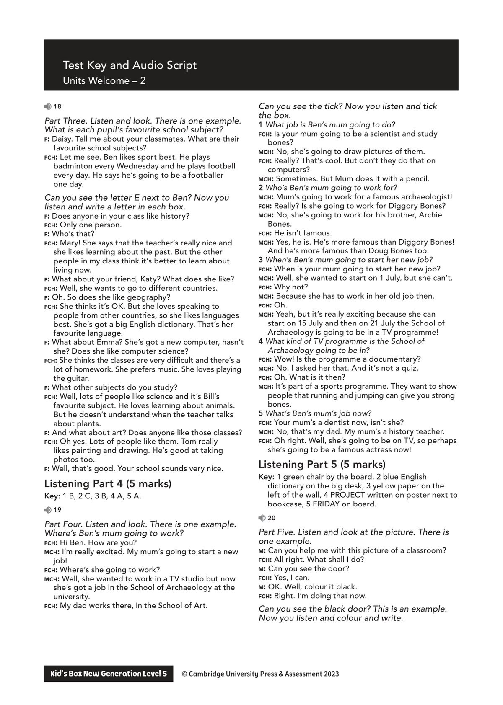
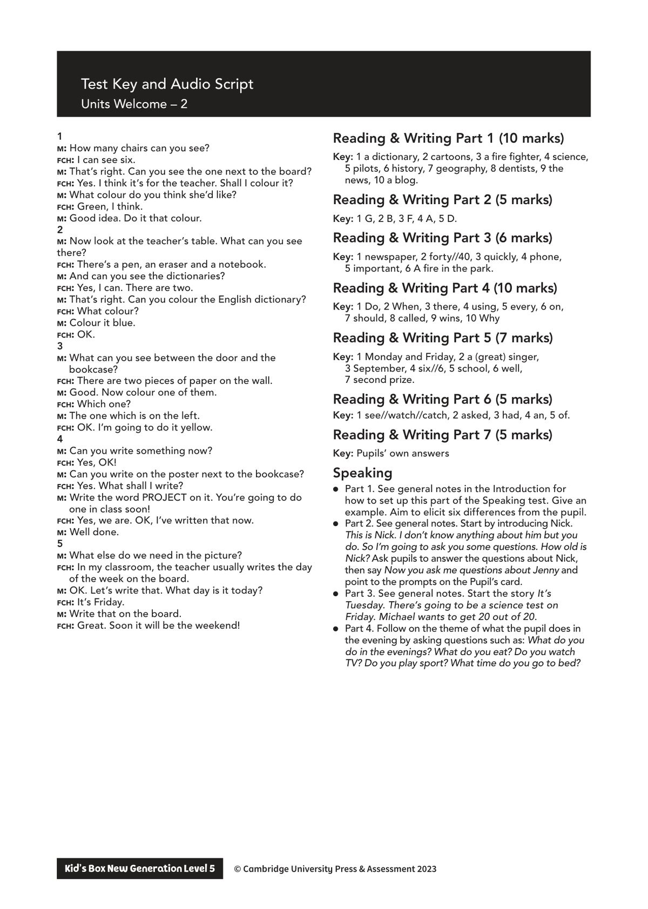

## 音频文件

- 🎧 [KidsBox_Level5_Test_Units_0-2_Listening_1_Audio_Track_16.mp3](KidsBox_Level5_Test_Units_0-2_Listening_1_Audio_Track_16.mp3)
- 🎧 [KidsBox_Level5_Test_Units_0-2_Listening_2_Audio_Track_17.mp3](KidsBox_Level5_Test_Units_0-2_Listening_2_Audio_Track_17.mp3)
- 🎧 [KidsBox_Level5_Test_Units_0-2_Listening_3_Audio_Track_18.mp3](KidsBox_Level5_Test_Units_0-2_Listening_3_Audio_Track_18.mp3)
- 🎧 [KidsBox_Level5_Test_Units_0-2_Listening_4_Audio_Track_19.mp3](KidsBox_Level5_Test_Units_0-2_Listening_4_Audio_Track_19.mp3)
- 🎧 [KidsBox_Level5_Test_Units_0-2_Listening_5_Audio_Track_20.mp3](KidsBox_Level5_Test_Units_0-2_Listening_5_Audio_Track_20.mp3)

## 第 1 页

Test Key and Audio Script
Units Welcome – 2
Kid’s Box New Generation Level 5        © Cambridge University Press & Assessment 2023
© Cambridge University Press & Assessment 2023
Marks are not shown on the tests themselves, giving you
the flexibility to mark in a way that suits your teaching
situation. However, a scheme is given below which you
may wish to use. Note that all four skills carry equal
weight in the Cambridge English: Young Learners Tests.
There are four complete tests in this section.
Marking Key
( )	= Acceptable extra words are placed in brackets
/	 = A single slash is placed between acceptable
alternative words within an answer
//	 = A double slash is placed between acceptable
alternative complete answers
Listening Key: f = adult female, m = adult male,
fch = female child, mch = male child.
Listening Part 1 (5 marks)
Key: Lines should be drawn as follows:
1	 Betty and girl writing at the desk, wearing a jacket
2	 Harry and boy wearing pilot’s uniform, carrying a
plane
3	 Sarah and shorter nurse, wearing glasses
4	 Emma and girl dressed as fire fighter, carrying hat, no
shoes
5	 Richard and boy on floor looking at plants
16
Part One. Look at the picture. Listen and look.
There is one example.
f: Hello Mr Green.
m: Hello, Mrs Smith. Why are all the children in uniform?
f: They’re wearing clothes for the jobs they’re going
to do.
m: I see. Where’s my son, David?
f: He’s there look. He’s sitting on the floor. He’s a
mechanic.
m: Oh yes. What’s he doing?
f: He’s working on a toy car.
Can you see the line? This is an example. Now you
listen and draw lines.
m: Who are the other children here?
f: Can you see the girl with blonde hair?
m: Is she writing in a notebook?
f: That’s right. And she’s wearing a jacket. That’s Betty.
m: Does she want to be a journalist?
f: Yes. She’s very good at English.
f: And can you see that boy in a hat? His name’s Harry.
m: Is he carrying a plane under his arm?
f: Yes. His dad’s a pilot and he wants to be one too.
m: And who’s the girl who’s talking to my son?
f: The tall girl with blonde hair?
m: No. I mean the short girl. She’s dressed as a nurse
too, but she’s wearing glasses.
f: Oh, yes. I see her. That’s Sarah. She and your son do
maths together.
m: Is a girl called Emma here today?
f: Yes, she’s a fire fighter. Can you see her hat?
m: Is she wearing it?
f: No, it’s really heavy. She’s carrying it in her hand.
m: Why hasn’t she got any shoes on?
f: She stood in some water and they’re wet.
m: I think I know that boy with the bowl. He lives in
our street.
f: The other boy on the floor?
m: Yes. Is his name Richard?
f: Yes. He’s a very good football player.
m: But he’s not dressed as one today.
f: That’s right. He loves working with plants and
animals. He wants to be a scientist.
Listening Part 2 (5 marks)
Key: 1 13, 2 School, 3 White, 4 Saturday, 5 3.15//quarter
past three.
17
Part Two. Listen and look. There is one example.
f: Hello. Thank you for calling. Can I have your name,
please?
mch: Yes. It’s Peter Clark.
f: Clark. Is that C-L-A-R-K?
mch: Yes. I’d like to be an actor in your new TV series.
Can you see the answer? Now you listen and
write.
f: And how old are you Peter?
mch: I’m 13. It was my birthday last week.
f: Did you have a nice birthday?
mch: Yes, thank you.
f: Now what kind of things do you watch on television,
Peter?
mch: Well, I like documentaries. There’s a really good
one called Animal World and I often watch cartoons
too. But my favourite is your TV series School
is Cool.
f: OK, I’ve got that. And who’s your favourite
movie actor?
mch: Well, there are lots of great movie and TV actors.
But I think the best actor in the world is Will Black.
I’m sorry, I mean Will White! His movies are great.
f: Well, Peter. We’d like you to do some acting for us.
When can you come to Channel 3?
mch: Is it possible to come on Sunday?
f: I’m sorry. More than 20 children are going to come
on that day.
mch: Oh, I see. Is Saturday OK then?
f: Yes, that’s fine.
mch: What time shall I come? My mum says any time
is OK.
f: Can I put your name down for quarter past three?
mch: Yes, thank you.
f: OK, Peter. We’ll see you at the weekend.
mch: Thank you very much. Goodbye.
Listening Part 3 (5 marks)
Key: 1 B Mary and history, 2 G Katy and English,
3 D Emma and music, 4 C Bill and science, 5 F Tom
and art.

## 第 2 页

Test Key and Audio Script
Units Welcome – 2
Kid’s Box New Generation Level 5        © Cambridge University Press & Assessment 2023
© Cambridge University Press & Assessment 2023
18
Part Three. Listen and look. There is one example.
What is each pupil’s favourite school subject?
f: Daisy. Tell me about your classmates. What are their
favourite school subjects?
fch: Let me see. Ben likes sport best. He plays
badminton every Wednesday and he plays football
every day. He says he’s going to be a footballer
one day.
Can you see the letter E next to Ben? Now you
listen and write a letter in each box.
f: Does anyone in your class like history?
fch: Only one person.
f: Who’s that?
fch: Mary! She says that the teacher’s really nice and
she likes learning about the past. But the other
people in my class think it’s better to learn about
living now.
f: What about your friend, Katy? What does she like?
fch: Well, she wants to go to different countries.
f: Oh. So does she like geography?
fch: She thinks it’s OK. But she loves speaking to
people from other countries, so she likes languages
best. She’s got a big English dictionary. That’s her
favourite language.
f: What about Emma? She’s got a new computer, hasn’t
she? Does she like computer science?
fch: She thinks the classes are very difficult and there’s a
lot of homework. She prefers music. She loves playing
the guitar.
f: What other subjects do you study?
fch: Well, lots of people like science and it’s Bill’s
favourite subject. He loves learning about animals.
But he doesn’t understand when the teacher talks
about plants.
f: And what about art? Does anyone like those classes?
fch: Oh yes! Lots of people like them. Tom really
likes painting and drawing. He’s good at taking
photos too.
f: Well, that’s good. Your school sounds very nice.
Listening Part 4 (5 marks)
Key: 1 B, 2 C, 3 B, 4 A, 5 A.
19
Part Four. Listen and look. There is one example.
Where’s Ben’s mum going to work?
fch: Hi Ben. How are you?
mch: I’m really excited. My mum’s going to start a new
job!
fch: Where’s she going to work?
mch: Well, she wanted to work in a TV studio but now
she’s got a job in the School of Archaeology at the
university.
fch: My dad works there, in the School of Art.
Can you see the tick? Now you listen and tick
the box.
1 What job is Ben’s mum going to do?
fch: Is your mum going to be a scientist and study
bones?
mch: No, she’s going to draw pictures of them.
fch: Really? That’s cool. But don’t they do that on
computers?
mch: Sometimes. But Mum does it with a pencil.
2 Who’s Ben’s mum going to work for?
mch: Mum’s going to work for a famous archaeologist!
fch: Really? Is she going to work for Diggory Bones?
mch: No, she’s going to work for his brother, Archie
Bones.
fch: He isn’t famous.
mch: Yes, he is. He’s more famous than Diggory Bones!
And he’s more famous than Doug Bones too.
3 When’s Ben’s mum going to start her new job?
fch: When is your mum going to start her new job?
mch: Well, she wanted to start on 1 July, but she can’t.
fch: Why not?
mch: Because she has to work in her old job then.
fch: Oh.
mch: Yeah, but it’s really exciting because she can
start on 15 July and then on 21 July the School of
Archaeology is going to be in a TV programme!
4 What kind of TV programme is the School of
Archaeology going to be in?
fch: Wow! Is the programme a documentary?
mch: No. I asked her that. And it’s not a quiz.
fch: Oh. What is it then?
mch: It’s part of a sports programme. They want to show
people that running and jumping can give you strong
bones.
5 What’s Ben’s mum’s job now?
fch: Your mum’s a dentist now, isn’t she?
mch: No, that’s my dad. My mum’s a history teacher.
fch: Oh right. Well, she’s going to be on TV, so perhaps
she’s going to be a famous actress now!
Listening Part 5 (5 marks)
Key: 1 green chair by the board, 2 blue English
dictionary on the big desk, 3 yellow paper on the
left of the wall, 4 PROJECT written on poster next to
bookcase, 5 FRIDAY on board.
20
Part Five. Listen and look at the picture. There is
one example.
m: Can you help me with this picture of a classroom?
fch: All right. What shall I do?
m: Can you see the door?
fch: Yes, I can.
m: OK. Well, colour it black.
fch: Right. I’m doing that now.
Can you see the black door? This is an example.
Now you listen and colour and write.

## 第 3 页

Test Key and Audio Script
Units Welcome – 2
Kid’s Box New Generation Level 5        © Cambridge University Press & Assessment 2023
© Cambridge University Press & Assessment 2023
1
m: How many chairs can you see?
fch: I can see six.
m: That’s right. Can you see the one next to the board?
fch: Yes. I think it’s for the teacher. Shall I colour it?
m: What colour do you think she’d like?
fch: Green, I think.
m: Good idea. Do it that colour.
2
m: Now look at the teacher’s table. What can you see
there?
fch: There’s a pen, an eraser and a notebook.
m: And can you see the dictionaries?
fch: Yes, I can. There are two.
m: That’s right. Can you colour the English dictionary?
fch: What colour?
m: Colour it blue.
fch: OK.
3
m: What can you see between the door and the
bookcase?
fch: There are two pieces of paper on the wall.
m: Good. Now colour one of them.
fch: Which one?
m: The one which is on the left.
fch: OK. I’m going to do it yellow.
4
m: Can you write something now?
fch: Yes, OK!
m: Can you write on the poster next to the bookcase?
fch: Yes. What shall I write?
m: Write the word PROJECT on it. You’re going to do
one in class soon!
fch: Yes, we are. OK, I’ve written that now.
m: Well done.
5
m: What else do we need in the picture?
fch: In my classroom, the teacher usually writes the day
of the week on the board.
m: OK. Let’s write that. What day is it today?
fch: It’s Friday.
m: Write that on the board.
fch: Great. Soon it will be the weekend!
Reading & Writing Part 1 (10 marks)
Key: 1 a dictionary, 2 cartoons, 3 a fire fighter, 4 science,
5 pilots, 6 history, 7 geography, 8 dentists, 9 the
news, 10 a blog.
Reading & Writing Part 2 (5 marks)
Key: 1 G, 2 B, 3 F, 4 A, 5 D.
Reading & Writing Part 3 (6 marks)
Key: 1 newspaper, 2 forty//40, 3 quickly, 4 phone,
5 important, 6 A fire in the park.
Reading & Writing Part 4 (10 marks)
Key: 1 Do, 2 When, 3 there, 4 using, 5 every, 6 on,
7 should, 8 called, 9 wins, 10 Why
Reading & Writing Part 5 (7 marks)
Key: 1 Monday and Friday, 2 a (great) singer,
3 September, 4 six//6, 5 school, 6 well,
7 second prize.
Reading & Writing Part 6 (5 marks)
Key: 1 see//watch//catch, 2 asked, 3 had, 4 an, 5 of.
Reading & Writing Part 7 (5 marks)
Key: Pupils’ own answers
Speaking
● Part 1. See general notes in the Introduction for
how to set up this part of the Speaking test. Give an
example. Aim to elicit six differences from the pupil.
● Part 2. See general notes. Start by introducing Nick.
This is Nick. I don’t know anything about him but you
do. So I’m going to ask you some questions. How old is
Nick? Ask pupils to answer the questions about Nick,
then say Now you ask me questions about Jenny and
point to the prompts on the Pupil’s card.
● Part 3. See general notes. Start the story It’s
Tuesday. There’s going to be a science test on
Friday. Michael wants to get 20 out of 20.
● Part 4. Follow on the theme of what the pupil does in
the evening by asking questions such as: What do you
do in the evenings? What do you eat? Do you watch
TV? Do you play sport? What time do you go to bed?
