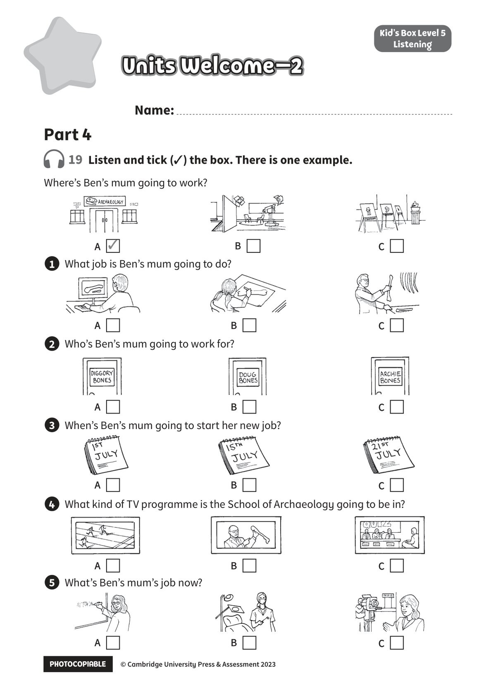

## 音频文件

- 🎧 [KidsBox_Level5_Test_Units_0-2_Listening_1_Audio_Track_16.mp3](KidsBox_Level5_Test_Units_0-2_Listening_1_Audio_Track_16.mp3)
- 🎧 [KidsBox_Level5_Test_Units_0-2_Listening_2_Audio_Track_17.mp3](KidsBox_Level5_Test_Units_0-2_Listening_2_Audio_Track_17.mp3)
- 🎧 [KidsBox_Level5_Test_Units_0-2_Listening_3_Audio_Track_18.mp3](KidsBox_Level5_Test_Units_0-2_Listening_3_Audio_Track_18.mp3)
- 🎧 [KidsBox_Level5_Test_Units_0-2_Listening_4_Audio_Track_19.mp3](KidsBox_Level5_Test_Units_0-2_Listening_4_Audio_Track_19.mp3)
- 🎧 [KidsBox_Level5_Test_Units_0-2_Listening_5_Audio_Track_20.mp3](KidsBox_Level5_Test_Units_0-2_Listening_5_Audio_Track_20.mp3)

## 第 1 页

PHOTOCOPIABLE        © Cambridge University Press & Assessment 2023
© Cambridge University Press & Assessment 2023
Kid’s Box Level 5
Listening
19  Listen and tick (✓) the box. There is one example.
Name:
Part 4
Units Welcome–2
Units Welcome–2
Units Welcome–2
Where’s Ben’s mum going to work?
1 	 What job is Ben’s mum going to do?
2 	 Who’s Ben’s mum going to work for?
3 	 When’s Ben’s mum going to start her new job?
4 	 What kind of TV programme is the School of Archaeology going to be in?
5 	 What’s Ben’s mum’s job now?
A  ✓
A
A
A
A
A
B
B
B
B
B
B
C
C
C
C
C
C
