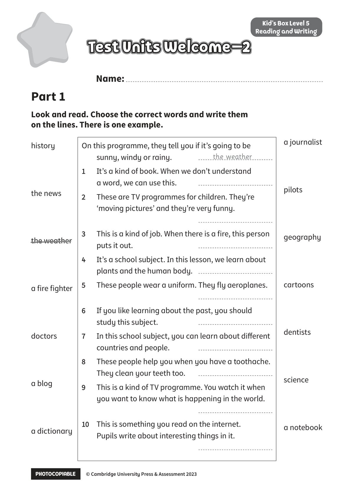

## 音频文件

- 🎧 [KidsBox_Level5_Test_Units_0-2_Listening_1_Audio_Track_16.mp3](KidsBox_Level5_Test_Units_0-2_Listening_1_Audio_Track_16.mp3)
- 🎧 [KidsBox_Level5_Test_Units_0-2_Listening_2_Audio_Track_17.mp3](KidsBox_Level5_Test_Units_0-2_Listening_2_Audio_Track_17.mp3)
- 🎧 [KidsBox_Level5_Test_Units_0-2_Listening_3_Audio_Track_18.mp3](KidsBox_Level5_Test_Units_0-2_Listening_3_Audio_Track_18.mp3)
- 🎧 [KidsBox_Level5_Test_Units_0-2_Listening_4_Audio_Track_19.mp3](KidsBox_Level5_Test_Units_0-2_Listening_4_Audio_Track_19.mp3)
- 🎧 [KidsBox_Level5_Test_Units_0-2_Listening_5_Audio_Track_20.mp3](KidsBox_Level5_Test_Units_0-2_Listening_5_Audio_Track_20.mp3)

## 第 1 页

PHOTOCOPIABLE        © Cambridge University Press & Assessment 2023
© Cambridge University Press & Assessment 2023
Name:
Part 1
Kid’s Box Level 5
Reading and Writing
Look and read. Choose the correct words and write them
on the lines. There is one example.
history
the news
the weather
a fire fighter
doctors
a blog
a dictionary
On this programme, they tell you if it’s going to be
sunny, windy or rainy.
1
It’s a kind of book. When we don’t understand
a word, we can use this.
2
These are TV programmes for children. They’re
‘moving pictures’ and they’re very funny.

3
This is a kind of job. When there is a fire, this person
puts it out.
4
It’s a school subject. In this lesson, we learn about
plants and the human body.
5
These people wear a uniform. They fly aeroplanes.

6
If you like learning about the past, you should
study this subject.
7
In this school subject, you can learn about different
countries and people.
8
These people help you when you have a toothache.
They clean your teeth too. 
9
This is a kind of TV programme. You watch it when
you want to know what is happening in the world.

10
10	 This is something you read on the internet.
Pupils write about interesting things in it.

the weather
a journalist
pilots
geography
cartoons
dentists
science
a notebook
Test Units Welcome–2
Test Units Welcome–2
Test Units Welcome–2
