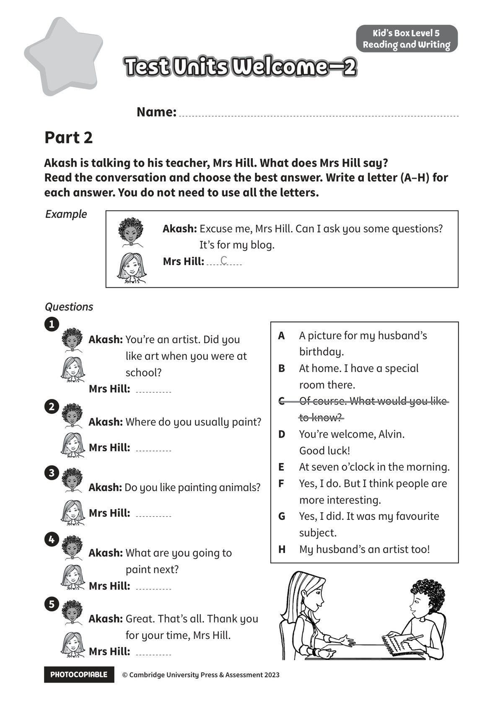

## 音频文件

- 🎧 [KidsBox_Level5_Test_Units_0-2_Listening_1_Audio_Track_16.mp3](KidsBox_Level5_Test_Units_0-2_Listening_1_Audio_Track_16.mp3)
- 🎧 [KidsBox_Level5_Test_Units_0-2_Listening_2_Audio_Track_17.mp3](KidsBox_Level5_Test_Units_0-2_Listening_2_Audio_Track_17.mp3)
- 🎧 [KidsBox_Level5_Test_Units_0-2_Listening_3_Audio_Track_18.mp3](KidsBox_Level5_Test_Units_0-2_Listening_3_Audio_Track_18.mp3)
- 🎧 [KidsBox_Level5_Test_Units_0-2_Listening_4_Audio_Track_19.mp3](KidsBox_Level5_Test_Units_0-2_Listening_4_Audio_Track_19.mp3)
- 🎧 [KidsBox_Level5_Test_Units_0-2_Listening_5_Audio_Track_20.mp3](KidsBox_Level5_Test_Units_0-2_Listening_5_Audio_Track_20.mp3)

## 第 1 页

PHOTOCOPIABLE        © Cambridge University Press & Assessment 2023
© Cambridge University Press & Assessment 2023
Name:
Part 2
Kid’s Box Level 5
Reading and Writing
Akash is talking to his teacher, Mrs Hill. What does Mrs Hill say?
Read the conversation and choose the best answer. Write a letter (A–H) for
each answer. You do not need to use all the letters.
Test Units Welcome–2
Test Units Welcome–2
Test Units Welcome–2
Example
Example
Questions
Questions
Akash: You’re an artist. Did you
like art when you were at
school?
Mrs Hill:
Akash: Where do you usually paint?
Mrs Hill:
Akash: Do you like painting animals?
Mrs Hill:
Akash: What are you going to
paint next?
Mrs Hill:
Akash: Great. That’s all. Thank you
for your time, Mrs Hill.
Mrs Hill:
Akash: Excuse me, Mrs Hill. Can I ask you some questions?
It’s for my blog.
Mrs Hill:
C
A
A picture for my husband’s
birthday.
B
At home. I have a special
room there.
C
Of course. What would you like
to know?
D
You’re welcome, Alvin.
Good luck!
E
At seven o’clock in the morning.
F
Yes, I do. But I think people are
more interesting.
G
Yes, I did. It was my favourite
subject.
H
My husband’s an artist too!
1
2
3
4
5
