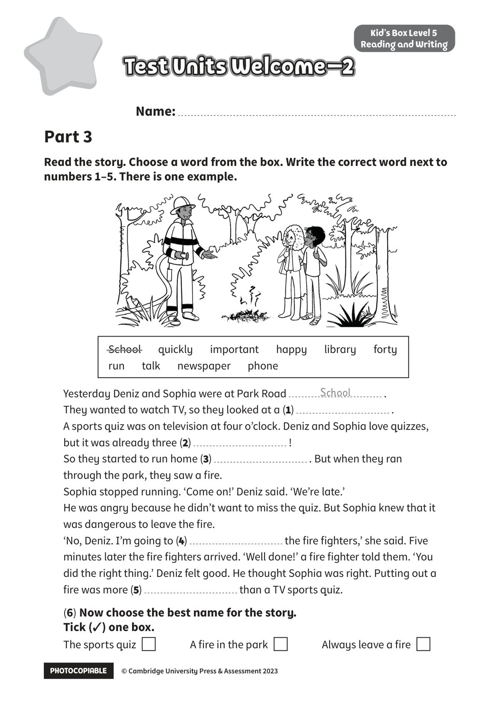

## 音频文件

- 🎧 [KidsBox_Level5_Test_Units_0-2_Listening_1_Audio_Track_16.mp3](KidsBox_Level5_Test_Units_0-2_Listening_1_Audio_Track_16.mp3)
- 🎧 [KidsBox_Level5_Test_Units_0-2_Listening_2_Audio_Track_17.mp3](KidsBox_Level5_Test_Units_0-2_Listening_2_Audio_Track_17.mp3)
- 🎧 [KidsBox_Level5_Test_Units_0-2_Listening_3_Audio_Track_18.mp3](KidsBox_Level5_Test_Units_0-2_Listening_3_Audio_Track_18.mp3)
- 🎧 [KidsBox_Level5_Test_Units_0-2_Listening_4_Audio_Track_19.mp3](KidsBox_Level5_Test_Units_0-2_Listening_4_Audio_Track_19.mp3)
- 🎧 [KidsBox_Level5_Test_Units_0-2_Listening_5_Audio_Track_20.mp3](KidsBox_Level5_Test_Units_0-2_Listening_5_Audio_Track_20.mp3)

## 第 1 页

PHOTOCOPIABLE        © Cambridge University Press & Assessment 2023
© Cambridge University Press & Assessment 2023
Name:
Part 3
Kid’s Box Level 5
Reading and Writing
Read the story. Choose a word from the box. Write the correct word next to
numbers 1–5. There is one example.
Test Units Welcome–2
Test Units Welcome–2
Test Units Welcome–2
Yesterday Deniz and Sophia were at Park Road
.
They wanted to watch TV, so they looked at a (1)
.
A sports quiz was on television at four o’clock. Deniz and Sophia love quizzes,
but it was already three (2)
!
So they started to run home (3)
. But when they ran
through the park, they saw a fire.
Sophia stopped running. ‘Come on!’ Deniz said. ‘We’re late.’
He was angry because he didn’t want to miss the quiz. But Sophia knew that it
was dangerous to leave the fire.
‘No, Deniz. I’m going to (4)
the fire fighters,’ she said. Five
minutes later the fire fighters arrived. ‘Well done!’ a fire fighter told them. ‘You
did the right thing.’ Deniz felt good. He thought Sophia was right. Putting out a
fire was more (5)
than a TV sports quiz.
(6) Now choose the best name for the story.
Tick (✓) one box.
The sports quiz
A fire in the park
Always leave a fire
School      quickly      important      happy      library      forty
run      talk      newspaper      phone
School
