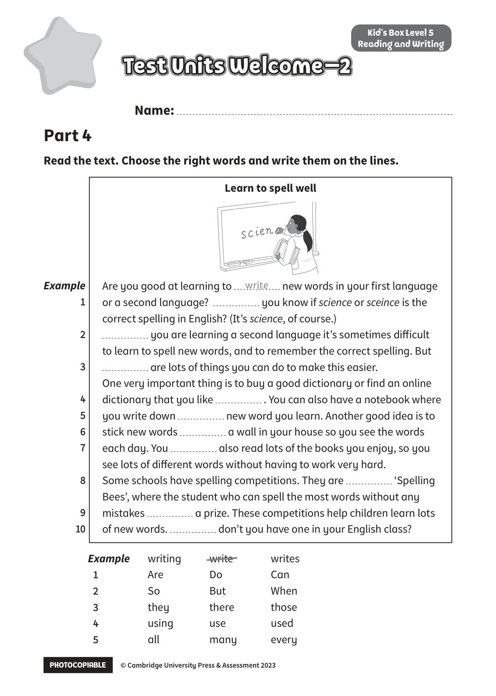
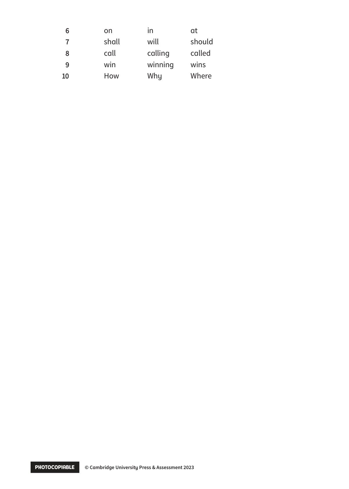

## 音频文件

- 🎧 [KidsBox_Level5_Test_Units_0-2_Listening_1_Audio_Track_16.mp3](KidsBox_Level5_Test_Units_0-2_Listening_1_Audio_Track_16.mp3)
- 🎧 [KidsBox_Level5_Test_Units_0-2_Listening_2_Audio_Track_17.mp3](KidsBox_Level5_Test_Units_0-2_Listening_2_Audio_Track_17.mp3)
- 🎧 [KidsBox_Level5_Test_Units_0-2_Listening_3_Audio_Track_18.mp3](KidsBox_Level5_Test_Units_0-2_Listening_3_Audio_Track_18.mp3)
- 🎧 [KidsBox_Level5_Test_Units_0-2_Listening_4_Audio_Track_19.mp3](KidsBox_Level5_Test_Units_0-2_Listening_4_Audio_Track_19.mp3)
- 🎧 [KidsBox_Level5_Test_Units_0-2_Listening_5_Audio_Track_20.mp3](KidsBox_Level5_Test_Units_0-2_Listening_5_Audio_Track_20.mp3)

## 第 1 页

PHOTOCOPIABLE    © Cambridge University Press & Assessment 2023
© Cambridge University Press & Assessment 2023
Name:
Part 4
Kid’s Box Level 5
Reading and Writing
Read the text. Choose the right words and write them on the lines.
Test Units Welcome–2
Test Units Welcome–2
Test Units Welcome–2
Test Units Welcome–2
Test Units Welcome–2
Example
writing
write
writes
1
1
Are
Do
Can
2
2
So
But
When
3
3
they
there
those
4
4
using
use
used
5
5
all
many
every
Are you good at learning to
new words in your first language
or a second language?
you know if science or sceince is the
correct spelling in English? (It’s science, of course.)
you are learning a second language it’s sometimes diff icult
to learn to spell new words, and to remember the correct spelling. But
are lots of things you can do to make this easier.
One very important thing is to buy a good dictionary or find an online
dictionary that you like
. You can also have a notebook where
you write down
new word you learn. Another good idea is to
stick new words
a wall in your house so you see the words
each day. You
also read lots of the books you enjoy, so you
see lots of diff erent words without having to work very hard.
Some schools have spelling competitions. They are
‘Spelling
Bees’, where the student who can spell the most words without any
mistakes
a prize. These competitions help children learn lots
of new words.
don’t you have one in your English class?
write
Example
1
2
3
4
5
6
7
8
9
10
10
Learn to spell well

## 第 2 页

PHOTOCOPIABLE        © Cambridge University Press & Assessment 2023
© Cambridge University Press & Assessment 2023
6
6
on
in
at
7
7
shall
will
should
8
8
call
calling
called
9
9
win
winning
wins
10
10
How
Why
Where
