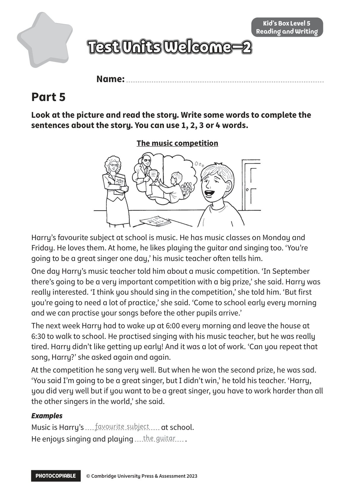
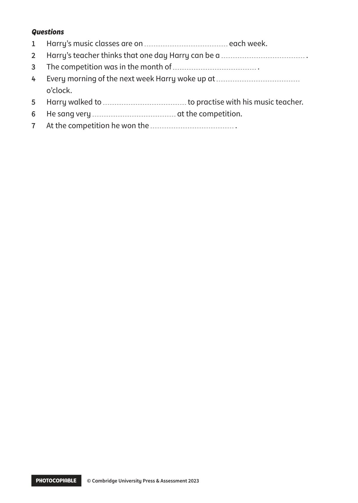

## 音频文件

- 🎧 [KidsBox_Level5_Test_Units_0-2_Listening_1_Audio_Track_16.mp3](KidsBox_Level5_Test_Units_0-2_Listening_1_Audio_Track_16.mp3)
- 🎧 [KidsBox_Level5_Test_Units_0-2_Listening_2_Audio_Track_17.mp3](KidsBox_Level5_Test_Units_0-2_Listening_2_Audio_Track_17.mp3)
- 🎧 [KidsBox_Level5_Test_Units_0-2_Listening_3_Audio_Track_18.mp3](KidsBox_Level5_Test_Units_0-2_Listening_3_Audio_Track_18.mp3)
- 🎧 [KidsBox_Level5_Test_Units_0-2_Listening_4_Audio_Track_19.mp3](KidsBox_Level5_Test_Units_0-2_Listening_4_Audio_Track_19.mp3)
- 🎧 [KidsBox_Level5_Test_Units_0-2_Listening_5_Audio_Track_20.mp3](KidsBox_Level5_Test_Units_0-2_Listening_5_Audio_Track_20.mp3)

## 第 1 页

PHOTOCOPIABLE        © Cambridge University Press & Assessment 2023
© Cambridge University Press & Assessment 2023
Name:
Part 5
Kid’s Box Level 5
Reading and Writing
Look at the picture and read the story. Write some words to complete the
sentences about the story. You can use 1, 2, 3 or 4 words.
Test Units Welcome–2
Test Units Welcome–2
Test Units Welcome–2
The music competition
Harry’s favourite subject at school is music. He has music classes on Monday and
Friday. He loves them. At home, he likes playing the guitar and singing too. ‘You’re
going to be a great singer one day,’ his music teacher often tells him.
One day Harry’s music teacher told him about a music competition. ‘In September
there’s going to be a very important competition with a big prize,’ she said. Harry was
really interested. ‘I think you should sing in the competition,’ she told him. ‘But first
you’re going to need a lot of practice,’ she said. ‘Come to school early every morning
and we can practise your songs before the other pupils arrive.’
The next week Harry had to wake up at 6:00 every morning and leave the house at
6:30 to walk to school. He practised singing with his music teacher, but he was really
tired. Harry didn’t like getting up early! And it was a lot of work. ‘Can you repeat that
song, Harry?’ she asked again and again.
At the competition he sang very well. But when he won the second prize, he was sad.
‘You said I’m going to be a great singer, but I didn’t win,’ he told his teacher. ‘Harry,
you did very well but if you want to be a great singer, you have to work harder than all
the other singers in the world,’ she said.
Examples
Examples
Music is Harry’s
at school.
He enjoys singing and playing
.
favourite subject
the guitar

## 第 2 页

PHOTOCOPIABLE        © Cambridge University Press & Assessment 2023
© Cambridge University Press & Assessment 2023
Questions
Questions
1
Harry’s music classes are on
each week.
2
Harry’s teacher thinks that one day Harry can be a
.
3
The competition was in the month of
.
4
Every morning of the next week Harry woke up at
o’clock.
5
Harry walked to
to practise with his music teacher.
6
He sang very
at the competition.
7
At the competition he won the
.
