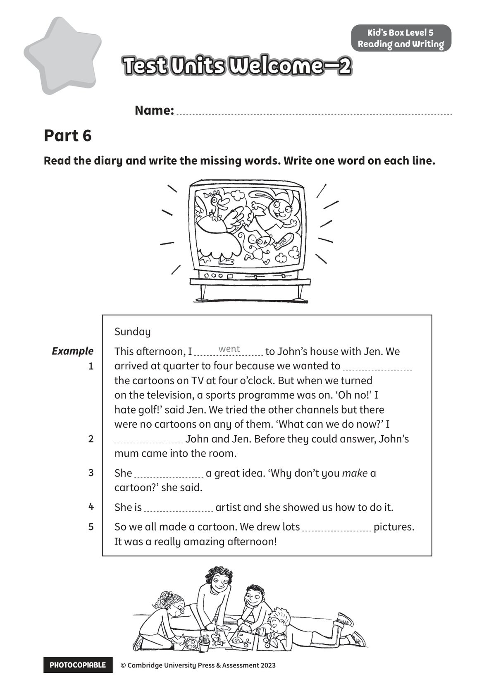

## 音频文件

- 🎧 [KidsBox_Level5_Test_Units_0-2_Listening_1_Audio_Track_16.mp3](KidsBox_Level5_Test_Units_0-2_Listening_1_Audio_Track_16.mp3)
- 🎧 [KidsBox_Level5_Test_Units_0-2_Listening_2_Audio_Track_17.mp3](KidsBox_Level5_Test_Units_0-2_Listening_2_Audio_Track_17.mp3)
- 🎧 [KidsBox_Level5_Test_Units_0-2_Listening_3_Audio_Track_18.mp3](KidsBox_Level5_Test_Units_0-2_Listening_3_Audio_Track_18.mp3)
- 🎧 [KidsBox_Level5_Test_Units_0-2_Listening_4_Audio_Track_19.mp3](KidsBox_Level5_Test_Units_0-2_Listening_4_Audio_Track_19.mp3)
- 🎧 [KidsBox_Level5_Test_Units_0-2_Listening_5_Audio_Track_20.mp3](KidsBox_Level5_Test_Units_0-2_Listening_5_Audio_Track_20.mp3)

## 第 1 页

PHOTOCOPIABLE        © Cambridge University Press & Assessment 2023
© Cambridge University Press & Assessment 2023
Name:
Part 6
Kid’s Box Level 5
Reading and Writing
Read the diary and write the missing words. Write one word on each line.
Test Units Welcome–2
Test Units Welcome–2
Test Units Welcome–2
Example
1 1
2
2
3
3
4
4
5
Sunday
This afternoon, I
to John’s house with Jen. We
arrived at quarter to four because we wanted to
the cartoons on TV at four o’clock. But when we turned
on the television, a sports programme was on. ‘Oh no!’ I
hate golf!’ said Jen. We tried the other channels but there
were no cartoons on any of them. ‘What can we do now?’ I
John and Jen. Before they could answer, John’s
mum came into the room.
She
a great idea. ‘Why don’t you make a
cartoon?’ she said.
She is
artist and she showed us how to do it.
So we all made a cartoon. We drew lots
pictures.
It was a really amazing afternoon!
went
