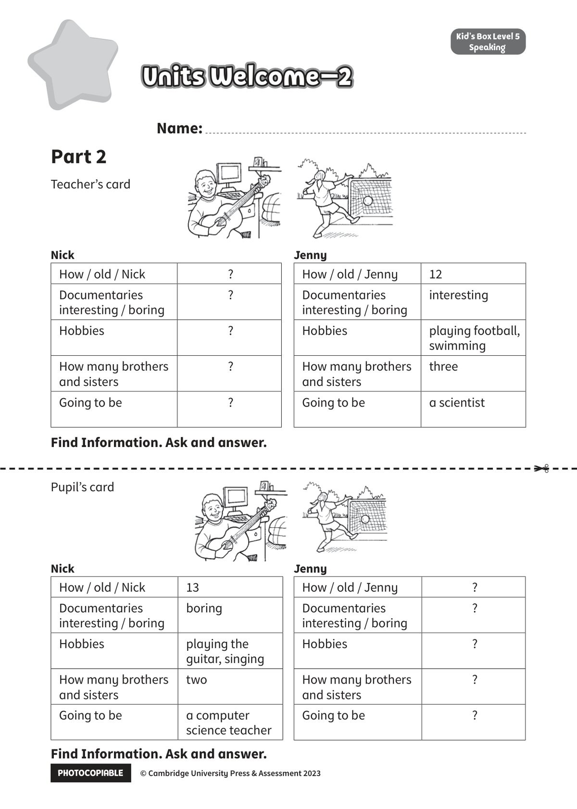

## 音频文件

- 🎧 [KidsBox_Level5_Test_Units_0-2_Listening_1_Audio_Track_16.mp3](KidsBox_Level5_Test_Units_0-2_Listening_1_Audio_Track_16.mp3)
- 🎧 [KidsBox_Level5_Test_Units_0-2_Listening_2_Audio_Track_17.mp3](KidsBox_Level5_Test_Units_0-2_Listening_2_Audio_Track_17.mp3)
- 🎧 [KidsBox_Level5_Test_Units_0-2_Listening_3_Audio_Track_18.mp3](KidsBox_Level5_Test_Units_0-2_Listening_3_Audio_Track_18.mp3)
- 🎧 [KidsBox_Level5_Test_Units_0-2_Listening_4_Audio_Track_19.mp3](KidsBox_Level5_Test_Units_0-2_Listening_4_Audio_Track_19.mp3)
- 🎧 [KidsBox_Level5_Test_Units_0-2_Listening_5_Audio_Track_20.mp3](KidsBox_Level5_Test_Units_0-2_Listening_5_Audio_Track_20.mp3)

## 第 1 页

PHOTOCOPIABLE        © Cambridge University Press & Assessment 2023
© Cambridge University Press & Assessment 2023
Units Welcome–2
Units Welcome–2
Units Welcome–2
Name:
Part 2
Kid’s Box Level 2
Speaking
Kid’s Box Level 5
Speaking
Nick
How / old / Nick
?
Documentaries
interesting / boring
?
Hobbies
?
How many brothers
and sisters
?
Going to be
?
Jenny
How / old / Jenny
12
Documentaries
interesting / boring
interesting
Hobbies
playing football,
swimming
How many brothers
and sisters
three
Going to be
a scientist
Nick
How / old / Nick
13
Documentaries
interesting / boring
boring
Hobbies
playing the
guitar, singing
How many brothers
and sisters
two
Going to be
a computer
science teacher
Jenny
How / old / Jenny
?
Documentaries
interesting / boring
?
Hobbies
?
How many brothers
and sisters
?
Going to be
?
Find Information. Ask and answer.
Find Information. Ask and answer.
✂
Teacher’s card
Pupil’s card
