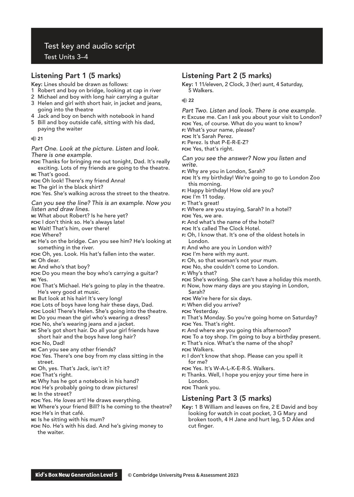
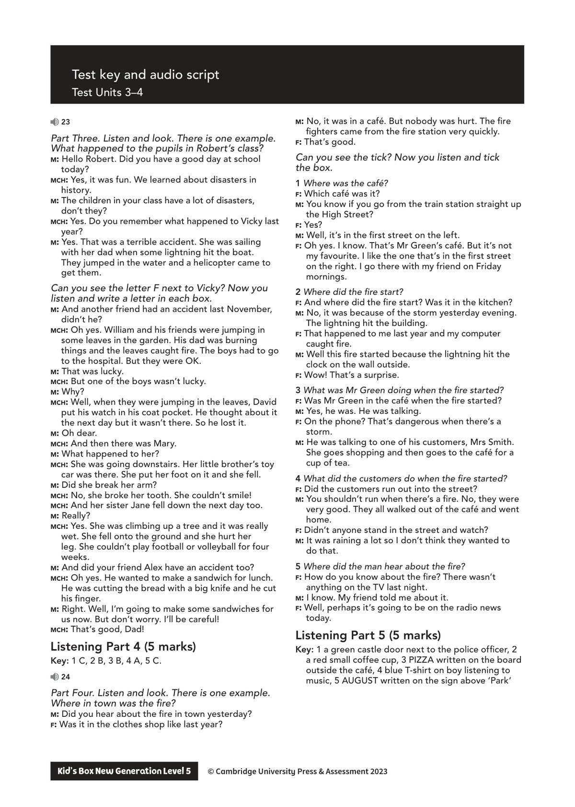
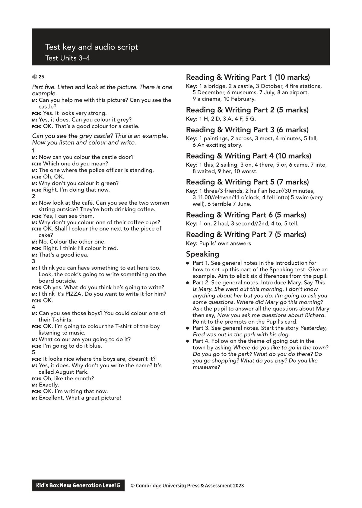

## 音频文件

- 🎧 [KidsBox_Level5_Test_Units_3-4_Listening_1_Audio_Track_21.mp3](KidsBox_Level5_Test_Units_3-4_Listening_1_Audio_Track_21.mp3)
- 🎧 [KidsBox_Level5_Test_Units_3-4_Listening_2_Audio_Track_22.mp3](KidsBox_Level5_Test_Units_3-4_Listening_2_Audio_Track_22.mp3)
- 🎧 [KidsBox_Level5_Test_Units_3-4_Listening_3_Audio_Track_23.mp3](KidsBox_Level5_Test_Units_3-4_Listening_3_Audio_Track_23.mp3)
- 🎧 [KidsBox_Level5_Test_Units_3-4_Listening_4_Audio_Track_24.mp3](KidsBox_Level5_Test_Units_3-4_Listening_4_Audio_Track_24.mp3)
- 🎧 [KidsBox_Level5_Test_Units_3-4_Listening_5_Audio_Track_25.mp3](KidsBox_Level5_Test_Units_3-4_Listening_5_Audio_Track_25.mp3)

## 第 1 页

Test key and audio script
Test Units 3–4
Kid’s Box New Generation Level 5        © Cambridge University Press & Assessment 2023
© Cambridge University Press & Assessment 2023
Listening Part 1 (5 marks)
Key: Lines should be drawn as follows:
1	 Robert and boy on bridge, looking at cap in river
2	 Michael and boy with long hair carrying a guitar
3	 Helen and girl with short hair, in jacket and jeans,
going into the theatre
4	 Jack and boy on bench with notebook in hand
5	 Bill and boy outside café, sitting with his dad,
paying the waiter
21
Part One. Look at the picture. Listen and look.
There is one example.
fch: Thanks for bringing me out tonight, Dad. It’s really
exciting. Lots of my friends are going to the theatre.
m: That’s good.
fch: Oh look! There’s my friend Anna!
m: The girl in the black shirt?
fch: Yes. She’s walking across the street to the theatre.
Can you see the line? This is an example. Now you
listen and draw lines.
m: What about Robert? Is he here yet?
fch: I don’t think so. He’s always late!
m: Wait! That’s him, over there!
fch: Where?
m: He’s on the bridge. Can you see him? He’s looking at
something in the river.
fch: Oh, yes. Look. His hat’s fallen into the water.
m: Oh dear.
m: And who’s that boy?
fch: Do you mean the boy who’s carrying a guitar?
m: Yes.
fch: That’s Michael. He’s going to play in the theatre.
He’s very good at music.
m: But look at his hair! It’s very long!
fch: Lots of boys have long hair these days, Dad.
fch: Look! There’s Helen. She’s going into the theatre.
m: Do you mean the girl who’s wearing a dress?
fch: No, she’s wearing jeans and a jacket.
m: She’s got short hair. Do all your girl friends have
short hair and the boys have long hair?
fch: No, Dad!
m: Can you see any other friends?
fch: Yes. There’s one boy from my class sitting in the
street.
m: Oh, yes. That’s Jack, isn’t it?
fch: That’s right.
m: Why has he got a notebook in his hand?
fch: He’s probably going to draw pictures!
m: In the street?
fch: Yes. He loves art! He draws everything.
m: Where’s your friend Bill? Is he coming to the theatre?
fch: He’s in that café.
m: Is he sitting with his mum?
fch: No. He’s with his dad. And he’s giving money to
the waiter.
Listening Part 2 (5 marks)
Key: 1 11/eleven, 2 Clock, 3 (her) aunt, 4 Saturday,
5 Walkers.
22
Part Two. Listen and look. There is one example.
f: Excuse me. Can I ask you about your visit to London?
fch: Yes, of course. What do you want to know?
f: What’s your name, please?
fch: It’s Sarah Perez.
f: Perez. Is that P-E-R-E-Z?
fch: Yes, that’s right.
Can you see the answer? Now you listen and
write.
f: Why are you in London, Sarah?
fch: It’s my birthday! We’re going to go to London Zoo
this morning.
f: Happy birthday! How old are you?
fch: I’m 11 today.
f: That’s great!
f: Where are you staying, Sarah? In a hotel?
fch: Yes, we are.
f: And what’s the name of the hotel?
fch: It’s called The Clock Hotel.
f: Oh, I know that. It’s one of the oldest hotels in
London.
f: And who are you in London with?
fch: I’m here with my aunt.
f: Oh, so that woman’s not your mum.
fch: No, she couldn’t come to London.
f: Why’s that?
fch: She’s working. She can’t have a holiday this month.
f: Now, how many days are you staying in London,
Sarah?
fch: We’re here for six days.
f: When did you arrive?
fch: Yesterday.
f: That’s Monday. So you’re going home on Saturday?
fch: Yes. That’s right.
f: And where are you going this afternoon?
fch: To a toy shop. I’m going to buy a birthday present.
f: That’s nice. What’s the name of the shop?
fch: Walkers.
f: I don’t know that shop. Please can you spell it
for me?
fch: Yes. It’s W-A-L-K-E-R-S. Walkers.
f: Thanks. Well, I hope you enjoy your time here in
London.
fch: Thank you.
Listening Part 3 (5 marks)
Key: 1 B William and leaves on fire, 2 E David and boy
looking for watch in coat pocket, 3 G Mary and
broken tooth, 4 H Jane and hurt leg, 5 D Alex and
cut finger.

## 第 2 页

Test key and audio script
Test Units 3–4
Kid’s Box New Generation Level 5        © Cambridge University Press & Assessment 2023
© Cambridge University Press & Assessment 2023
23
Part Three. Listen and look. There is one example.
What happened to the pupils in Robert’s class?
m: Hello Robert. Did you have a good day at school
today?
mch: Yes, it was fun. We learned about disasters in
history.
m: The children in your class have a lot of disasters,
don’t they?
mch: Yes. Do you remember what happened to Vicky last
year?
m: Yes. That was a terrible accident. She was sailing
with her dad when some lightning hit the boat.
They jumped in the water and a helicopter came to
get them.
Can you see the letter F next to Vicky? Now you
listen and write a letter in each box.
m: And another friend had an accident last November,
didn’t he?
mch: Oh yes. William and his friends were jumping in
some leaves in the garden. His dad was burning
things and the leaves caught fire. The boys had to go
to the hospital. But they were OK.
m: That was lucky.
mch: But one of the boys wasn’t lucky.
m: Why?
mch: Well, when they were jumping in the leaves, David
put his watch in his coat pocket. He thought about it
the next day but it wasn’t there. So he lost it.
m: Oh dear.
mch: And then there was Mary.
m: What happened to her?
mch: She was going downstairs. Her little brother’s toy
car was there. She put her foot on it and she fell.
m: Did she break her arm?
mch: No, she broke her tooth. She couldn’t smile!
mch: And her sister Jane fell down the next day too.
m: Really?
mch: Yes. She was climbing up a tree and it was really
wet. She fell onto the ground and she hurt her
leg. She couldn’t play football or volleyball for four
weeks.
m: And did your friend Alex have an accident too?
mch: Oh yes. He wanted to make a sandwich for lunch.
He was cutting the bread with a big knife and he cut
his finger.
m: Right. Well, I’m going to make some sandwiches for
us now. But don’t worry. I’ll be careful!
mch: That’s good, Dad!
Listening Part 4 (5 marks)
Key: 1 C, 2 B, 3 B, 4 A, 5 C.
24
Part Four. Listen and look. There is one example.
Where in town was the fire?
m: Did you hear about the fire in town yesterday?
f: Was it in the clothes shop like last year?
m: No, it was in a café. But nobody was hurt. The fire
fighters came from the fire station very quickly.
f: That’s good.
Can you see the tick? Now you listen and tick
the box.
1 Where was the café?
f: Which café was it?
m: You know if you go from the train station straight up
the High Street?
f: Yes?
m: Well, it’s in the first street on the left.
f: Oh yes. I know. That’s Mr Green’s café. But it’s not
my favourite. I like the one that’s in the first street
on the right. I go there with my friend on Friday
mornings.
2 Where did the fire start?
f: And where did the fire start? Was it in the kitchen?
m: No, it was because of the storm yesterday evening.
The lightning hit the building.
f: That happened to me last year and my computer
caught fire.
m: Well this fire started because the lightning hit the
clock on the wall outside.
f: Wow! That’s a surprise.
3 What was Mr Green doing when the fire started?
f: Was Mr Green in the café when the fire started?
m: Yes, he was. He was talking.
f: On the phone? That’s dangerous when there’s a
storm.
m: He was talking to one of his customers, Mrs Smith.
She goes shopping and then goes to the café for a
cup of tea.
4 What did the customers do when the fire started?
f: Did the customers run out into the street?
m: You shouldn’t run when there’s a fire. No, they were
very good. They all walked out of the café and went
home.
f: Didn’t anyone stand in the street and watch?
m: It was raining a lot so I don’t think they wanted to
do that.
5 Where did the man hear about the fire?
f: How do you know about the fire? There wasn’t
anything on the TV last night.
m: I know. My friend told me about it.
f: Well, perhaps it’s going to be on the radio news
today.
Listening Part 5 (5 marks)
Key: 1 a green castle door next to the police officer, 2
a red small coffee cup, 3 PIZZA written on the board
outside the café, 4 blue T-shirt on boy listening to
music, 5 AUGUST written on the sign above ‘Park’

## 第 3 页

Test key and audio script
Test Units 3–4
Kid’s Box New Generation Level 5        © Cambridge University Press & Assessment 2023
© Cambridge University Press & Assessment 2023
25
Part five. Listen and look at the picture. There is one
example.
m: Can you help me with this picture? Can you see the
castle?
fch: Yes. It looks very strong.
m: Yes, it does. Can you colour it grey?
fch: OK. That’s a good colour for a castle.
Can you see the grey castle? This is an example.
Now you listen and colour and write.
1
m: Now can you colour the castle door?
fch: Which one do you mean?
m: The one where the police officer is standing.
fch: Oh, OK.
m: Why don’t you colour it green?
fch: Right. I’m doing that now.
2
m: Now look at the café. Can you see the two women
sitting outside? They’re both drinking coffee.
fch: Yes, I can see them.
m: Why don’t you colour one of their coffee cups?
fch: OK. Shall I colour the one next to the piece of
cake?
m: No. Colour the other one.
fch: Right. I think I’ll colour it red.
m: That’s a good idea.
3
m: I think you can have something to eat here too.
Look, the cook’s going to write something on the
board outside.
fch: Oh yes. What do you think he’s going to write?
m: I think it’s PIZZA. Do you want to write it for him?
fch: OK.
4
m: Can you see those boys? You could colour one of
their T-shirts.
fch: OK. I’m going to colour the T-shirt of the boy
listening to music.
m: What colour are you going to do it?
fch: I’m going to do it blue.
5
fch: It looks nice where the boys are, doesn’t it?
m: Yes, it does. Why don’t you write the name? It’s
called August Park.
fch: Oh, like the month?
m: Exactly.
fch: OK. I’m writing that now.
m: Excellent. What a great picture!
Reading & Writing Part 1 (10 marks)
Key: 1 a bridge, 2 a castle, 3 October, 4 fire stations,
5 December, 6 museums, 7 July, 8 an airport,
9 a cinema, 10 February.
Reading & Writing Part 2 (5 marks)
Key: 1 H, 2 D, 3 A, 4 F, 5 G.
Reading & Writing Part 3 (6 marks)
Key: 1 paintings, 2 across, 3 most, 4 minutes, 5 fall,
6 An exciting story.
Reading & Writing Part 4 (10 marks)
Key: 1 this, 2 sailing, 3 on, 4 there, 5 or, 6 came, 7 into,
8 waited, 9 her, 10 worst.
Reading & Writing Part 5 (7 marks)
Key: 1 three/3 friends, 2 half an hour//30 minutes,
3 11.00//eleven/11 o’clock, 4 fell in(to) 5 swim (very
well), 6 terrible 7 June.
Reading & Writing Part 6 (5 marks)
Key: 1 on, 2 had, 3 second//2nd, 4 to, 5 tell.
Reading & Writing Part 7 (5 marks)
Key: Pupils’ own answers
Speaking
● Part 1. See general notes in the Introduction for
how to set up this part of the Speaking test. Give an
example. Aim to elicit six differences from the pupil.
● Part 2. See general notes. Introduce Mary. Say This
is Mary. She went out this morning. I don’t know
anything about her but you do. I’m going to ask you
some questions. Where did Mary go this morning?
Ask the pupil to answer all the questions about Mary
then say, Now you ask me questions about Richard.
Point to the prompts on the Pupil’s card.
● Part 3. See general notes. Start the story Yesterday,
Fred was out in the park with his dog.
● Part 4. Follow on the theme of going out in the
town by asking Where do you like to go in the town?
Do you go to the park? What do you do there? Do
you go shopping? What do you buy? Do you like
museums?
