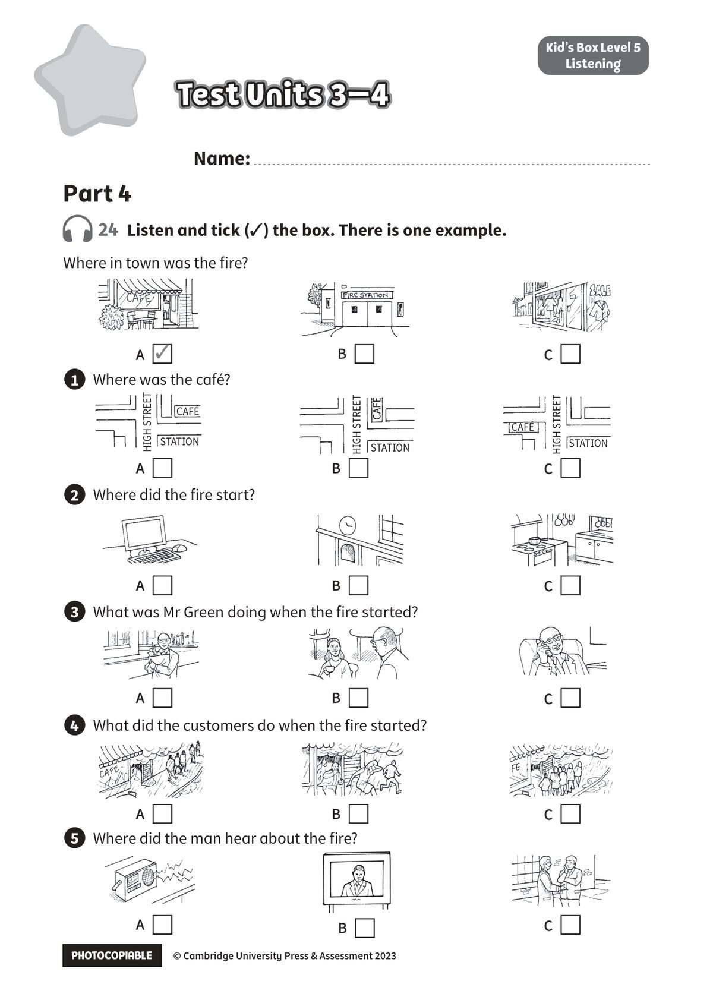

## 音频文件

- 🎧 [KidsBox_Level5_Test_Units_3-4_Listening_1_Audio_Track_21.mp3](KidsBox_Level5_Test_Units_3-4_Listening_1_Audio_Track_21.mp3)
- 🎧 [KidsBox_Level5_Test_Units_3-4_Listening_2_Audio_Track_22.mp3](KidsBox_Level5_Test_Units_3-4_Listening_2_Audio_Track_22.mp3)
- 🎧 [KidsBox_Level5_Test_Units_3-4_Listening_3_Audio_Track_23.mp3](KidsBox_Level5_Test_Units_3-4_Listening_3_Audio_Track_23.mp3)
- 🎧 [KidsBox_Level5_Test_Units_3-4_Listening_4_Audio_Track_24.mp3](KidsBox_Level5_Test_Units_3-4_Listening_4_Audio_Track_24.mp3)
- 🎧 [KidsBox_Level5_Test_Units_3-4_Listening_5_Audio_Track_25.mp3](KidsBox_Level5_Test_Units_3-4_Listening_5_Audio_Track_25.mp3)

## 第 1 页

PHOTOCOPIABLE        © Cambridge University Press & Assessment 2023
© Cambridge University Press & Assessment 2023
Test Units 3–4
Test Units 3–4
Test Units 3–4
Kid’s Box Level 5
Listening
24  Listen and tick (✓) the box. There is one example.
Name:
Part 4
Where in town was the fire?
1 	 Where was the café?
2 	 Where did the fire start?
3 	 What was Mr Green doing when the fire started?
4 	 What did the customers do when the fire started?
5 	 Where did the man hear about the fire?
A  ✓
A
A
A
A
A
B
B
B
B
B
B
C
C
C
C
C
C
HIGH STREET
STATION
CAFÉ
HIGH STREET
HIGH STREET
CAFÉ
STATION
CAFÉ
STATION
